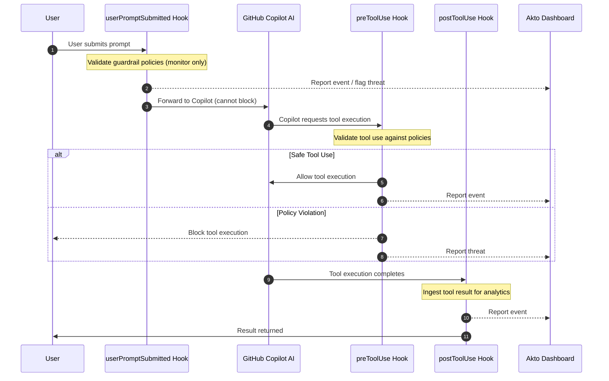

# GitHub Copilot CLI Hooks

Akto Guardrails for GitHub Copilot CLI provides security validation for AI-assisted development. It intercepts prompts when submitted and tool executions before and after they run, validates against security policies, blocks risky behavior, and reports events to your Akto dashboard.

## Key Features

* ✅ **Zero Installation** - No standalone apps to install
* ✅ **Transparent Integration** - Uses GitHub Copilot CLI's native hook mechanism
* ✅ **Real-time Tool Blocking** - Can block dangerous tool executions before they run
* ✅ **Centralized Monitoring** - All events reported to Akto dashboard
* ✅ **Flexible Deployment** - Supports Argus and Atlas modes
* ✅ **Configurable Behavior** - Blocking or observation modes
* ⚠️ **Prompt Monitoring Only** - GitHub Copilot limitation prevents blocking prompts at submission

## How It Works

GitHub Copilot CLI's hook system executes custom scripts at three critical points:



**3 Hook Points:**

1. `userPromptSubmitted` - Monitors prompts when submitted to Copilot (reporting only, cannot block)
2. `preToolUse` - Validates tool use before execution and **can block** dangerous operations
3. `postToolUse` - Ingests tool execution results for monitoring and audit


**GitHub Copilot Limitation**: The `userPromptSubmitted` hook **cannot block** prompt execution. Prompts flagged by guardrails will still reach the LLM. Only `preToolUse` can prevent operations from executing. For complete prompt blocking, consider using a network proxy.


## File Structure

```
<project-root>/
└── .github/
    └── hooks/
        ├── akto-validate-prompt-wrapper.sh       # Prompt monitoring wrapper
        ├── akto-validate-prompt.py               # Prompt monitoring logic
        ├── akto-validate-pre-tool-wrapper.sh     # Pre-tool validation wrapper
        ├── akto-validate-pre-tool.py             # Pre-tool validation and blocking logic
        ├── akto-validate-post-tool-wrapper.sh    # Post-tool ingestion wrapper
        ├── akto-validate-post-tool.py            # Post-tool ingestion logic
        ├── akto_machine_id.py                    # Device ID utility
        └── hooks.json                            # Hook configuration
```

**Key Files:**

* **Wrapper scripts (`.sh`)**: Set environment variables, invoke Python scripts
  * ⚠️ **Contains `AKTO_DATA_INGESTION_URL` placeholder** - Must be set to your Akto instance URL
* **Python scripts (`.py`)**: Core validation logic and Akto API communication
* **`akto_machine_id.py`**: Generates unique device identifiers for Atlas mode
* **`hooks.json`**: Links hooks to wrapper scripts

> **Note:** `hooks.json` is loaded from the project root's `.github/hooks/` directory.

## Setup Guide

### Prerequisites

* GitHub CLI installed ([GitHub CLI](https://github.com/features/copilot/cli))
* Akto instance URL
* Python 3
* macOS or Linux with bash/zsh

### Installation Steps



**Create the Hooks Directory**

```bash
mkdir -p .github/hooks
```



**Download Hook Scripts**

```bash
# Base URL for downloading hooks
HOOKS_BASE="https://raw.githubusercontent.com/akto-api-security/akto/agent-hooks/apps/mcp-endpoint-shield/github-cli-hooks"

# Download prompt monitoring hooks
curl -o .github/hooks/akto-validate-prompt-wrapper.sh \
  "${HOOKS_BASE}/akto-validate-prompt-wrapper.sh"
curl -o .github/hooks/akto-validate-prompt.py \
  "${HOOKS_BASE}/akto-validate-prompt.py"

# Download pre-tool validation hooks
curl -o .github/hooks/akto-validate-pre-tool-wrapper.sh \
  "${HOOKS_BASE}/akto-validate-pre-tool-wrapper.sh"
curl -o .github/hooks/akto-validate-pre-tool.py \
  "${HOOKS_BASE}/akto-validate-pre-tool.py"

# Download post-tool ingestion hooks
curl -o .github/hooks/akto-validate-post-tool-wrapper.sh \
  "${HOOKS_BASE}/akto-validate-post-tool-wrapper.sh"
curl -o .github/hooks/akto-validate-post-tool.py \
  "${HOOKS_BASE}/akto-validate-post-tool.py"

# Download utility
curl -o .github/hooks/akto_machine_id.py \
  "${HOOKS_BASE}/akto_machine_id.py"

# Download hooks configuration
curl -o .github/hooks/hooks.json \
  "${HOOKS_BASE}/hooks.json"

# Make executable
chmod +x .github/hooks/*.py .github/hooks/*.sh
```



**Configure Akto Ingestion URL** ⚠️ **CRITICAL STEP**


All wrapper scripts contain the variable `AKTO_DATA_INGESTION_URL` that **must be set** to your actual Akto instance URL.


**Automated replacement:**

```bash
# Set your Akto ingestion URL
AKTO_URL="https://your-akto-instance.com"

# Update all wrapper scripts
sed -i.bak "s|{{AKTO_DATA_INGESTION_URL}}|${AKTO_URL}|g" .github/hooks/*-wrapper.sh

# Verify replacement
grep "AKTO_DATA_INGESTION_URL" .github/hooks/*-wrapper.sh
```

**Manual replacement (alternative):**

Edit each wrapper script and replace:

```bash
export AKTO_DATA_INGESTION_URL="{{AKTO_DATA_INGESTION_URL}}"
```

With:

```bash
export AKTO_DATA_INGESTION_URL="https://your-akto-instance.com"
```

Files to update:

* `akto-validate-prompt-wrapper.sh`
* `akto-validate-pre-tool-wrapper.sh`
* `akto-validate-post-tool-wrapper.sh`



**Verify hooks.json Configuration**

The `hooks.json` file should already be configured after downloading. Verify it contains all three hooks:

```json
{
  "version": 1,
  "hooks": {
    "userPromptSubmitted": [
      {
        "type": "command",
        "bash": "bash ./.github/hooks/akto-validate-prompt-wrapper.sh",
        "powershell": "python .github/hooks/akto-validate-prompt.py",
        "comment": "Validate prompts against Akto Guardrails (monitoring only - cannot block per GitHub limitation)",
        "timeoutSec": 30
      }
    ],
    "preToolUse": [
      {
        "type": "command",
        "bash": "bash ./.github/hooks/akto-validate-pre-tool-wrapper.sh",
        "powershell": "python .github/hooks/akto-validate-pre-tool.py",
        "comment": "Validate and block tool execution based on Akto Guardrails policies",
        "timeoutSec": 30
      }
    ],
    "postToolUse": [
      {
        "type": "command",
        "bash": "bash ./.github/hooks/akto-validate-post-tool-wrapper.sh",
        "powershell": "python .github/hooks/akto-validate-post-tool.py",
        "comment": "Ingest tool execution results to Akto for monitoring and analytics",
        "timeoutSec": 30
      }
    ]
  }
}
```

> **Note:** `timeoutSec` is in seconds (30 = 30 seconds). Hooks are loaded from `.github/hooks/hooks.json` in the directory you run copilot from.



**Configure Hook Behavior (Optional)**

Edit wrapper scripts to customize:

```bash
# In each *-wrapper.sh file:

export MODE="atlas"                    # "argus" or "atlas"
export AKTO_DATA_INGESTION_URL="..."  # Your Akto instance URL
export AKTO_SYNC_MODE="true"          # "true" (blocking) or "false" (observe only)
export AKTO_TIMEOUT="5"               # Timeout in seconds
export AKTO_CONNECTOR="github_copilot_cli"
export CONTEXT_SOURCE="ENDPOINT"
```

**Mode Options:**

* **Argus**: Standard validation and reporting
* **Atlas**: Includes device-specific metadata

**Sync Mode:**

* **true**: Validates in real-time; `preToolUse` blocks dangerous tool executions
* **false**: Monitoring only; all tool executions pass through but are logged



**Verify Installation**

```bash
# Check hooks.json is valid JSON
python3 -m json.tool .github/hooks/hooks.json

# Verify scripts are executable
ls -la .github/hooks/

# Test a hook manually
echo '{"prompt":"test","cwd":"/test","timestamp":1704614400000}' | \
  python3 .github/hooks/akto-validate-prompt.py

# Run a Copilot command from the project root
copilot
```

Check logs to confirm hooks are working:

```bash
# Default log location
tail -f ~/akto-main/akto/.github/akto/copilot/logs/validate-prompt.log
tail -f ~/akto-main/akto/.github/akto/copilot/logs/validate-pre-tool.log
tail -f ~/akto-main/akto/.github/akto/copilot/logs/validate-post-tool.log
```



## Configuration Reference

### Wrapper Script Variables

```bash
export MODE="atlas"                                  # "argus" or "atlas"
export AKTO_DATA_INGESTION_URL="http://localhost:9091"  # ⚠️ MUST REPLACE
export AKTO_SYNC_MODE="true"                         # "true" or "false"
export AKTO_TIMEOUT="5"                              # Timeout in seconds
export AKTO_CONNECTOR="github_copilot_cli"           # Connector identifier
export CONTEXT_SOURCE="ENDPOINT"                     # Context source tag
```

### Environment Variables (Optional)

Override defaults via environment variables (e.g. in `~/.bashrc` or `~/.zshrc`):

```bash
export MODE="atlas"
export AKTO_DATA_INGESTION_URL="https://your-akto-instance.com"
export AKTO_SYNC_MODE="true"
export AKTO_TIMEOUT="5"
```


## Troubleshooting

### Hooks Not Executing

```bash
# Check you're running from the project root
ls -la .github/hooks/hooks.json

# Verify scripts are executable
ls -la .github/hooks/
chmod +x .github/hooks/*.py .github/hooks/*.sh

# Check JSON syntax
python3 -m json.tool .github/hooks/hooks.json
```

### Ingestion URL Not Configured

```bash
# Check current URL value in wrapper scripts
grep "AKTO_DATA_INGESTION_URL" .github/hooks/*-wrapper.sh

# Replace with actual URL
AKTO_URL="https://your-akto-instance.com"
sed -i.bak "s|http://localhost:9091|${AKTO_URL}|g" .github/hooks/*-wrapper.sh
```

### Check Logs for Errors

```bash
# View logs
cat .github/akto/copilot/logs/*.log

# Check for errors
grep -i error .github/akto/copilot/logs/*.log 2>/dev/null || true
```

### Events Not in Dashboard

```bash
# Test API connectivity
curl -X POST "${AKTO_DATA_INGESTION_URL}/api/http-proxy?akto_connector=github_copilot_cli" \
  -H "Content-Type: application/json" \
  -d '{"test": "event"}'

# Verify URL in wrapper scripts
grep "AKTO_DATA_INGESTION_URL" .github/hooks/*-wrapper.sh
```

### Hook Timing Out

Increase `timeoutSec` in `hooks.json` (value in seconds, e.g. `"timeoutSec": 60`). Ensure `AKTO_DATA_INGESTION_URL` is reachable from your machine.

### Permission Denied on Scripts

```bash
# Fix permissions
chmod +x .github/hooks/*.py .github/hooks/*.sh

# Verify Python 3 is available
python3 --version
```

## Uninstallation

### Complete Removal

```bash
# 1. Remove hook configuration and scripts
rm -rf .github/hooks/

# 2. Remove Akto logs (optional - keeps historical data if skipped)
rm -rf ~/akto-main/akto/.github/akto/

# 3. No restart needed - Copilot reads hooks.json on each invocation
```

### Selective Removal (Keep Logs)

```bash
# Remove only hooks and configuration
rm -rf .github/hooks/

# Logs preserved in ~/akto-main/akto/.github/akto/copilot/logs/
```

### Backup Before Removal

```bash
# Backup configuration and logs before removal
mkdir -p ~/akto-backup
cp -r .github/hooks/ ~/akto-backup/copilot-hooks/ 2>/dev/null
cp -r ~/akto-main/akto/.github/akto/ ~/akto-backup/copilot-akto-logs/ 2>/dev/null

# Then proceed with removal steps above
```

### Verify Removal

```bash
# Check that hooks are removed
test -f .github/hooks/hooks.json && echo "⚠️  hooks.json still exists" || echo "✅ hooks.json removed"
test -d .github/hooks && echo "⚠️  Hook scripts still exist" || echo "✅ Hook scripts removed"
```

## Enterprise Deployment

### Automated Deployment Script

```bash
#!/bin/bash
# deploy-copilot-cli-hooks.sh

set -e
AKTO_URL="${1:-https://your-akto-instance.com}"
PROJECT_DIR="${2:-.}"

echo "🔧 Installing Akto Guardrails for GitHub Copilot CLI..."

# Create directory
mkdir -p "${PROJECT_DIR}/.github/hooks"

# Download hooks
HOOKS_BASE="https://raw.githubusercontent.com/akto-api-security/akto/agent-hooks/apps/mcp-endpoint-shield/github-cli-hooks"
for FILE in \
  akto-validate-prompt-wrapper.sh akto-validate-prompt.py \
  akto-validate-pre-tool-wrapper.sh akto-validate-pre-tool.py \
  akto-validate-post-tool-wrapper.sh akto-validate-post-tool.py \
  akto_machine_id.py hooks.json; do
  curl -s "${HOOKS_BASE}/${FILE}" -o "${PROJECT_DIR}/.github/hooks/${FILE}"
done

# Make executable
chmod +x "${PROJECT_DIR}/.github/hooks"/*.py "${PROJECT_DIR}/.github/hooks"/*.sh

# Configure URL
sed -i.bak "s|http://localhost:9091|${AKTO_URL}|g" \
  "${PROJECT_DIR}/.github/hooks"/*-wrapper.sh

echo "✅ Installation complete!"
echo "📍 Akto instance: ${AKTO_URL}"
echo "📁 Hooks installed in: ${PROJECT_DIR}/.github/hooks/"
echo "Test with: cd ${PROJECT_DIR} && gh copilot suggest 'list files'"
```

**Deploy to developers:**

```bash
curl -fsSL https://your-org.com/deploy-copilot-cli-hooks.sh | \
  bash -s https://your-akto-instance.com /path/to/project
```

## Quick Setup Summary

```bash
# 1. Create directory (from your project root)
mkdir -p .github/hooks

# 2. Download all hook scripts from GitHub (see step 2 above)

# 3. ⚠️ Configure Akto URL (REQUIRED)
AKTO_URL="https://your-akto-instance.com"
sed -i.bak "s|{{AKTO_DATA_INGESTION_URL}}|${AKTO_URL}|g" .github/hooks/*-wrapper.sh

# 4. Make executable
chmod +x .github/hooks/*.py .github/hooks/*.sh

# 5. Verify hooks.json is present and valid
python3 -m json.tool .github/hooks/hooks.json

# 6. Test (run from project root)
copilot
```

## Resources

* **GitHub Copilot CLI**: [https://github.com/features/copilot/cli](https://github.com/features/copilot/cli)
* **GitHub**: [https://github.com/akto-api-security/akto](https://github.com/akto-api-security/akto)
* **Support**: [support@akto.io](mailto:support@akto.io)
* **Community**: [https://www.akto.io/community](https://www.akto.io/community)
