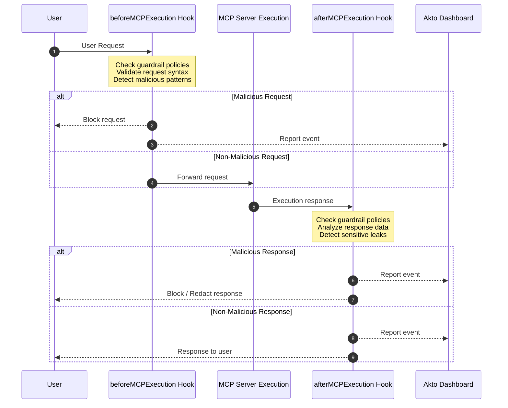

# Cursor Hooks

MCP Endpoint Shield via Cursor Hooks provides **zero-installation runtime security** for MCP servers by leveraging Cursor's native hook system. It intercepts all MCP calls (requests and responses), performs validation, blocks malicious activity, and reports threats to your security dashboard—**without requiring any MCP server configuration or wrapper installation**.

## Key Advantages

* ✅ **Zero Installation** - No standalone apps or packages to install
* ✅ **No MCP Config Changes** - Works without wrapping your MCP servers
* ✅ **Transparent Integration** - Uses Cursor's native hook mechanism
* ✅ **Real-time Protection** - Intercepts every MCP request and response
* ✅ **Centralized Monitoring** - All threats reported to Akto dashboard
* ✅ **Automatic Updates** - Hook scripts auto-sync security policies

## How It Works

Cursor's hook system allows you to execute custom scripts before and after MCP operations. Akto leverages these hooks to provide comprehensive security:




### **Key Points:**

* `beforeMCPExecution` hook checks guardrail policies and validates requests
* `afterMCPExecution` hook checks guardrail policies and analyzes responses
* **Both hooks report to Akto Dashboard** regardless of whether threats are detected
* Malicious requests/responses are blocked with standard JSON-RPC errors
* All events (safe and malicious) are logged for compliance and analytics


## Setup Guide

### Prerequisites

* Cursor IDE installed (version 0.40+ with hooks support)
* Akto API token ([Get from Akto Dashboard](https://app.akto.io))
* macOS, Linux, or Windows with bash/zsh support



#### Create Hook Directory

Create the Cursor hooks directory if it doesn't exist:

```bash
mkdir -p ~/.cursor/hooks/akto
```



#### Download Hook Scripts

Download the Akto MCP guard scripts from our GitHub repository:

**Option A: Using curl**

```bash
# Download before-execution hook
curl -o ~/.cursor/hooks/akto/akto-mcp-guard-before.sh \
  https://raw.githubusercontent.com/akto-api-security/akto/refs/heads/master/apps/mcp-endpoint-shield/cursor-hooks/akto-mcp-guard-before.sh

# Download after-execution hook
curl -o ~/.cursor/hooks/akto/akto-mcp-guard-after.sh \
  https://raw.githubusercontent.com/akto-api-security/akto/refs/heads/master/apps/mcp-endpoint-shield/cursor-hooks/akto-mcp-guard-after.sh

# Make scripts executable
chmod +x ~/.cursor/hooks/akto/akto-mcp-guard-before.sh
chmod +x ~/.cursor/hooks/akto/akto-mcp-guard-after.sh
```

**Option B: Using wget**

```bash
# Download before-execution hook
wget -O ~/.cursor/hooks/akto/akto-mcp-guard-before.sh \
https://raw.githubusercontent.com/akto-api-security/akto/refs/heads/master/apps/mcp-endpoint-shield/cursor-hooks/akto-mcp-guard-before.sh

# Download after-execution hook
wget -O ~/.cursor/hooks/akto/akto-mcp-guard-after.sh \
https://raw.githubusercontent.com/akto-api-security/akto/refs/heads/master/apps/mcp-endpoint-shield/cursor-hooks/akto-mcp-guard-after.sh

# Make scripts executable
chmod +x ~/.cursor/hooks/akto/akto-mcp-guard-before.sh
chmod +x ~/.cursor/hooks/akto/akto-mcp-guard-after.sh
```

**Option C: Clone the Repository**

```bash
# Clone the repository
git clone https://github.com/akto-api-security/akto.git
cd akto/apps/mcp-endpoint-shield/cursor-hooks

# Copy hooks to Cursor directory
cp cursor-hooks/akto-mcp-guard-before.sh ~/.cursor/hooks/akto
cp cursor-hooks/akto-mcp-guard-after.sh ~/.cursor/hooks/akto

# Make scripts executable
chmod +x ~/.cursor/hooks/akto/akto-mcp-guard-before.sh
chmod +x ~/.cursor/hooks/akto/akto-mcp-guard-after.sh
```



#### Configure Hooks in Cursor

Create or edit the Cursor hooks configuration file:

```bash
# Create .cursor directory if it doesn't exist
mkdir -p ~/.cursor

# Create hooks.json configuration
cat > ~/.cursor/hooks.json << 'EOF'
{
  "version": 1,
  "hooks": {
    "beforeMCPExecution": [
      {
        "command": "~/.cursor/hooks/akto/akto-mcp-guard-before.sh"
      }
    ],
    "afterMCPExecution": [
      {
        "command": "~/.cursor/hooks/akto/akto-mcp-guard-after.sh"
      }
    ]
  }
}
EOF
```

**Configuration Options:**

* `version`: Hook configuration schema version (currently `1`)
* `beforeMCPExecution`: Array of hooks to run before MCP server execution
* `afterMCPExecution`: Array of hooks to run after MCP server execution
* `command`: Absolute path to the hook script

<details>

<summary><strong>Example with multiple hooks</strong></summary>

```json
{
  "version": 1,
  "hooks": {
    "beforeMCPExecution": [
      {
        "command": "~/.cursor/hooks/akto/akto-mcp-guard-before.sh"
      },
      {
        "command": "~/.cursor/hooks/akto/custom-logger.sh"
      }
    ],
    "afterMCPExecution": [
      {
        "command": "~/.cursor/hooks/akto/akto-mcp-guard-after.sh"
      }
    ]
  }
}
```

</details>



#### Set Your Akto API Token

The hook scripts need your Akto API token to report security events. The following options are present to set tokens:



Add to your shell configuration file (`~/.bashrc`, `~/.zshrc`, or `~/.profile`):

```bash
export AKTO_API_TOKEN="your-actual-token-here"
export AKTO_PROJECT_NAME="default"  # Optional: specify project name
```

Reload your shell:

```bash
source ~/.bashrc  # or ~/.zshrc
```



Create a configuration file:

```bash
mkdir -p ~/.akto
cat > ~/.akto/config << 'EOF'
AKTO_API_TOKEN=your-actual-token-here
AKTO_PROJECT_NAME=default
AKTO_SKIP_THREAT=false
EOF

chmod 600 ~/.akto/config  # Secure the file
```

The hook scripts will automatically read from this file.



Edit the hook scripts to include your token directly (less secure):

```bash
# Edit ~/.cursor/hooks/akto/akto-mcp-guard-before.sh
# Find the line: AKTO_API_TOKEN="${AKTO_API_TOKEN:-}"
# Replace with: AKTO_API_TOKEN="your-actual-token-here"
```





#### Restart Cursor

Restart Cursor IDE to activate the hooks:

```bash
# Close all Cursor windows, then reopen
# Or use Cmd+Q (macOS) / Alt+F4 (Windows/Linux)
```



#### Verify Installation

Check that hooks are working:

1. **Open Cursor Settings**
   * Go to `Settings` → `Extensions` → `MCP`
   * Look for "Hooks enabled" indicator
2. **Check Hook Logs**

```bash
# View hook execution logs
tail -f ~/.cursor/hooks/akto/logs/mcp-guard.log

# Check for errors
cat ~/.cursor/hooks/akto/logs/mcp-guard-error.log
```

3. **Test with MCP Operation**

Use any MCP tool in Cursor (e.g., file search, code completion). You should see:

```bash
# In the log file
[2025-12-24T10:30:45Z] [INFO] beforeMCPExecution: Checking guardrail policies
[2025-12-24T10:30:45Z] [INFO] Request validated - allowing execution
[2025-12-24T10:30:45Z] [INFO] Reported to Akto Dashboard: event-abc123
[2025-12-24T10:30:46Z] [INFO] afterMCPExecution: Checking response guardrail policies
[2025-12-24T10:30:46Z] [INFO] Response clean - no threats detected
[2025-12-24T10:30:46Z] [INFO] Reported to Akto Dashboard: event-def456
```



## Security Features

### Request Validation (beforeMCPExecution)

The before-execution hook performs:

1. **Guardrail Policy Check** - Applies organization-wide security policies
2. **Request Validation** - Validates JSON-RPC structure and parameters
3. **Threat Detection** - Identifies malicious patterns:
   * **SQL Injection Attempts** - Blocks malicious SQL patterns in tool arguments
   * **Path Traversal** - Prevents access to sensitive file paths (`/etc/passwd`, `.env`, etc.)
   * **Command Injection** - Detects shell command injection attempts
   * **Unsafe Tool Calls** - Blocks dangerous MCP tool invocations
   * **Rate Limiting** - Prevents abuse through excessive requests
4. **Dashboard Reporting** - Reports all events (safe and malicious) to Akto Dashboard

<details>

<summary><strong>Example: Blocked Request</strong></summary>

```json
{
  "jsonrpc": "2.0",
  "error": {
    "code": -32001,
    "message": "Request blocked by Akto MCP Shield: Path traversal attempt detected",
    "data": {
      "threat_type": "PATH_TRAVERSAL",
      "severity": "HIGH",
      "blocked_path": "../../../../etc/passwd",
      "incident_id": "akto-threat-2025-12-24-abc123",
      "guardrail_policy": "block-sensitive-file-access"
    }
  },
  "id": 1
}
```

**Log Entry for Blocked Request**

```bash
[2025-12-24T10:35:12Z] [WARN] beforeMCPExecution: Threat detected - PATH_TRAVERSAL
[2025-12-24T10:35:12Z] [WARN] Guardrail policy violated: block-sensitive-file-access
[2025-12-24T10:35:12Z] [INFO] Request blocked - JSON-RPC error returned
[2025-12-24T10:35:12Z] [INFO] Reported to Akto Dashboard: incident-abc123
```

</details>

### Response Analysis (afterMCPExecution)

The after-execution hook performs:

1. **Guardrail Policy Check** - Applies response-specific security policies
2. **Response Validation** - Validates response structure and data
3. **Threat Detection** - Identifies security issues:
   * **Sensitive Data Exposure** - Detects credentials, API keys, tokens
   * **PII Leakage** - Identifies personal information (SSN, credit cards, emails)
   * **Excessive Data Return** - Flags responses with unusually large payloads
   * **Anomalous Behavior** - Detects deviations from normal patterns
   * **Data Exfiltration** - Monitors for suspicious data access patterns
   * **Compliance Violations** - Checks against configured security policies
4. **Dashboard Reporting** - Reports all events (safe and malicious) to Akto Dashboard

<details>

<summary><strong>Example: Detected Sensitive Data</strong></summary>

```bash
[2025-12-24T10:35:12Z] [WARN] afterMCPExecution: Sensitive data detected in response
[2025-12-24T10:35:12Z] [WARN] Guardrail policy violated: prevent-credential-exposure
[2025-12-24T10:35:12Z] [WARN] Found: AWS_ACCESS_KEY_ID in filesystem read response
[2025-12-24T10:35:12Z] [INFO] Response redacted - sensitive data removed
[2025-12-24T10:35:12Z] [INFO] Reported to Akto Dashboard: incident-456
```

</details>

### Comprehensive Reporting

All events are reported to Akto Dashboard:

* ✅ **Safe Requests** - Normal operations logged for analytics
* ✅ **Safe Responses** - Clean responses tracked for compliance
* ⚠️ **Blocked Requests** - Threat details and remediation actions
* ⚠️ **Blocked Responses** - Sensitive data exposures and redactions

This provides complete visibility into:

* Total MCP operation volume
* Security threat trends
* Compliance audit trails
* Developer behavior patterns
* Risk assessment data

## Akto Dashboard Integration

#### Viewing Security Events

1. **Login to Akto Dashboard**: [https://app.akto.io](https://app.akto.io)
2. **Navigate to MCP Shield Section**:
   * Go to `Security` → `MCP Endpoint Shield` → `Cursor Hooks`
3. **View Real-time Events**:
   * See all MCP requests/responses from your Cursor IDE
   * Filter by severity, threat type, MCP server, or time range
   * Drill down into specific incidents for detailed analysis

#### Event Categories

The dashboard organizes events into categories:

**Safe Operations:**

* `mcp.request.allowed` - Request passed all guardrail checks
* `mcp.response.clean` - Response contained no sensitive data

**Threat Events:**

* `mcp.request.blocked` - Request violated guardrail policy
* `mcp.response.blocked` - Response contained sensitive/malicious data
* `mcp.anomaly.detected` - Unusual behavior pattern identified

**Each event includes:**

* Timestamp and duration
* MCP server name and tool called
* Request/response payload (sanitized)
* Guardrail policies evaluated
* Threat type and severity (if applicable)
* User and machine identifier
* Remediation action taken

#### Key Metrics

The dashboard shows:

* **Total MCP Calls** - Volume of MCP operations per day/week/month
* **Blocked Threats** - Count and types of threats prevented
* **Sensitive Data Exposures** - Detected leaks of credentials or PII
* **Top Threat Actors** - Users/machines with most security events
* **MCP Server Risk Scores** - Which servers pose highest risk
* **Compliance Status** - Adherence to security policies
* **Guardrail Policy Effectiveness** - Which policies trigger most often

#### Alert Configuration

Set up notifications for critical events:

1. Go to `Settings` → `Alerts` → `MCP Shield`
2. Configure alert rules:
   * **Immediate Alert**: Any high-severity threat detected
   * **Daily Digest**: Summary of all security events
   * **Threshold Alert**: More than 5 blocked requests in 1 hour
3. Choose notification channels:
   * Slack webhook
   * Email
   * PagerDuty
   * Custom webhooks

<details>

<summary><strong>Example Alert Rule:</strong></summary>

```json
{
  "name": "High Severity MCP Threat",
  "condition": {
    "severity": "HIGH",
    "threat_types": ["SQL_INJECTION", "PATH_TRAVERSAL", "COMMAND_INJECTION"],
    "hook_phase": ["beforeMCPExecution", "afterMCPExecution"]
  },
  "actions": [
    {
      "type": "slack",
      "channel": "#security-alerts",
      "message": "🚨 High-severity MCP threat blocked in Cursor: {{threat_type}} by {{user}} in {{hook_phase}}"
    },
    {
      "type": "email",
      "recipients": ["security@company.com"],
      "subject": "MCP Security Alert - {{threat_type}}"
    }
  ]
}
```

</details>

## Configuration Options

### Hook Script Environment Variables

Configure the hook behavior via environment variables:

```bash
# Required
export AKTO_API_TOKEN="your-token"

# Optional
export AKTO_PROJECT_NAME="default"           # Project identifier
export AKTO_SKIP_THREAT="false"              # Set to "true" for audit-only mode
export AKTO_LOG_LEVEL="info"                 # debug, info, warn, error
export AKTO_ENDPOINT="https://app.akto.io"   # Custom Akto instance URL
export AKTO_TIMEOUT="5"                      # API call timeout in seconds
export AKTO_RETRY_COUNT="3"                  # Number of retries for failed reports
export AKTO_ASYNC_REPORTING="true"           # Report events asynchronously
```

### Advanced Hook Configuration

Edit `~/.cursor/hooks.json` for advanced scenarios:

* **Conditional Hook Execution:**

```json
{
  "version": 1,
  "hooks": {
    "beforeMCPExecution": [
      {
        "command": "~/.cursor/hooks/akto/akto-mcp-guard-before.sh",
        "conditions": {
          "mcpServers": ["filesystem", "postgres"],
          "toolNames": ["read_file", "execute_query"]
        }
      }
    ]
  }
}
```

* **Hook with Arguments:**

```json
{
  "version": 1,
  "hooks": {
    "beforeMCPExecution": [
      {
        "command": "~/.cursor/hooks/akto/akto-mcp-guard-before.sh",
        "args": ["--strict-mode", "--log-level=debug"]
      }
    ]
  }
}
```

* **Timeout Configuration:**

```json
{
  "version": 1,
  "hooks": {
    "beforeMCPExecution": [
      {
        "command": "~/.cursor/hooks/akto/akto-mcp-guard-before.sh",
        "timeout": 2000
      }
    ]
  }
}
```

#### Custom Guardrail Policies

Create custom guardrail policies in your Akto dashboard:

1. Go to `Settings` → `MCP Shield` → `Guardrail Policies`
2. Create a new policy or edit default policy
3. Configure rules for both request and response phases

**Example Policy:**

```yaml
name: "Enterprise MCP Security Policy"
version: "1.0"

# Request phase policies (beforeMCPExecution)
request_policies:
  - name: "Block file system access to secrets"
    type: "PATH_BLACKLIST"
    patterns:
      - "**/.env"
      - "**/.aws/credentials"
      - "**/id_rsa"
      - "**/config/secrets.yml"
    action: "BLOCK"
    severity: "CRITICAL"

  - name: "Restrict database queries"
    type: "SQL_PATTERN"
    patterns:
      - "DROP TABLE"
      - "DELETE FROM.*WHERE.*1=1"
      - "INSERT INTO.*users"
    action: "BLOCK"
    severity: "HIGH"

  - name: "Monitor external API calls"
    type: "EXTERNAL_REQUEST"
    patterns:
      - "https://api.stripe.com"
      - "https://api.github.com"
    action: "AUDIT"
    severity: "MEDIUM"

# Response phase policies (afterMCPExecution)
response_policies:
  - name: "Detect credentials in responses"
    type: "RESPONSE_PATTERN"
    patterns:
      - "password\\s*[:=]"
      - "api[_-]?key\\s*[:=]"
      - "secret\\s*[:=]"
      - "token\\s*[:=]"
      - "AKIA[0-9A-Z]{16}"  # AWS access key
    action: "REDACT"
    severity: "HIGH"

  - name: "Detect PII in responses"
    type: "RESPONSE_PATTERN"
    patterns:
      - "\\b[A-Za-z0-9._%+-]+@[A-Za-z0-9.-]+\\.[A-Z|a-z]{2,}\\b"  # Email
      - "\\b\\d{3}-\\d{2}-\\d{4}\\b"  # SSN
      - "\\b\\d{4}[\\s-]?\\d{4}[\\s-]?\\d{4}[\\s-]?\\d{4}\\b"  # Credit card
    action: "ALERT"
    severity: "MEDIUM"

  - name: "Limit response size"
    type: "RESPONSE_SIZE"
    max_size: "10MB"
    action: "BLOCK"
    severity: "MEDIUM"
```

## Enterprise Deployment

### Centralized Configuration Management

For organizations deploying to multiple developers:



**Create Organization-wide Config Repository**

<pre class="language-bash"><code class="lang-bash"># In your org's config repo
mkdir -p cursor-hooks
curl -o cursor-hooks/akto-mcp-guard-before.sh \
  https://raw.githubusercontent.com/akto-api-security/akto/refs/heads/master/apps/mcp-endpoint-shield/cursor-hooks/akto-mcp-guard-before.sh
curl -o cursor-hooks/akto-mcp-guard-after.sh \
<strong>  https://raw.githubusercontent.com/akto-api-security/akto/refs/heads/master/apps/mcp-endpoint-shield/cursor-hooks/akto-mcp-guard-after.sh
</strong></code></pre>



**Create Deployment Script**

```bash
#!/bin/bash
# deploy-cursor-hooks.sh

set -e

echo "🔧 Installing Akto MCP Shield hooks for Cursor..."

# Create hooks directory
mkdir -p ~/.cursor/hooks/akto

# Download hooks from org repo (or from Akto GitHub)
curl -s https://raw.githubusercontent.com/akto-api-security/akto/refs/heads/master/apps/mcp-endpoint-shield/cursor-hooks/akto-mcp-guard-before.sh \
  -o ~/.cursor/hooks/akto/akto-mcp-guard-before.sh
curl -s https://raw.githubusercontent.com/akto-api-security/akto/refs/heads/master/apps/mcp-endpoint-shield/cursor-hooks/akto-mcp-guard-after.sh \
  -o ~/.cursor/hooks/akto/akto-mcp-guard-after.sh

# Make executable
chmod +x ~/.cursor/hooks/akto/akto-mcp-guard-before.sh
chmod +x ~/.cursor/hooks/akto/akto-mcp-guard-after.sh

# Create hooks.json
cat > ~/.cursor/hooks.json << 'EOF'
{
  "version": 1,
  "hooks": {
    "beforeMCPExecution": [
      {
        "command": "~/.cursor/hooks/akto/akto-mcp-guard-before.sh"
      }
    ],
    "afterMCPExecution": [
      {
        "command": "~/.cursor/hooks/akto/akto-mcp-guard-after.sh"
      }
    ]
  }
}
EOF

# Set API token from organization SSM/Vault
export AKTO_API_TOKEN=$(get-secret "akto/api-token")

echo "✅ Installation complete! Please restart Cursor."
```



**Distribute to Developers**

```bash
# Option A: via email/docs
curl -fsSL https://github.com/your-org/security-config/raw/main/deploy-cursor-hooks.sh | bash

# Option B: via MDM (similar to MCP Endpoint Shield installer)
# Create .pkg/.msi installer that runs the script

# Option C: via onboarding automation
# Add to new developer setup checklist
```



### Policy Enforcement

Enforce hook installation across the organization:



Add to your git hooks:

```bash
#!/bin/bash
# .git/hooks/pre-commit

if [ ! -f ~/.cursor/hooks.json ]; then
  echo "❌ Akto MCP Shield hooks not installed!"
  echo "Run: curl -fsSL https://setup.example.com/cursor-hooks | bash"
  exit 1
fi
```



```yaml
# .github/workflows/security-check.yml
name: Security Compliance Check

on: [push, pull_request]

jobs:
  check-mcp-hooks:
    runs-on: ubuntu-latest
    steps:
      - name: Verify developer has MCP hooks
        run: |
          if ! grep -q "mcp-guard" ~/.cursor/hooks.json 2>/dev/null; then
            echo "::error::MCP Shield hooks not configured"
            exit 1
          fi
```



Deploy monitoring script via MDM:

```bash
#!/bin/bash
# check-cursor-hooks-compliance.sh

HOOKS_FILE="$HOME/.cursor/hooks.json"

if [ ! -f "$HOOKS_FILE" ]; then
  echo "FAIL: Hooks not configured"
  # Report to compliance dashboard
  curl -X POST https://compliance.example.com/report \
    -d "user=$(whoami)&status=non-compliant&reason=hooks-missing"
  exit 1
fi

if ! grep -q "akto-mcp-guard-before.sh" "$HOOKS_FILE"; then
  echo "FAIL: Akto hooks not present"
  curl -X POST https://compliance.example.com/report \
    -d "user=$(whoami)&status=non-compliant&reason=akto-hooks-missing"
  exit 1
fi

echo "PASS: Cursor hooks compliant"
exit 0
```



## Audit and Compliance

**SOC 2 / ISO 27001 Requirements:**

1. **Access Logging**: All MCP operations logged to Akto dashboard
2. **Threat Prevention**: Real-time blocking of malicious requests/responses
3. **Data Loss Prevention**: Detection of sensitive data exposures
4. **Incident Response**: Automated alerting and reporting
5. **Audit Trail**: Immutable logs for compliance audits
6. **Complete Coverage**: Both request and response phases monitored

**Generate Compliance Report:**

```bash
# From Akto Dashboard
akto-cli reports generate \
  --type mcp-shield \
  --format pdf \
  --start-date 2025-01-01 \
  --end-date 2025-12-31 \
  --output compliance-report-2025.pdf
```

### Troubleshooting

#### Hooks Not Executing

**Issue:** MCP operations work but hooks don't seem to run

**Diagnosis:**

```bash
# Check if hooks.json exists
cat ~/.cursor/hooks.json

# Check if scripts exist and are executable
ls -la ~/.cursor/hooks/akto/mcp-guard-*.sh

# Check Cursor logs
tail -f ~/Library/Logs/Cursor/main.log  # macOS
tail -f ~/.config/Cursor/logs/main.log  # Linux
```

**Fix:**

```bash
# Ensure proper permissions
chmod +x ~/.cursor/hooks/akto/akto-mcp-guard-before.sh
chmod +x ~/.cursor/hooks/akto/akto-mcp-guard-after.sh

# Verify hooks.json syntax
cat ~/.cursor/hooks.json | jq .

# Restart Cursor completely
killall Cursor && open -a Cursor
```

#### API Token Not Set

**Issue:** `AKTO_API_TOKEN is not set` in logs

**Fix:**

```bash
# Verify token is set
echo $AKTO_API_TOKEN

# If not set, add to shell profile
echo 'export AKTO_API_TOKEN="your-token"' >> ~/.zshrc
source ~/.zshrc

# Or create config file
mkdir -p ~/.akto
echo "AKTO_API_TOKEN=your-token" > ~/.akto/config
chmod 600 ~/.akto/config
```

#### Slow Hook Execution

**Issue:** MCP operations are noticeably slower

*   **Diagnosis:**

    ```bash
    # Check hook execution time
    time ~/.cursor/hooks/akto/akto-mcp-guard-before.sh <<< '{"jsonrpc":"2.0","method":"test","id":1}'
    ```
*   **Fix:**

    ```bash
    # Enable async reporting
    export AKTO_ASYNC_REPORTING="true"

    # Reduce timeout
    export AKTO_TIMEOUT="2"

    # Disable verbose logging
    export AKTO_LOG_LEVEL="error"
    ```

#### Permission Denied Errors

* **Issue:** `Permission denied: ~/.cursor/hooks/akto/akto-mcp-guard-before.sh`
*   **Fix:**

    ```bash
    # Make scripts executable
    chmod +x ~/.cursor/hooks/akto/akto-mcp-guard-before.sh
    chmod +x ~/.cursor/hooks/akto/akto-mcp-guard-after.sh

    # Check ownership
    ls -la ~/.cursor/hooks/akto/
    # If wrong owner:
    chown $(whoami) ~/.cursor/hooks/akto/mcp-guard-*.sh
    ```

#### Hook Script Crashes

* **Issue:** Hook exits with error code, MCP operations fail
*   **Diagnosis:**

    ```bash
    # Run hook manually with test input
    echo '{"jsonrpc":"2.0","method":"tools/call","params":{"name":"read_file","arguments":{"path":"test.txt"}},"id":1}' | \
      ~/.cursor/hooks/akto/akto-mcp-guard-before.sh

    # Check for syntax errors
    bash -n ~/.cursor/hooks/akto/akto-mcp-guard-before.sh

    # Check dependencies
    which jq curl
    ```
*   **Fix:**

    ```bash
    # Install missing dependencies
    brew install jq  # macOS
    apt-get install jq  # Linux

    # Update hook script to latest version
    curl -o ~/.cursor/hooks/akto/akto-mcp-guard-before.sh \
        https://raw.githubusercontent.com/akto-api-security/akto/refs/heads/master/apps/mcp-endpoint-shield/cursor-hooks/akto-mcp-guard-before.sh
    ```

#### Events Not Appearing in Dashboard

* **Issue:** Hooks execute but events don't appear in Akto dashboard
*   **Diagnosis:**

    ```bash
    # Check API connectivity
    curl -H "Authorization: Bearer $AKTO_API_TOKEN" \
      https://app.akto.io/api/v1/health

    # Check hook logs
    cat ~/.cursor/hooks/akto/logs/mcp-guard.log | grep ERROR

    # Test manual event submission
    curl -X POST https://app.akto.io/api/v1/mcp/events \
      -H "Authorization: Bearer $AKTO_API_TOKEN" \
      -H "Content-Type: application/json" \
      -d '{"event_type":"test","timestamp":"2025-12-24T10:00:00Z"}'
    ```
*   **Fix:**

    ```bash
    # Verify API token is valid
    # Login to https://app.akto.io → Settings → API Tokens

    # Check firewall/proxy settings
    export https_proxy=http://proxy.company.com:8080

    # Use correct Akto endpoint
    export AKTO_ENDPOINT="https://your-instance.akto.io"

    # Disable async reporting for debugging
    export AKTO_ASYNC_REPORTING="false"
    ```

### Comparison: Cursor Hooks vs Traditional Installation

| Feature                   | Cursor Hooks                 | MCP Endpoint Shield (Installer)   |
| ------------------------- | ---------------------------- | --------------------------------- |
| **Installation**          | Simple script + JSON config  | Requires .pkg/.deb/.exe installer |
| **MCP Config Changes**    | None required                | Automatic config wrapping         |
| **IDE Support**           | Cursor only                  | Cursor, VS Code, Claude Desktop   |
| **Updates**               | Manual script update via Git | Auto-update via agent             |
| **Enterprise Deployment** | Via script distribution      | Via MDM (Jamf, Intune)            |
| **Multi-IDE Protection**  | Requires separate setup      | Single agent protects all IDEs    |
| **Offline Mode**          | Limited (requires API calls) | Full offline detection available  |
| **Customization**         | Edit hook scripts locally    | Central policy management         |
| **Maintenance**           | Manual script updates        | Automatic via package manager     |
| **Reporting Coverage**    | Request + Response reporting | Request + Response reporting      |

**When to use Cursor Hooks:**

* You only use Cursor IDE
* Want zero-installation security
* Need quick setup for individual developers
* Prefer scriptable, transparent solution
* Want to inspect/modify hook scripts

**When to use Traditional Installation:**

* Multiple IDEs in use (Cursor + VS Code + Claude)
* Enterprise-wide deployment via MDM
* Need automatic updates and centralized management
* Require offline/air-gapped operation

### Additional Resources

#### Documentation

* [Cursor Hooks API Reference](https://docs.cursor.com/hooks)

#### Support

* **Email**: [help@akto.io](mailto:help@akto.io)
* **Discord**: [https://www.akto.io/community](https://www.akto.io/community)
* **Slack**: Join `#mcp-endpoint-shield` channel

#### Community

* [Akto Blog](https://www.akto.io/blog) - Latest security insights
* [MCP Security Best Practices](https://www.akto.io/blog/mcp-security-best-practices)


### Akto Security Scope

* **Transparency**: Safe MCP traffic is never altered or delayed
* **Clarity**: Blocked requests return standard JSON-RPC errors with clear explanations
* **Privacy**: All data is encrypted in transit (TLS 1.3)
* **Compliance**: SOC 2, ISO 27001, GDPR compliant
* **Minimal Footprint**: Hooks execute in <10ms for 99.9% of requests
* **Reliability**: Graceful degradation - if hook fails, MCP operation proceeds
* **Complete Coverage**: Both request and response phases protected
* **Comprehensive Reporting**: All events logged to Akto Dashboard


## **Get Started Now**

```bash
# Quick setup (30 seconds)
curl -o ~/.cursor/hooks/akto/akto-mcp-guard-before.sh \
  https://raw.githubusercontent.com/akto-api-security/akto/refs/heads/master/apps/mcp-endpoint-shield/cursor-hooks/akto-mcp-guard-before.sh
curl -o ~/.cursor/hooks/akto/akto-mcp-guard-after.sh \
  https://raw.githubusercontent.com/akto-api-security/akto/refs/heads/master/apps/mcp-endpoint-shield/cursor-hooks/akto-mcp-guard-after.sh
chmod +x ~/.cursor/hooks/akto/mcp-guard-*.sh

cat > ~/.cursor/hooks.json << 'EOF'
{
  "version": 1,
  "hooks": {
    "beforeMCPExecution": [{"command": "~/.cursor/hooks/akto/akto-mcp-guard-before.sh"}],
    "afterMCPExecution": [{"command": "~/.cursor/hooks/akto/akto-mcp-guard-after.sh"}]
  }
}
EOF

export AKTO_API_TOKEN="your-token"
# Restart Cursor - Done!
```
