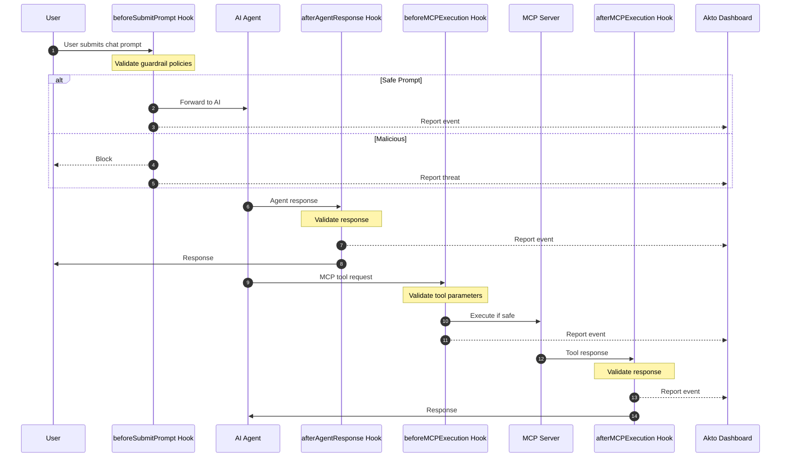

# Cursor Hooks

Akto Guardrails for Cursor provides comprehensive security monitoring and validation for both **chat interactions** and **MCP tool executions**. It intercepts all agent operations, validates against security policies, blocks risky behavior, and reports events to your Akto dashboard.

## Key Features

* ✅ **Zero Installation** - No standalone apps or packages to install
* ✅ **Comprehensive Coverage** - Monitors both chat prompts/responses and MCP requests/responses
* ✅ **Transparent Integration** - Uses Cursor's native hook mechanism
* ✅ **Real-time Protection** - Intercepts every interaction before execution
* ✅ **Centralized Monitoring** - All events reported to Akto dashboard
* ✅ **Flexible Deployment** - Supports both Argus and Atlas modes

## How It Works

Cursor's hook system executes custom scripts at four critical points:



**4 Hook Points:**
1. `beforeSubmitPrompt` - Validates chat prompts before sending to AI
2. `afterAgentResponse` - Validates AI responses before displaying
3. `beforeMCPExecution` - Validates MCP tool requests before execution
4. `afterMCPExecution` - Validates MCP tool responses

## File Structure

```
~/.cursor/
├── hooks/
│   └── akto/
│       ├── akto-validate-chat-prompt-wrapper.sh       # Chat prompt wrapper
│       ├── akto-validate-chat-prompt.py               # Chat prompt validation
│       ├── akto-validate-chat-response-wrapper.sh     # Chat response wrapper
│       ├── akto-validate-chat-response.py             # Chat response validation
│       ├── akto-validate-mcp-request-wrapper.sh       # MCP request wrapper
│       ├── akto-validate-mcp-request.py               # MCP request validation
│       ├── akto-validate-mcp-response-wrapper.sh      # MCP response wrapper
│       ├── akto-validate-mcp-response.py              # MCP response validation
│       └── akto_machine_id.py                         # Device ID utility
├── akto/
│   ├── chat-logs/
│   │   ├── akto-validate-chat-prompt.log
│   │   └── akto-validate-chat-response.log
│   └── mcp-logs/
│       ├── akto-validate-request.log
│       └── akto-validate-response.log
└── hooks.json                                          # Hook configuration
```

**Key Files:**
* **Wrapper scripts (`.sh`)**: Set environment variables, invoke Python scripts
  * ⚠️ **Contains `AKTO_DATA_INGESTION_URL` placeholder** - Must be replaced with your Akto instance URL
* **Python scripts (`.py`)**: Core validation logic and Akto API communication
* **`akto_machine_id.py`**: Generates unique device identifiers for Atlas mode
* **`hooks.json`**: Links hooks to wrapper scripts

## Setup Guide

### Prerequisites

* Cursor IDE (version 0.40+ with hooks support)
* Akto instance URL
* macOS, Linux, or Windows with bash/zsh

### Installation Steps



**Create Directories**

```bash
mkdir -p ~/.cursor/hooks/akto
mkdir -p ~/.cursor/akto/chat-logs
mkdir -p ~/.cursor/akto/mcp-logs
```



**Download Hook Scripts**

```bash
# Base URL for downloading hooks
HOOKS_BASE="https://raw.githubusercontent.com/akto-api-security/akto/agent-hooks/apps/mcp-endpoint-shield/cursor-hooks"

# Download chat validation hooks
curl -o ~/.cursor/hooks/akto/akto-validate-chat-prompt-wrapper.sh \
  "${HOOKS_BASE}/akto-validate-chat-prompt-wrapper.sh"
curl -o ~/.cursor/hooks/akto/akto-validate-chat-prompt.py \
  "${HOOKS_BASE}/akto-validate-chat-prompt.py"
curl -o ~/.cursor/hooks/akto/akto-validate-chat-response-wrapper.sh \
  "${HOOKS_BASE}/akto-validate-chat-response-wrapper.sh"
curl -o ~/.cursor/hooks/akto/akto-validate-chat-response.py \
  "${HOOKS_BASE}/akto-validate-chat-response.py"

# Download MCP validation hooks
curl -o ~/.cursor/hooks/akto/akto-validate-mcp-request-wrapper.sh \
  "${HOOKS_BASE}/akto-validate-mcp-request-wrapper.sh"
curl -o ~/.cursor/hooks/akto/akto-validate-mcp-request.py \
  "${HOOKS_BASE}/akto-validate-mcp-request.py"
curl -o ~/.cursor/hooks/akto/akto-validate-mcp-response-wrapper.sh \
  "${HOOKS_BASE}/akto-validate-mcp-response-wrapper.sh"
curl -o ~/.cursor/hooks/akto/akto-validate-mcp-response.py \
  "${HOOKS_BASE}/akto-validate-mcp-response.py"

# Download utility
curl -o ~/.cursor/hooks/akto/akto_machine_id.py \
  "${HOOKS_BASE}/akto_machine_id.py"

# Make executable
chmod +x ~/.cursor/hooks/akto/*.sh
```



**Configure Akto Ingestion URL** ⚠️ **CRITICAL STEP**


All wrapper scripts contain placeholder `{{AKTO_DATA_INGESTION_URL}}` that **must be replaced** with your actual Akto instance URL.


**Automated replacement:**

```bash
# Set your Akto ingestion URL
AKTO_URL="https://your-akto-instance.com"

# Update all wrapper scripts
sed -i.bak "s|{{AKTO_DATA_INGESTION_URL}}|${AKTO_URL}|g" ~/.cursor/hooks/akto/*-wrapper.sh

# Verify replacement
grep "AKTO_DATA_INGESTION_URL" ~/.cursor/hooks/akto/*-wrapper.sh
```

**Manual replacement (alternative):**

Edit each wrapper script and replace:
```bash
AKTO_DATA_INGESTION_URL="{{AKTO_DATA_INGESTION_URL}}"
```
With:
```bash
AKTO_DATA_INGESTION_URL="https://your-akto-instance.com"
```

Files to update:
- `akto-validate-chat-prompt-wrapper.sh`
- `akto-validate-chat-response-wrapper.sh`
- `akto-validate-mcp-request-wrapper.sh`
- `akto-validate-mcp-response-wrapper.sh`



**Configure Hooks**

Create Cursor hooks configuration:

```bash
cat > ~/.cursor/hooks.json << 'EOF'
{
  "version": 1,
  "hooks": {
    "beforeSubmitPrompt": [
      {
        "command": "bash ~/.cursor/hooks/akto/akto-validate-chat-prompt-wrapper.sh",
        "timeout": 10
      }
    ],
    "afterAgentResponse": [
      {
        "command": "bash ~/.cursor/hooks/akto/akto-validate-chat-response-wrapper.sh",
        "timeout": 10
      }
    ],
    "beforeMCPExecution": [
      {
        "command": "bash ~/.cursor/hooks/akto/akto-validate-mcp-request-wrapper.sh",
        "timeout": 10
      }
    ],
    "afterMCPExecution": [
      {
        "command": "bash ~/.cursor/hooks/akto/akto-validate-mcp-response-wrapper.sh",
        "timeout": 10
      }
    ]
  }
}
EOF
```



**Configure Hook Behavior (Optional)**

Edit wrapper scripts to customize:

```bash
# In each *-wrapper.sh file:

MODE="atlas"                    # "argus" or "atlas"
AKTO_SYNC_MODE="true"          # "true" (blocking) or "false" (observe only)
AKTO_TIMEOUT="5"               # Timeout in seconds
AKTO_CONNECTOR="claude_code_cli"
```

**Mode Options:**
* **Argus**: Standard validation and reporting
* **Atlas**: Includes device-specific metadata

**Sync Mode:**
* **true**: Blocks threats
* **false**: Reports but allows execution



**Restart Cursor**

```bash
# Close all Cursor windows and reopen
# Or use Cmd+Q (macOS) / Alt+F4 (Windows/Linux)
```



**Verify Installation**

Check logs to confirm hooks are working:

```bash
# View chat logs
tail -f ~/.cursor/akto/chat-logs/akto-validate-chat-prompt.log
tail -f ~/.cursor/akto/chat-logs/akto-validate-chat-response.log

# View MCP logs
tail -f ~/.cursor/akto/mcp-logs/akto-validate-request.log
tail -f ~/.cursor/akto/mcp-logs/akto-validate-response.log
```

Test by typing a message in Cursor's chat or using an MCP tool. You should see log entries indicating validation occurred.



## Configuration Reference

### Wrapper Script Variables

```bash
MODE="atlas"                                            # "argus" or "atlas"
AKTO_DATA_INGESTION_URL="{{AKTO_DATA_INGESTION_URL}}"  # ⚠️ MUST REPLACE
AKTO_SYNC_MODE="true"                                  # "true" or "false"
AKTO_TIMEOUT="5"                                       # Timeout in seconds
AKTO_CONNECTOR="claude_code_cli"                       # Connector identifier
```

### Environment Variables (Optional)

Override defaults via environment variables:

```bash
export MODE="atlas"
export AKTO_DATA_INGESTION_URL="https://your-akto-instance.com"
export AKTO_SYNC_MODE="true"
export AKTO_TIMEOUT="5"
```

## Troubleshooting

### Hooks Not Executing

```bash
# Check hooks.json exists and is valid
cat ~/.cursor/hooks.json | python3 -m json.tool

# Verify scripts are executable
ls -la ~/.cursor/hooks/akto/
chmod +x ~/.cursor/hooks/akto/*.sh

# Restart Cursor completely
killall Cursor && open -a Cursor
```

### Ingestion URL Not Configured

```bash
# Check if placeholder still exists
grep "{{AKTO_DATA_INGESTION_URL}}" ~/.cursor/hooks/akto/*-wrapper.sh

# Replace with actual URL
AKTO_URL="https://your-akto-instance.com"
sed -i.bak "s|{{AKTO_DATA_INGESTION_URL}}|${AKTO_URL}|g" ~/.cursor/hooks/akto/*-wrapper.sh
```

### Check Logs for Errors

```bash
# View chat logs
cat ~/.cursor/akto/chat-logs/akto-validate-chat-prompt.log
cat ~/.cursor/akto/chat-logs/akto-validate-chat-response.log

# View MCP logs
cat ~/.cursor/akto/mcp-logs/akto-validate-request.log
cat ~/.cursor/akto/mcp-logs/akto-validate-response.log
```

### Events Not in Dashboard

```bash
# Test API connectivity
curl -X POST "${AKTO_DATA_INGESTION_URL}/api/v1/events" \
  -H "Content-Type: application/json" \
  -d '{"test": "event"}'

# Verify URL in wrapper scripts
grep "AKTO_DATA_INGESTION_URL" ~/.cursor/hooks/akto/*-wrapper.sh
```

## Uninstallation

To completely remove Akto hooks from Cursor:

### Complete Removal

```bash
# 1. Remove hook configuration
rm ~/.cursor/hooks.json

# 2. Remove Akto hook scripts
rm -rf ~/.cursor/hooks/akto/

# 3. Remove Akto logs (optional - keeps historical data if skipped)
rm -rf ~/.cursor/akto/

# 4. Restart Cursor
killall Cursor && open -a Cursor
```

### Selective Removal (Keep Logs)

If you want to preserve logs for audit purposes:

```bash
# Remove only hooks and configuration
rm ~/.cursor/hooks.json
rm -rf ~/.cursor/hooks/akto/

# Restart Cursor
killall Cursor && open -a Cursor
```

### Backup Before Removal

```bash
# Backup configuration and logs before removal
mkdir -p ~/akto-backup
cp ~/.cursor/hooks.json ~/akto-backup/cursor-hooks.json.bak
cp -r ~/.cursor/akto/ ~/akto-backup/cursor-akto-logs/

# Then proceed with removal steps above
```

### Verify Removal

```bash
# Check that hooks are removed
test -f ~/.cursor/hooks.json && echo "⚠️  hooks.json still exists" || echo "✅ hooks.json removed"
test -d ~/.cursor/hooks/akto && echo "⚠️  Hook scripts still exist" || echo "✅ Hook scripts removed"

# Check if logs are removed (if you chose to remove them)
test -d ~/.cursor/akto && echo "ℹ️  Logs still present" || echo "✅ Logs removed"
```

### Restore Cursor to Default

After uninstallation, Cursor will operate without Akto security monitoring. No restart or additional configuration is needed beyond removing the files.

## Enterprise Deployment

### Automated Deployment Script

```bash
#!/bin/bash
# deploy-cursor-hooks.sh

set -e
AKTO_URL="${1:-https://your-akto-instance.com}"

echo "🔧 Installing Akto Guardrails for Cursor..."

# Create directories
mkdir -p ~/.cursor/hooks/akto ~/.cursor/akto/chat-logs ~/.cursor/akto/mcp-logs

# Download hooks
HOOKS_BASE="https://raw.githubusercontent.com/akto-api-security/akto/agent-hooks/apps/mcp-endpoint-shield/cursor-hooks"
curl -s "${HOOKS_BASE}/akto-validate-chat-prompt-wrapper.sh" -o ~/.cursor/hooks/akto/akto-validate-chat-prompt-wrapper.sh
curl -s "${HOOKS_BASE}/akto-validate-chat-prompt.py" -o ~/.cursor/hooks/akto/akto-validate-chat-prompt.py
curl -s "${HOOKS_BASE}/akto-validate-chat-response-wrapper.sh" -o ~/.cursor/hooks/akto/akto-validate-chat-response-wrapper.sh
curl -s "${HOOKS_BASE}/akto-validate-chat-response.py" -o ~/.cursor/hooks/akto/akto-validate-chat-response.py
curl -s "${HOOKS_BASE}/akto-validate-mcp-request-wrapper.sh" -o ~/.cursor/hooks/akto/akto-validate-mcp-request-wrapper.sh
curl -s "${HOOKS_BASE}/akto-validate-mcp-request.py" -o ~/.cursor/hooks/akto/akto-validate-mcp-request.py
curl -s "${HOOKS_BASE}/akto-validate-mcp-response-wrapper.sh" -o ~/.cursor/hooks/akto/akto-validate-mcp-response-wrapper.sh
curl -s "${HOOKS_BASE}/akto-validate-mcp-response.py" -o ~/.cursor/hooks/akto/akto-validate-mcp-response.py
curl -s "${HOOKS_BASE}/akto_machine_id.py" -o ~/.cursor/hooks/akto/akto_machine_id.py

# Make executable
chmod +x ~/.cursor/hooks/akto/*.sh

# Configure URL
sed -i.bak "s|{{AKTO_DATA_INGESTION_URL}}|${AKTO_URL}|g" ~/.cursor/hooks/akto/*-wrapper.sh

# Create hooks.json
cat > ~/.cursor/hooks.json << 'EOFHOOKS'
{
  "version": 1,
  "hooks": {
    "beforeSubmitPrompt": [{"command": "bash ~/.cursor/hooks/akto/akto-validate-chat-prompt-wrapper.sh", "timeout": 10}],
    "afterAgentResponse": [{"command": "bash ~/.cursor/hooks/akto/akto-validate-chat-response-wrapper.sh", "timeout": 10}],
    "beforeMCPExecution": [{"command": "bash ~/.cursor/hooks/akto/akto-validate-mcp-request-wrapper.sh", "timeout": 10}],
    "afterMCPExecution": [{"command": "bash ~/.cursor/hooks/akto/akto-validate-mcp-response-wrapper.sh", "timeout": 10}]
  }
}
EOFHOOKS

echo "✅ Installation complete! Restart Cursor."
echo "📍 Akto instance: ${AKTO_URL}"
```

**Deploy to developers:**

```bash
curl -fsSL https://your-org.com/deploy-cursor-hooks.sh | bash -s https://your-akto-instance.com
```

## Quick Setup Summary

```bash
# 1. Create directories
mkdir -p ~/.cursor/hooks/akto ~/.cursor/akto/chat-logs ~/.cursor/akto/mcp-logs

# 2. Download all hook scripts from GitHub (see step 2 above)

# 3. ⚠️ Configure Akto URL (REQUIRED)
AKTO_URL="https://your-akto-instance.com"
sed -i.bak "s|{{AKTO_DATA_INGESTION_URL}}|${AKTO_URL}|g" ~/.cursor/hooks/akto/*-wrapper.sh

# 4. Make executable
chmod +x ~/.cursor/hooks/akto/*.sh

# 5. Create hooks.json (see step 4 above)

# 6. Restart Cursor
```

## Comparison with Claude CLI Hooks

| Feature                | Cursor Hooks                          | Claude CLI Hooks                     |
| ---------------------- | ------------------------------------- | ------------------------------------ |
| **Platform**           | Cursor IDE                            | Claude CLI                           |
| **Hook Points**        | 4 (Chat + MCP, each with req/resp)   | 2 (Prompt + Response)                |
| **Chat Monitoring**    | ✅ Yes (beforeSubmitPrompt, afterAgentResponse) | ✅ Yes (UserPromptSubmit, Stop) |
| **MCP Tool Monitoring**| ✅ Yes (beforeMCPExecution, afterMCPExecution) | ❌ No                          |
| **Total Files**        | 10 files (4 wrappers, 4 Python, 1 utility, 1 config) | 6 files (2 wrappers, 2 Python, 1 utility, 1 config) |
| **Configuration File** | `~/.cursor/hooks.json`                | `~/.claude/settings.json`            |
| **Chat Log Location**  | `~/.cursor/akto/chat-logs/`           | `~/.claude/akto/logs/`               |
| **MCP Log Location**   | `~/.cursor/akto/mcp-logs/`            | N/A                                  |
| **Setup Complexity**   | More files, more comprehensive        | Fewer files, simpler                 |

**See also:** [Claude CLI Hooks](claude-cli-hooks.md) for Claude CLI setup

## Resources

* **GitHub**: [https://github.com/akto-api-security/akto](https://github.com/akto-api-security/akto)
* **Support**: [help@akto.io](mailto:help@akto.io)
* **Community**: [https://www.akto.io/community](https://www.akto.io/community)
