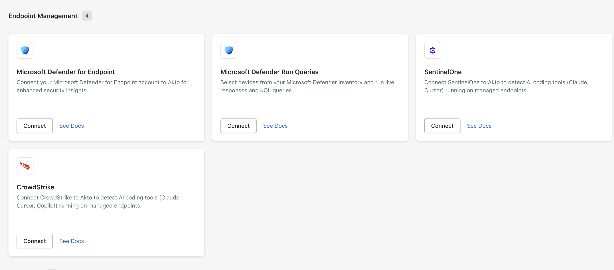
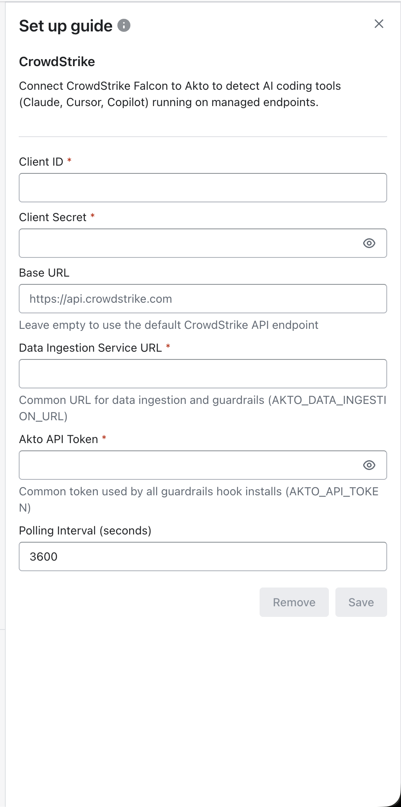
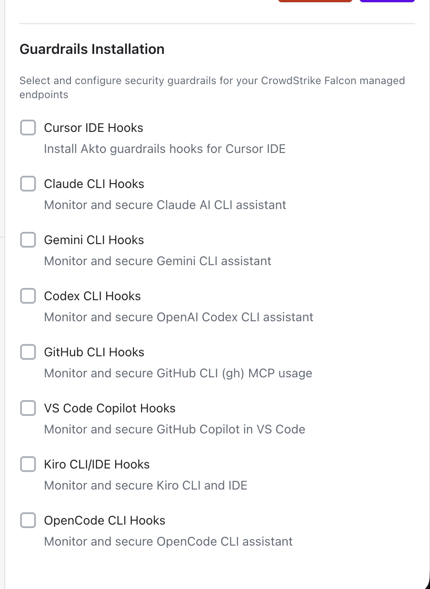

# Deploy via CrowdStrike

## Overview

CrowdStrike Falcon provides centralized visibility and management for enterprise endpoints.\
Akto integrates with CrowdStrike to help security teams discover AI coding tools and deploy guardrails on managed devices.

With this integration, you can:

* Discover AI agents and AI coding tools running on CrowdStrike-managed endpoints
* Configure and deploy guardrails for selected devices directly from Akto

## Prerequisites

Before connecting CrowdStrike to Akto, ensure the following:

* **CrowdStrike Falcon API Client** with a valid **Client ID** and **Client Secret**
* **CrowdStrike Base URL** (defaults to `https://api.crowdstrike.com` if left empty)
* **Akto Data Ingestion Service URL** (`AKTO_DATA_INGESTION_URL`)
* **Akto API Token** (`AKTO_API_TOKEN`)


Your CrowdStrike API client should have sufficient scope to access endpoint inventory and run integration actions for your organization.


### How Akto Discovers AI Agents via CrowdStrike

Akto uses the CrowdStrike Falcon **device inventory** API to list and read details of managed hosts, and the **Real Time Response (RTR)** API to run discovery scripts on those hosts that scan for installed AI coding tools, CLI agents, and MCP configuration files. The same RTR capability is used to push and execute the Akto guardrail hook installation scripts when you run guardrails from Akto.

### Required CrowdStrike API Client Scopes

Akto authenticates to CrowdStrike Falcon using the OAuth 2.0 client credentials flow (`Client ID` / `Client Secret`). When creating the API client in the Falcon console, grant it the following scopes:

| Scope | Why Akto needs it |
| --- | --- |
| **Hosts: Read** | List managed devices and read device details, used to identify targets for discovery and guardrail deployment. |
| **Real Time Response: Read** | Initiate and close RTR sessions (including batch sessions) on managed hosts. |
| **Real Time Response (Admin): Write** | Upload/update discovery and guardrail scripts to the RTR script library, and run those scripts on hosts (`runscript`) to detect AI tools and install guardrail hooks. |


`Real Time Response (Admin): Write` is required even for read-only discovery, because uploading and executing scripts via RTR's `runscript` action requires the admin scope. An API client with only the base `Real Time Response: Read/Write` scope (non-admin) will get **403 Forbidden** errors on script upload and execution.


## Steps to Integrate

The integration flow has two stages:

1. Connect CrowdStrike in Akto to discover AI agents on managed endpoints
2. Configure and run guardrails on selected devices



**Connect CrowdStrike to Akto**

1. Open **Akto ATLAS Dashboard**.
2. Go to Connectors.
3. Go to **Endpoint Management**.
4.  Select **CrowdStrike** and click **Connect**.

    
<figure><figcaption></figcaption></figure>

5. Fill in the following fields:

* **Client ID**: CrowdStrike Falcon API client ID
* **Client Secret**: CrowdStrike Falcon API client secret
* **Base URL**: `https://api.crowdstrike.com` (leave empty to use the default CrowdStrike API endpoint)
* **Data Ingestion Service URL**: your Akto ingestion endpoint (`AKTO_DATA_INGESTION_URL`), common URL used for data ingestion and guardrails
* **Akto API Token**: common token used by all guardrail hook installs (`AKTO_API_TOKEN`)
*   **Polling Interval (seconds)**: keep default or set based on your monitoring preference

    
<figure><figcaption></figcaption></figure>

6. Click **Save**.

After saving, Akto starts discovering AI coding tools and related agent activity from CrowdStrike-managed endpoints.



**Discover AI Agents on Managed Endpoints**

Once integration is active, Akto uses CrowdStrike Falcon telemetry to identify AI tooling usage (for example Cursor, Claude, Copilot, and other supported agent clients) on managed devices.

You can then:

* Review discovered endpoints in Akto
* Select target devices for guardrail deployment
* Continue monitoring newly discovered devices as polling runs



**Configure and Run Guardrails**

1. Open the CrowdStrike integration setup in Akto.
2.  In **Guardrails Installation**, choose the guardrails you want to deploy for your CrowdStrike Falcon managed endpoints.

    
<figure><figcaption></figcaption></figure>

3. Select specific devices, or use **Run on all devices**.
4. Click **Save & Run Guardrails**.

Each guardrail installs the corresponding Akto hook on the selected devices, using `AKTO_DATA_INGESTION_URL` and `AKTO_API_TOKEN` as the default ingestion destination and auth token. Guardrails that require additional environment values (for example provider API keys or model IDs) will show those input fields dynamically in the setup panel.


For guardrails that require additional environment values, Akto displays the required input fields dynamically in the setup panel.




## Operational Notes

* Use a CrowdStrike Falcon API client with sufficient scope for reliable integration setup.
* Use a valid `AKTO_DATA_INGESTION_URL` that is reachable from managed endpoints.
* Use a valid `AKTO_API_TOKEN` so guardrail hook installs can authenticate with Akto.
* Polling interval controls how frequently Akto refreshes endpoint discovery data.
* Guardrails can be deployed to selected devices or across all managed devices.

## Get Support for your Akto setup

There are multiple ways to request support from Akto. We are 24X7 available on the following:

1. In-app `intercom` support. Message us with your query on intercom in Akto dashboard and someone will reply.
2. Join our [discord channel](https://www.akto.io/community) for community support.
3. Contact `support@akto.io` for email support.
