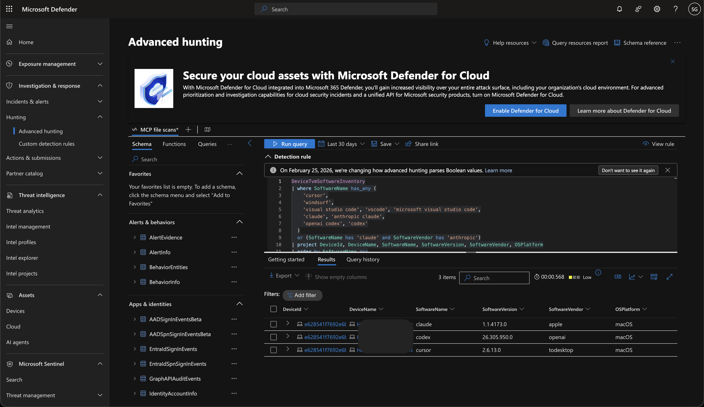
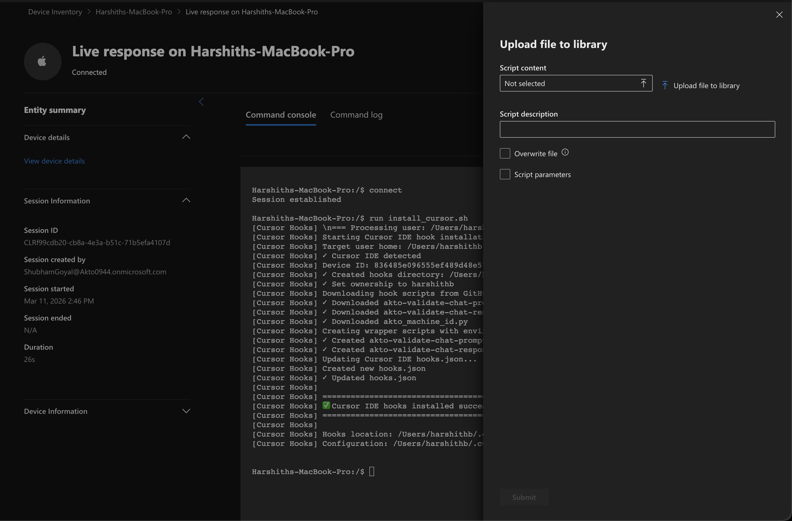
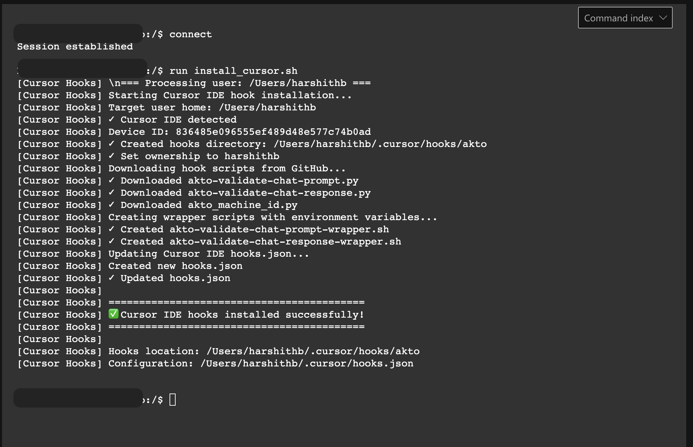

# Deploy via Microsoft Defender Endpoint

## Overview

Microsoft Defender for Endpoint provides centralized visibility and remote management for enterprise devices. Microsoft Defender Live Response allows you to run scripts remotely on managed devices.

You can use Microsoft Defender Live Response to deploy the Akto MCP Endpoint Shield hook on developer machines. Hook installation enables Akto to monitor agent interactions from tools such as Cursor, Claude, or Gemini.

## Prerequisites

Microsoft Defender integration requires the following environment configuration.

* Administrator access to the **Microsoft Defender portal**
* **Microsoft Defender for Endpoint license**
* Devices onboarded to **Microsoft Defender for Endpoint**
* Supported operating systems: **macOS, Windows, Linux**

<div data-with-frame="true"><figure><figcaption></figcaption></figure></div>

Devices must be onboarded using one of the supported onboarding methods:

* **Microsoft Intune onboarding**
* **Local onboarding script or installation package**

Verify device enrolment before running queries or deploying hooks.

1. Open the **Microsoft Defender portal**.
2. Navigate to **Assets → Devices**.
3. Confirm that device status shows **Active**.

Active device status confirms that Microsoft Defender receives endpoint telemetry.

## Steps to Deploy

The deployment workflow consists of two stages:

1. Optional visibility queries to identify AI agents and MCP usage across devices.
2. Installation of the Akto MCP Endpoint Shield hook on developer machines.



#### (Optional) Identify AI Agent Software Installed on Devices

Software inventory queries help you identify which AI development tools exist across enterprise devices.

1. Open the **Microsoft Defender portal**.
2.  Navigate to **Investigation & response → Hunting → Advanced hunting**.

    <div data-with-frame="true"><figure><figcaption></figcaption></figure></div>
3. Paste the following query into the query editor.
4. Replace `<your-device-name>` with a hostname from the **Devices** inventory.
5. Click **Run query**.

```kql
DeviceTvmSoftwareInventory
| where DeviceName contains "<your-device-name>"
| where SoftwareName has_any (
    'cursor',
    'windsurf',
    'visual studio code', 'vscode', 'microsoft visual studio code',
    'claude', 'anthropic claude',
    'openai codex', 'codex'
  )
  or (SoftwareName has 'claude' and SoftwareVendor has 'anthropic')
| project DeviceId, DeviceName, SoftwareName, SoftwareVersion, SoftwareVendor, OSPlatform
| order by SoftwareName asc
```

Query results show devices where AI tools such as **Cursor, Windsurf, Claude, VS Code, or Codex** are installed.

Remove the `DeviceName` filter to scan the entire device fleet.



#### (Optional) Identify AI CLI Activity on Devices

Process telemetry queries help you determine which devices actively run AI CLI agents.

1. Open **Advanced hunting** in the Microsoft Defender portal.
2. Paste the following query into the query editor.
3. Replace `<your-device-name>` with the target device hostname.
4. Click **Run query**.

```kql
DeviceProcessEvents
| where DeviceName contains "<your-device-name>"
| extend fn = tolower(FileName),
         cmd = tolower(ProcessCommandLine),
         icmd = tolower(InitiatingProcessCommandLine)
| where
    fn in ("gh","gh.exe","claude","claude.exe","agent","agent.exe","gemini","gemini.exe","codex","codex.exe")
    or cmd has_any (" gh ", "gh copilot", " github copilot", " claude ", " claude-code ", " agent ", " gemini ", " codex ")
    or icmd has_any (" gh ", "gh copilot", " github copilot", " claude ", " claude-code ", " agent ", " gemini ", " codex ")
| extend Tool = case(
    fn startswith "gh" or cmd has "gh copilot" or cmd has " gh ", "GitHub CLI",
    fn startswith "claude" or cmd has " claude " or cmd has " claude-code ", "Claude CLI",
    fn startswith "agent" or cmd has " agent ", "Cursor CLI",
    fn startswith "gemini" or cmd has " gemini ", "Gemini CLI",
    fn startswith "codex" or cmd has " codex ", "Codex CLI",
    "Other/Unknown"
)
| project Timestamp, DeviceId, DeviceName, Tool, FileName, FolderPath, ProcessCommandLine, InitiatingProcessFileName, InitiatingProcessCommandLine, AccountName
| order by Timestamp desc
| limit 200
```

Query results show which CLI tools run on enterprise devices, including **Claude CLI, GitHub Copilot CLI, Gemini CLI, Codex CLI, and Cursor CLI**.



#### (Optional) Detect MCP Configuration File Usage

MCP configuration files often define agent integrations and tool execution paths. Process telemetry queries help you detect devices referencing MCP configuration files.

1. Open **Advanced hunting** in the Microsoft Defender portal.
2. Paste the following query into the editor.
3. Replace `<your-device-name>` with the device hostname.
4. Click **Run query**.

```kql
DeviceProcessEvents
| where DeviceName contains "<your-device-name>"
| where ProcessCommandLine has 'mcp.json'
    or ProcessCommandLine has 'mcp_config.json'
    or ProcessCommandLine has 'claude_desktop_config.json'
    or InitiatingProcessCommandLine has 'mcp.json'
    or InitiatingProcessCommandLine has 'mcp_config.json'
    or InitiatingProcessCommandLine has 'claude_desktop_config.json'
| extend ExtractedPath = extract(@'([^\s"]+(?:mcp\.json|mcp_config\.json|claude_desktop_config\.json))', 1, coalesce(ProcessCommandLine, InitiatingProcessCommandLine))
| where isnotempty(ExtractedPath)
| summarize LastSeen=max(Timestamp) by DeviceId, DeviceName, ExtractedPath, FileName
| order by LastSeen desc
| limit 100
```

Query results show devices referencing MCP configuration files such as:

* `mcp.json`
* `mcp_config.json`
* `claude_desktop_config.json`

You can modify the query to add or remove file names depending on the MCP configurations used in your environment.



#### Request the MCP Endpoint Shield Hook Script from Akto

MCP Endpoint Shield deployment requires a hook installation script provided by Akto.


Contact the **Akto support team at** [**support@akto.io**](mailto:support@akto.io) to obtain the required hook script.




#### Upload the Hook Script to the Microsoft Defender Live Response Library

Microsoft Defender Live Response allows you to run scripts remotely on enterprise devices.

1. Open the **Microsoft Defender portal**.
2. Navigate to **Settings**.
3. Select **Endpoints → General → Live response library**.
4.  Click **Upload file**.

    <div data-with-frame="true"><figure><figcaption></figcaption></figure></div>
5. Upload the hook script received from the Akto support team.

Example script files include:

* `install_cursor_hooks.sh`
* `install_claude_hooks.sh`

6. Add a description such as **Akto – Install MCP Endpoint Shield hooks**.
7. Click **Save**.

The script must exist in the Live Response library before execution. Upload the script again whenever the script version changes.



#### Run the Hook Script on a Device Using Live Response

Microsoft Defender Live Response allows script execution on individual devices.

1. Open the **Microsoft Defender portal**.
2. Navigate to **Assets → Devices**.
3. Select the target device.
4. Open the device details page.
5. Click **Initiate live response session**.
6. Wait until the Live Response session connects. Session initialization may take **up to two minutes**.
7.  After the Live Response console opens, run the hook installation command.

    Here we have taken the cursor hook script example:

    ```bash
    run install_cursor.sh -parameters "AKTO_DATA_INGESTION_URL=<your.guardrails.akto.io>"
    ```

The script name must match the file uploaded to the Live Response library.

The console displays execution output as the script runs.

<div data-with-frame="true"><figure><figcaption></figcaption></figure></div>

*   Successful execution ends with:

    ```
    ✅ Cursor IDE hooks installed successfully!
    ```
*   Devices without the required IDE installed exit safely with the following output:

    ```
    Cursor IDE not detected - skipping hook installation
    ```



## Operational Notes

* Microsoft Defender **Live Response requires Microsoft Defender for Endpoint Plan 2**.
* Microsoft Defender Advanced Hunting queries support a **maximum time range of 30 days**.
* Queries scope to a single device by default using `DeviceName contains`.
* Removing the device filter runs queries across the entire device fleet and may return larger result sets.

## Get Support for your Akto setup

There are multiple ways to request support from Akto. We are 24X7 available on the following:

1. In-app `intercom` support. Message us with your query on intercom in Akto dashboard and someone will reply.
2. Join our [discord channel](https://www.akto.io/community) for community support.
3. Contact `support@akto.io` for email support.
