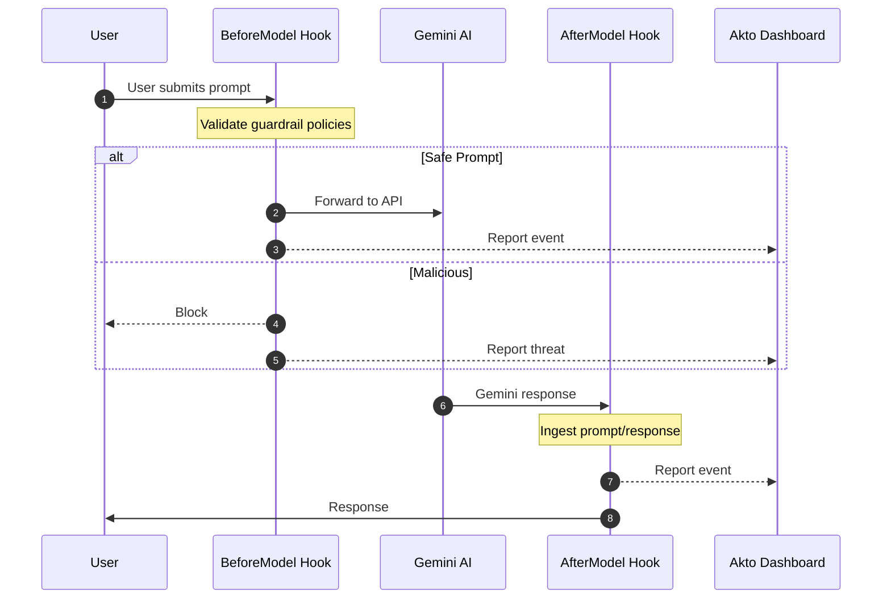

# Gemini CLI Hooks

Akto Guardrails for Gemini CLI provides security validation for AI interactions. It intercepts prompts before sending to Gemini and responses after generation, validates against security policies, blocks risky behavior, and reports events to your Akto dashboard.

## Key Features

* ✅ **Zero Installation** - No standalone apps to install
* ✅ **Transparent Integration** - Uses Gemini CLI's native hook mechanism
* ✅ **Real-time Protection** - Validates every prompt and response
* ✅ **Centralized Monitoring** - All events reported to Akto dashboard
* ✅ **Flexible Deployment** - Supports Argus and Atlas modes (project or user-level)
* ✅ **Configurable Behavior** - Blocking or observation modes

## How It Works

Gemini CLI's hook system executes custom scripts at two critical points:



**2 Hook Points:**
1. `BeforeModel` - Validates prompts before sending to Gemini API
2. `AfterModel` - Ingests prompt/response when Gemini finishes (final chunk)

## File Structure

```
~/.gemini/
├── hooks/
│   ├── akto-validate-prompt-wrapper.sh       # Prompt validation wrapper
│   ├── akto-validate-prompt.py                # Prompt validation logic
│   ├── akto-validate-response-wrapper.sh      # Response ingestion wrapper
│   ├── akto-validate-response.py              # Response ingestion logic
│   └── akto_machine_id.py                     # Device ID utility
├── akto/
│   └── chat-logs/                             # Optional local logs
└── settings.json                              # Hook configuration
```

**Key Files:**
* **Wrapper scripts (`.sh`)**: Set environment variables, invoke Python scripts
  * ⚠️ **Contains `AKTO_DATA_INGESTION_URL` placeholder** - Must be replaced with your Akto instance URL
* **Python scripts (`.py`)**: Core validation logic and Akto API communication
* **`akto_machine_id.py`**: Generates unique device identifiers for Atlas mode
* **`settings.json`**: Links hooks to wrapper scripts

> **Note:** Gemini CLI also supports project-level setup (`.gemini/hooks/` and `.gemini/settings.json` in your project root). Config precedence: project → user → system.

## Setup Guide

### Prerequisites

* Gemini CLI installed and configured ([Gemini CLI](https://geminicli.com/))
* Akto instance URL
* Python 3
* macOS or Linux with bash/zsh

### Installation Steps



**Create Directories**

```bash
mkdir -p ~/.gemini/hooks
mkdir -p ~/.gemini/akto/chat-logs
```



**Download Hook Scripts**

```bash
# Base URL for downloading hooks
HOOKS_BASE="https://raw.githubusercontent.com/akto-api-security/akto/apps/mcp-endpoint-shield/gemini-cli-hooks"

# Download prompt validation hooks
curl -o ~/.gemini/hooks/akto-validate-prompt-wrapper.sh \
  "${HOOKS_BASE}/akto-validate-prompt-wrapper.sh"
curl -o ~/.gemini/hooks/akto-validate-prompt.py \
  "${HOOKS_BASE}/akto-validate-prompt.py"

# Download response ingestion hooks
curl -o ~/.gemini/hooks/akto-validate-response-wrapper.sh \
  "${HOOKS_BASE}/akto-validate-response-wrapper.sh"
curl -o ~/.gemini/hooks/akto-validate-response.py \
  "${HOOKS_BASE}/akto-validate-response.py"

# Download utility
curl -o ~/.gemini/hooks/akto_machine_id.py \
  "${HOOKS_BASE}/akto_machine_id.py"

# Make executable
chmod +x ~/.gemini/hooks/*.sh
```



**Configure Akto Ingestion URL** ⚠️ **CRITICAL STEP**


All wrapper scripts contain placeholder `{{AKTO_DATA_INGESTION_URL}}` that **must be replaced** with your actual Akto instance URL.


**Automated replacement:**

```bash
# Set your Akto ingestion URL
AKTO_URL="https://your-akto-instance.com"

# Update all wrapper scripts
sed -i.bak "s|{{AKTO_DATA_INGESTION_URL}}|${AKTO_URL}|g" ~/.gemini/hooks/*-wrapper.sh

# Verify replacement
grep "AKTO_DATA_INGESTION_URL" ~/.gemini/hooks/*-wrapper.sh
```

**Manual replacement (alternative):**

Edit each wrapper script and replace:
```bash
AKTO_DATA_INGESTION_URL="{{AKTO_DATA_INGESTION_URL}}"
```
With:
```bash
AKTO_DATA_INGESTION_URL="https://your-akto-instance.com"
```

Files to update:
- `akto-validate-prompt-wrapper.sh`
- `akto-validate-response-wrapper.sh`



**Configure Hooks**

Create Gemini CLI settings configuration (user-level):

```bash
cat > ~/.gemini/settings.json << 'EOF'
{
  "hooks": {
    "BeforeModel": [
      {
        "matcher": "*",
        "hooks": [
          {
            "name": "akto-validate-prompt",
            "type": "command",
            "command": "bash ~/.gemini/hooks/akto-validate-prompt-wrapper.sh",
            "timeout": 10000,
            "description": "Validates prompts against Akto Guardrails"
          }
        ]
      }
    ],
    "AfterModel": [
      {
        "matcher": "*",
        "hooks": [
          {
            "name": "akto-validate-response",
            "type": "command",
            "command": "bash ~/.gemini/hooks/akto-validate-response-wrapper.sh",
            "timeout": 10000,
            "description": "Sends prompt/response pairs to Akto for ingestion"
          }
        ]
      }
    ]
  }
}
EOF
```

> **Note:** Timeout is in milliseconds (10000 = 10 seconds). For project-level setup, use `.gemini/settings.json` and `$GEMINI_PROJECT_DIR/.gemini/hooks/` in the command paths.



**Configure Hook Behavior (Optional)**

Edit wrapper scripts to customize:

```bash
# In each *-wrapper.sh file:

MODE="atlas"                    # "argus" or "atlas"
AKTO_SYNC_MODE="true"          # "true" (blocking) or "false" (observe only)
AKTO_TIMEOUT="5"               # Timeout in seconds
AKTO_CONNECTOR="gemini_cli"
GEMINI_API_URL="https://generativelanguage.googleapis.com"
```

**Mode Options:**
* **Argus**: Standard validation and reporting
* **Atlas**: Includes device-specific metadata

**Sync Mode:**
* **true**: Blocks threats
* **false**: Reports but allows execution



**Install Python Dependencies**

```bash
pip3 install requests

# Verify installation
python3 -c "import requests; print('Requests installed successfully')"
```



**Verify Installation**

Check logs to confirm hooks are working:

```bash
# View logs (if LOG_DIR is set)
tail -f ~/.gemini/akto/chat-logs/*.log
```

Test by running a Gemini command:

```bash
gemini
```

You should see log entries or hook activity. In Gemini CLI, use `/hooks panel` to view hook execution status.



## Configuration Reference

### Wrapper Script Variables

```bash
MODE="atlas"                                            # "argus" or "atlas"
AKTO_DATA_INGESTION_URL="{{AKTO_DATA_INGESTION_URL}}"  # ⚠️ MUST REPLACE
AKTO_SYNC_MODE="true"                                  # "true" or "false"
AKTO_TIMEOUT="5"                                       # Timeout in seconds
AKTO_CONNECTOR="gemini_cli"                            # Connector identifier
GEMINI_API_URL="https://generativelanguage.googleapis.com"
```

### Environment Variables (Optional)

Override defaults via environment variables or config file:

**Option 1: Environment variables**
```bash
export MODE="atlas"
export AKTO_DATA_INGESTION_URL="https://your-akto-instance.com"
export AKTO_SYNC_MODE="true"
export AKTO_TIMEOUT="5"
```

**Option 2: Config file**
```bash
# Create ~/.gemini/akto/config
cat > ~/.gemini/akto/config << 'EOF'
AKTO_DATA_INGESTION_URL=https://your-akto-instance.com
AKTO_TIMEOUT=5
GEMINI_API_URL=https://generativelanguage.googleapis.com
AKTO_SYNC_MODE=true
MODE=atlas
EOF

chmod 600 ~/.gemini/akto/config
```

## Managing Hooks (Gemini CLI)

| Command | Description |
|---------|-------------|
| `/hooks panel` | View hook execution status and recent output |
| `/hooks enable-all` | Enable all hooks |
| `/hooks disable-all` | Disable all hooks |
| `/hooks enable <name>` | Enable a specific hook |
| `/hooks disable <name>` | Disable a specific hook |

## Troubleshooting

### Hooks Not Executing

```bash
# Check settings.json exists and is valid
cat ~/.gemini/settings.json | python3 -m json.tool

# Verify scripts are executable
ls -la ~/.gemini/hooks/
chmod +x ~/.gemini/hooks/*.sh

# Check Gemini CLI and hook panel
gemini
# Then in CLI: /hooks panel
```

### Ingestion URL Not Configured

```bash
# Check if placeholder still exists
grep "{{AKTO_DATA_INGESTION_URL}}" ~/.gemini/hooks/*-wrapper.sh

# Replace with actual URL
AKTO_URL="https://your-akto-instance.com"
sed -i.bak "s|{{AKTO_DATA_INGESTION_URL}}|${AKTO_URL}|g" ~/.gemini/hooks/*-wrapper.sh
```

### Check Logs for Errors

```bash
# View logs (if LOG_DIR is set)
cat ~/.gemini/akto/chat-logs/*.log

# Check for errors
grep -i error ~/.gemini/akto/chat-logs/*.log 2>/dev/null || true
```

### Events Not in Dashboard

```bash
# Test API connectivity
curl -X POST "${AKTO_DATA_INGESTION_URL}/api/v1/events" \
  -H "Content-Type: application/json" \
  -d '{"test": "event"}'

# Verify URL in wrapper scripts
grep "AKTO_DATA_INGESTION_URL" ~/.gemini/hooks/*-wrapper.sh
```

### Python Dependencies Missing

```bash
# Install required packages
pip3 install requests

# Verify installation
python3 -c "import requests; print(requests.__version__)"
```

### Hook Timing Out

Increase timeout in `~/.gemini/settings.json` (value in milliseconds, e.g. `"timeout": 120000`). Ensure `AKTO_DATA_INGESTION_URL` is reachable.

## Uninstallation

To completely remove Akto hooks from Gemini CLI:

### Complete Removal

```bash
# 1. Remove hook configuration
rm ~/.gemini/settings.json

# 2. Remove Akto hook scripts
rm -rf ~/.gemini/hooks/

# 3. Remove Akto logs (optional - keeps historical data if skipped)
rm -rf ~/.gemini/akto/

# 4. No restart needed - Gemini CLI reads settings on each invocation
```

### Selective Removal (Keep Logs)

If you want to preserve logs for audit purposes:

```bash
# Remove only hooks and configuration
rm ~/.gemini/settings.json
rm -rf ~/.gemini/hooks/

# Akto logs preserved in ~/.gemini/akto/
```

### Backup Before Removal

```bash
# Backup configuration and logs before removal
mkdir -p ~/akto-backup
cp ~/.gemini/settings.json ~/akto-backup/gemini-settings.json.bak 2>/dev/null
cp -r ~/.gemini/akto/ ~/akto-backup/gemini-akto-logs/ 2>/dev/null

# Then proceed with removal steps above
```

### Verify Removal

```bash
# Check that hooks are removed
test -f ~/.gemini/settings.json && echo "⚠️  settings.json still exists" || echo "✅ settings.json removed"
test -d ~/.gemini/hooks && echo "⚠️  Hook scripts still exist" || echo "✅ Hook scripts removed"

# Check if logs are removed (if you chose to remove them)
test -d ~/.gemini/akto && echo "ℹ️  Logs still present" || echo "✅ Logs removed"
```

### Restore Gemini CLI to Default

After uninstallation, Gemini CLI will operate without Akto security monitoring. No additional configuration is needed beyond removing the files. Test with:

```bash
gemini
```

## Enterprise Deployment

### Automated Deployment Script

```bash
#!/bin/bash
# deploy-gemini-cli-hooks.sh

set -e
AKTO_URL="${1:-https://your-akto-instance.com}"

echo "🔧 Installing Akto Guardrails for Gemini CLI..."

# Create directories
mkdir -p ~/.gemini/hooks ~/.gemini/akto/chat-logs

# Download hooks
HOOKS_BASE="https://raw.githubusercontent.com/akto-api-security/akto/apps/mcp-endpoint-shield/gemini-cli-hooks"
curl -s "${HOOKS_BASE}/akto-validate-prompt-wrapper.sh" -o ~/.gemini/hooks/akto-validate-prompt-wrapper.sh
curl -s "${HOOKS_BASE}/akto-validate-prompt.py" -o ~/.gemini/hooks/akto-validate-prompt.py
curl -s "${HOOKS_BASE}/akto-validate-response-wrapper.sh" -o ~/.gemini/hooks/akto-validate-response-wrapper.sh
curl -s "${HOOKS_BASE}/akto-validate-response.py" -o ~/.gemini/hooks/akto-validate-response.py
curl -s "${HOOKS_BASE}/akto_machine_id.py" -o ~/.gemini/hooks/akto_machine_id.py

# Make executable
chmod +x ~/.gemini/hooks/*.sh

# Configure URL
sed -i.bak "s|{{AKTO_DATA_INGESTION_URL}}|${AKTO_URL}|g" ~/.gemini/hooks/*-wrapper.sh

# Create config file
cat > ~/.gemini/akto/config << EOFCONFIG
AKTO_DATA_INGESTION_URL=${AKTO_URL}
AKTO_TIMEOUT=5
GEMINI_API_URL=https://generativelanguage.googleapis.com
AKTO_SYNC_MODE=true
MODE=atlas
EOFCONFIG
chmod 600 ~/.gemini/akto/config

# Create settings.json
cat > ~/.gemini/settings.json << 'EOFSETTINGS'
{
  "hooks": {
    "BeforeModel": [
      {
        "matcher": "*",
        "hooks": [
          {
            "name": "akto-validate-prompt",
            "type": "command",
            "command": "bash ~/.gemini/hooks/akto-validate-prompt-wrapper.sh",
            "timeout": 10000,
            "description": "Validates prompts against Akto Guardrails"
          }
        ]
      }
    ],
    "AfterModel": [
      {
        "matcher": "*",
        "hooks": [
          {
            "name": "akto-validate-response",
            "type": "command",
            "command": "bash ~/.gemini/hooks/akto-validate-response-wrapper.sh",
            "timeout": 10000,
            "description": "Sends prompt/response pairs to Akto for ingestion"
          }
        ]
      }
    ]
  }
}
EOFSETTINGS

# Install dependencies
pip3 install requests

echo "✅ Installation complete!"
echo "📍 Akto instance: ${AKTO_URL}"
echo "Test with: gemini"
```

**Deploy to developers:**

```bash
curl -fsSL https://your-org.com/deploy-gemini-cli-hooks.sh | bash -s https://your-akto-instance.com
```

## Comparison with Cursor Hooks

| Feature                | Gemini CLI Hooks                     | Cursor Hooks                          |
| ---------------------- | ------------------------------------ | ------------------------------------- |
| **Platform**           | Gemini CLI                           | Cursor IDE                            |
| **Hook Points**        | 2 (Prompt + Response)                | 4 (Chat + MCP, each with req/resp)   |
| **Chat Monitoring**    | ✅ Yes (BeforeModel, AfterModel)      | ✅ Yes (beforeSubmitPrompt, afterAgentResponse) |
| **MCP Tool Monitoring** | ❌ No                                | ✅ Yes (beforeMCPExecution, afterMCPExecution) |
| **Total Files**        | 6 files (2 wrappers, 2 Python, 1 utility, 1 config) | 10 files (4 wrappers, 4 Python, 1 utility, 1 config) |
| **Configuration File** | `~/.gemini/settings.json`            | `~/.cursor/hooks.json`                |
| **Log Location**       | `~/.gemini/akto/chat-logs/`          | `~/.cursor/akto/chat-logs/` + `~/.cursor/akto/mcp-logs/` |
| **Setup Complexity**   | Fewer files, simpler                 | More files, more comprehensive        |

**See also:** [Claude CLI Hooks](claude-cli-hooks.md) for Claude CLI setup · [Cursor Hooks](cursor-hooks.md) for Cursor IDE setup

## Quick Setup Summary

```bash
# 1. Create directories
mkdir -p ~/.gemini/hooks ~/.gemini/akto/chat-logs

# 2. Download all hook scripts from GitHub (see step 2 above)

# 3. ⚠️ Configure Akto URL (REQUIRED)
AKTO_URL="https://your-akto-instance.com"
sed -i.bak "s|{{AKTO_DATA_INGESTION_URL}}|${AKTO_URL}|g" ~/.gemini/hooks/*-wrapper.sh

# 4. Make executable
chmod +x ~/.gemini/hooks/*.sh

# 5. Create settings.json (see step 4 above)

# 6. Install dependencies
pip3 install requests

# 7. Test
gemini
```

## Resources

* **Gemini CLI**: [https://geminicli.com/](https://geminicli.com/)
* **GitHub**: [https://github.com/akto-api-security/akto](https://github.com/akto-api-security/akto)
* **Support**: [help@akto.io](mailto:help@akto.io)
* **Community**: [https://www.akto.io/community](https://www.akto.io/community)
