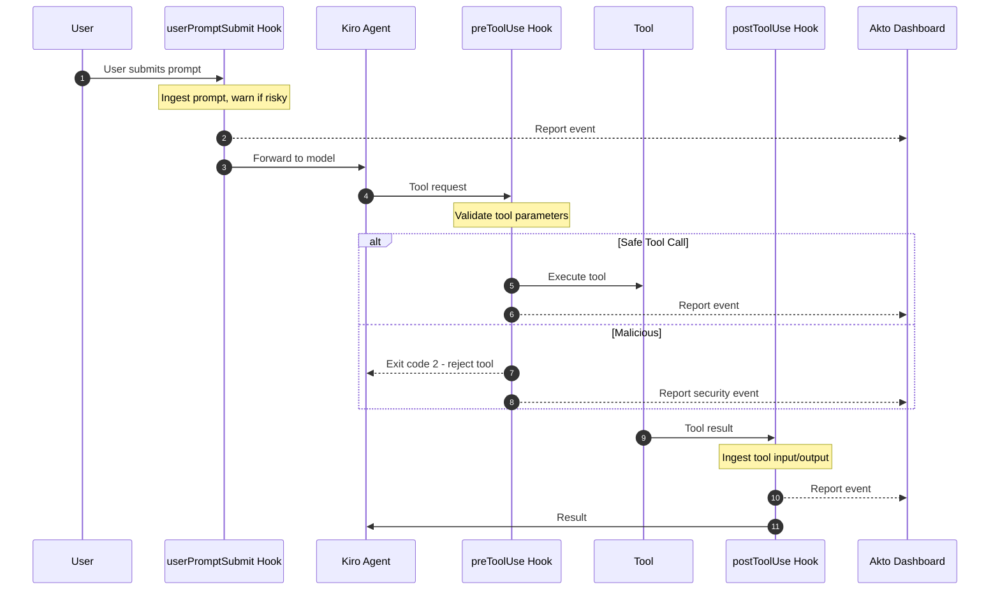

# Kiro CLI Hooks

Akto Guardrails for Kiro CLI brings real-time security validation to AI interactions by hooking into Kiro CLI's native lifecycle hooks — validating prompts and tool calls before they execute, and reporting every event to your Akto dashboard.

## Key Features

* ✅ **Zero Installation** - No standalone apps to install
* ✅ **Transparent Integration** - Uses Kiro CLI's native hook mechanism
* ✅ **Real-time Protection** - Validates every prompt and tool call
* ✅ **Centralized Monitoring** - All events reported to Akto dashboard
* ✅ **Flexible Deployment** - Supports Argus and Atlas modes
* ✅ **Configurable Behavior** - Blocking or observation modes

## How It Works

Kiro CLI's hook system executes custom scripts at three points:



**3 Hook Points:**

1. `userPromptSubmit` - Ingests prompts before they're sent to the model. Cannot block — a non-zero exit only shows the user a warning, the prompt still proceeds.
2. `preToolUse` - Validates tool requests before execution. The only event that can block: exit code `2` rejects the tool call.
3. `postToolUse` - Ingests tool input/output after execution (observational only).

## File Structure

```
~/.kiro/
├── hooks/
│   └── akto/
│       ├── akto-validate-prompt-wrapper.sh    # userPromptSubmit wrapper
│       ├── akto-validate-pre-tool-wrapper.sh  # preToolUse wrapper
│       ├── akto-validate-post-tool-wrapper.sh # postToolUse wrapper
│       ├── akto-hooks.py                      # Event dispatcher
│       ├── akto_ingestion_utility.py          # Shared hook runner logic
│       └── akto_machine_id.py                 # Device ID utility
├── akto/
│   └── logs/
│       ├── validate-prompt.log
│       ├── validate-pre-tool.log
│       └── validate-post-tool.log
└── agents/
    └── <agent-name>.json                      # Agent config - hooks block goes here
```

**Key Files:**

* **Wrapper scripts (`.sh`)**: Set environment variables, invoke `akto-hooks.py`
  * ⚠️ **Contains `AKTO_DATA_INGESTION_URL` placeholder** - Must be replaced with your Akto instance URL
* **`akto-hooks.py`**: Single dispatch script — routes `preToolUse` to a blocking runner, `userPromptSubmit` to a warn-only runner, and everything else to an observability-only runner
* **`akto_ingestion_utility.py`**: Core validation/ingestion logic and Akto API communication
* **`akto_machine_id.py`**: Generates unique device identifiers for Atlas mode
* **Agent config (`hooks` block)**: Links hooks to wrapper scripts

## Setup Guide

### Prerequisites

* Kiro CLI installed ([Installation Guide](https://kiro.dev/docs/cli/quick-start/))
* Akto instance URL
* Python 3.7+
* macOS, Linux, or Windows with bash/zsh

### Installation Steps



**Create Directories**

```bash
mkdir -p ~/.kiro/hooks/akto
mkdir -p ~/.kiro/akto/logs
```



**Download Hook Scripts**

```bash
# Base URLs for downloading hooks
HOOKS_BASE="https://raw.githubusercontent.com/akto-api-security/akto/master/apps/mcp-endpoint-shield/kiro-cli-hooks"
SHARED_BASE="https://raw.githubusercontent.com/akto-api-security/akto/master/apps/mcp-endpoint-shield/shared"

# Download wrapper scripts and dispatcher
curl -o ~/.kiro/hooks/akto/akto-validate-prompt-wrapper.sh \
  "${HOOKS_BASE}/akto-validate-prompt-wrapper.sh"
curl -o ~/.kiro/hooks/akto/akto-validate-pre-tool-wrapper.sh \
  "${HOOKS_BASE}/akto-validate-pre-tool-wrapper.sh"
curl -o ~/.kiro/hooks/akto/akto-validate-post-tool-wrapper.sh \
  "${HOOKS_BASE}/akto-validate-post-tool-wrapper.sh"
curl -o ~/.kiro/hooks/akto/akto-hooks.py \
  "${HOOKS_BASE}/akto-hooks.py"
curl -o ~/.kiro/hooks/akto/akto_machine_id.py \
  "${HOOKS_BASE}/akto_machine_id.py"

# Download shared ingestion utility
curl -o ~/.kiro/hooks/akto/akto_ingestion_utility.py \
  "${SHARED_BASE}/akto_ingestion_utility.py"

# Make executable
chmod +x ~/.kiro/hooks/akto/*.sh
```



**Configure Akto Ingestion URL and API Token** ⚠️ **CRITICAL STEP**


All wrapper scripts contain the placeholders `{{AKTO_DATA_INGESTION_URL}}` and `{{AKTO_API_TOKEN}}` that **must be replaced** — the URL with your actual Akto instance URL, and the token with your Akto API token (obtain it from **Akto Atlas → Connectors → Setup Guardrail** card). If your deployment does not require auth, set the token to an empty string so the placeholder is removed (an unsubstituted `{{AKTO_API_TOKEN}}` would be sent as an invalid `Authorization` header).


**Automated replacement:**

```bash
# Set your Akto ingestion URL and API token
AKTO_URL="https://your-akto-instance.com"
AKTO_API_TOKEN="your-akto-api-token"   # leave empty ("") if your deployment doesn't require auth

# Update all wrapper scripts
sed -i.bak "s|{{AKTO_DATA_INGESTION_URL}}|${AKTO_URL}|g" ~/.kiro/hooks/akto/*-wrapper.sh
sed -i.bak "s|{{AKTO_API_TOKEN}}|${AKTO_API_TOKEN}|g" ~/.kiro/hooks/akto/*-wrapper.sh

# Verify replacement
grep -E "AKTO_DATA_INGESTION_URL|AKTO_API_TOKEN" ~/.kiro/hooks/akto/*-wrapper.sh
```

**Manual replacement (alternative):**

Edit each wrapper script and replace:

```bash
AKTO_DATA_INGESTION_URL="{{AKTO_DATA_INGESTION_URL}}"
AKTO_API_TOKEN="{{AKTO_API_TOKEN}}"
```

With:

```bash
AKTO_DATA_INGESTION_URL="https://your-akto-instance.com"
AKTO_API_TOKEN="your-akto-api-token"
```

Files to update:

* `akto-validate-prompt-wrapper.sh`
* `akto-validate-pre-tool-wrapper.sh`
* `akto-validate-post-tool-wrapper.sh`



**Configure Hooks**

Merge the `hooks` block below into your `kiro-cli` agent config (`~/.kiro/agents/<agent-name>.json`, or edit via `kiro-cli agent edit`):

```json
{
  "hooks": {
    "userPromptSubmit": [
      {
        "command": "bash ~/.kiro/hooks/akto/akto-validate-prompt-wrapper.sh"
      }
    ],
    "preToolUse": [
      {
        "matcher": "*",
        "command": "bash ~/.kiro/hooks/akto/akto-validate-pre-tool-wrapper.sh"
      }
    ],
    "postToolUse": [
      {
        "matcher": "*",
        "command": "bash ~/.kiro/hooks/akto/akto-validate-post-tool-wrapper.sh"
      }
    ]
  }
}
```



**Configure Hook Behavior (Optional)**

Edit wrapper scripts to customize:

```bash
# In each *-wrapper.sh file:

MODE="atlas"                    # "argus" or "atlas"
AKTO_SYNC_MODE="true"          # "true" (blocking) or "false" (observe only)
AKTO_TIMEOUT="5"               # Timeout in seconds
AKTO_CONNECTOR="kiro_cli"
```

**Mode Options:**

* **Argus**: Standard validation and reporting
* **Atlas**: Includes device-specific metadata

**Sync Mode:**

* **true**: Blocks threats on `preToolUse` (exit code `2`)
* **false**: Reports but allows execution



**Install Python Dependencies**

```bash
pip3 install requests

# Verify installation
python3 -c "import requests; print('Requests installed successfully')"
```



**Verify Installation**

Check logs to confirm hooks are working:

```bash
# View logs
tail -f ~/.kiro/akto/logs/validate-prompt.log
tail -f ~/.kiro/akto/logs/validate-pre-tool.log
tail -f ~/.kiro/akto/logs/validate-post-tool.log
```

Test by running a Kiro command:

```bash
kiro-cli chat "What is 2+2?"
```

You should see log entries indicating validation occurred.



## Configuration Reference

### Wrapper Script Variables

```bash
MODE="atlas"                                            # "argus" or "atlas"
AKTO_DATA_INGESTION_URL="{{AKTO_DATA_INGESTION_URL}}"  # ⚠️ MUST REPLACE
AKTO_API_TOKEN="{{AKTO_API_TOKEN}}"                    # Akto API token (Authorization header)
AKTO_SYNC_MODE="true"                                  # "true" or "false"
AKTO_TIMEOUT="5"                                       # Timeout in seconds
AKTO_CONNECTOR="kiro_cli"                              # Connector identifier
```

### Environment Variables (Optional)

Override defaults via environment variables or config file:

**Option 1: Environment variables**

```bash
export MODE="atlas"
export AKTO_DATA_INGESTION_URL="https://your-akto-instance.com"
export AKTO_API_TOKEN="your-akto-api-token"
export AKTO_SYNC_MODE="true"
export AKTO_TIMEOUT="5"
```

**Option 2: Config file**

```bash
# Create ~/.kiro/akto/config
cat > ~/.kiro/akto/config << 'EOF'
AKTO_DATA_INGESTION_URL=https://your-akto-instance.com
AKTO_API_TOKEN=your-akto-api-token
AKTO_TIMEOUT=5
AKTO_SYNC_MODE=true
MODE=atlas
EOF

chmod 600 ~/.kiro/akto/config
```

## Troubleshooting

### Hooks Not Executing

```bash
# Check agent config contains a valid "hooks" block
cat ~/.kiro/agents/<agent-name>.json | python3 -m json.tool

# Verify scripts are executable
ls -la ~/.kiro/hooks/akto/
chmod +x ~/.kiro/hooks/akto/*.sh

# Check Kiro CLI version
kiro-cli --version
```

### Ingestion URL Not Configured

```bash
# Check if placeholder still exists
grep "{{AKTO_DATA_INGESTION_URL}}" ~/.kiro/hooks/akto/*-wrapper.sh

# Replace with actual URL
AKTO_URL="https://your-akto-instance.com"
sed -i.bak "s|{{AKTO_DATA_INGESTION_URL}}|${AKTO_URL}|g" ~/.kiro/hooks/akto/*-wrapper.sh
```

### Check Logs for Errors

```bash
# View logs
cat ~/.kiro/akto/logs/validate-prompt.log
cat ~/.kiro/akto/logs/validate-pre-tool.log
cat ~/.kiro/akto/logs/validate-post-tool.log

# Check for errors
grep -i error ~/.kiro/akto/logs/*.log
```

### Events Not in Dashboard

```bash
# Test API connectivity
curl -X POST "${AKTO_DATA_INGESTION_URL}/api/v1/events" \
  -H "Content-Type: application/json" \
  -d '{"test": "event"}'

# Verify URL in wrapper scripts
grep "AKTO_DATA_INGESTION_URL" ~/.kiro/hooks/akto/*-wrapper.sh
```

### Python Dependencies Missing

```bash
# Install required packages
pip3 install requests

# Verify installation
python3 -c "import requests; print(requests.__version__)"
```

## Uninstallation

To completely remove Akto hooks from Kiro CLI:

### Complete Removal

```bash
# 1. Remove the "hooks" block from your agent config
#    (edit ~/.kiro/agents/<agent-name>.json and delete the "hooks" key)

# 2. Remove Akto hook scripts
rm -rf ~/.kiro/hooks/akto/

# 3. Remove Akto logs (optional - keeps historical data if skipped)
rm -rf ~/.kiro/akto/

# 4. No restart needed - Kiro CLI reads agent config on each invocation
```

### Selective Removal (Keep Logs)

If you want to preserve logs for audit purposes:

```bash
# Remove only hooks and configuration
rm -rf ~/.kiro/hooks/akto/
# and remove the "hooks" block from your agent config

# Akto logs preserved in ~/.kiro/akto/
```

### Backup Before Removal

```bash
# Backup configuration and logs before removal
mkdir -p ~/akto-backup
cp ~/.kiro/agents/<agent-name>.json ~/akto-backup/kiro-agent.json.bak 2>/dev/null
cp -r ~/.kiro/akto/ ~/akto-backup/kiro-akto-logs/ 2>/dev/null

# Then proceed with removal steps above
```

### Verify Removal

```bash
# Check that hooks are removed
test -d ~/.kiro/hooks/akto && echo "⚠️  Hook scripts still exist" || echo "✅ Hook scripts removed"

# Check if logs are removed (if you chose to remove them)
test -d ~/.kiro/akto && echo "ℹ️  Logs still present" || echo "✅ Logs removed"
```

### Restore Kiro CLI to Default

After uninstallation, Kiro CLI will operate without Akto security monitoring. No additional configuration is needed beyond removing the files and the `hooks` block. Test with:

```bash
kiro-cli chat "Test message"
```

## Enterprise Deployment

### Automated Deployment Script

```bash
#!/bin/bash
# deploy-kiro-cli-hooks.sh

set -e
AKTO_URL="${1:-https://your-akto-instance.com}"
AKTO_API_TOKEN="${2:-}"   # optional: pass your Akto API token as the 2nd argument

echo "🔧 Installing Akto Guardrails for Kiro CLI..."

# Create directories
mkdir -p ~/.kiro/hooks/akto ~/.kiro/akto/logs

# Download hooks
HOOKS_BASE="https://raw.githubusercontent.com/akto-api-security/akto/master/apps/mcp-endpoint-shield/kiro-cli-hooks"
SHARED_BASE="https://raw.githubusercontent.com/akto-api-security/akto/master/apps/mcp-endpoint-shield/shared"
curl -s "${HOOKS_BASE}/akto-validate-prompt-wrapper.sh" -o ~/.kiro/hooks/akto/akto-validate-prompt-wrapper.sh
curl -s "${HOOKS_BASE}/akto-validate-pre-tool-wrapper.sh" -o ~/.kiro/hooks/akto/akto-validate-pre-tool-wrapper.sh
curl -s "${HOOKS_BASE}/akto-validate-post-tool-wrapper.sh" -o ~/.kiro/hooks/akto/akto-validate-post-tool-wrapper.sh
curl -s "${HOOKS_BASE}/akto-hooks.py" -o ~/.kiro/hooks/akto/akto-hooks.py
curl -s "${HOOKS_BASE}/akto_machine_id.py" -o ~/.kiro/hooks/akto/akto_machine_id.py
curl -s "${SHARED_BASE}/akto_ingestion_utility.py" -o ~/.kiro/hooks/akto/akto_ingestion_utility.py

# Make executable
chmod +x ~/.kiro/hooks/akto/*.sh

# Configure URL and token
sed -i.bak "s|{{AKTO_DATA_INGESTION_URL}}|${AKTO_URL}|g" ~/.kiro/hooks/akto/*-wrapper.sh
sed -i.bak "s|{{AKTO_API_TOKEN}}|${AKTO_API_TOKEN}|g" ~/.kiro/hooks/akto/*-wrapper.sh

echo "✅ Installation complete!"
echo "📍 Akto instance: ${AKTO_URL}"
echo "⚠️  Merge the hooks block into ~/.kiro/agents/<agent-name>.json (see Configure Hooks step)"
echo "Test with: kiro-cli chat 'What is 2+2?'"
```

**Deploy to developers:**

```bash
curl -fsSL https://your-org.com/deploy-kiro-cli-hooks.sh | bash -s https://your-akto-instance.com
```

## Quick Setup Summary

```bash
# 1. Create directories
mkdir -p ~/.kiro/hooks/akto ~/.kiro/akto/logs

# 2. Download all hook scripts from GitHub (see step 2 above)

# 3. ⚠️ Configure Akto URL and API token (REQUIRED)
AKTO_URL="https://your-akto-instance.com"
AKTO_API_TOKEN="your-akto-api-token"   # leave empty ("") if your deployment doesn't require auth
sed -i.bak "s|{{AKTO_DATA_INGESTION_URL}}|${AKTO_URL}|g" ~/.kiro/hooks/akto/*-wrapper.sh
sed -i.bak "s|{{AKTO_API_TOKEN}}|${AKTO_API_TOKEN}|g" ~/.kiro/hooks/akto/*-wrapper.sh

# 4. Make executable
chmod +x ~/.kiro/hooks/akto/*.sh

# 5. Merge the "hooks" block into your kiro-cli agent config (see step 4 above)

# 6. Install dependencies
pip3 install requests

# 7. Test
kiro-cli chat "What is 2+2?"
```

## Resources

* **GitHub**: [https://github.com/akto-api-security/akto](https://github.com/akto-api-security/akto)
* **Support**: [support@akto.io](mailto:support@akto.io)
* **Community**: [https://www.akto.io/community](https://www.akto.io/community)
