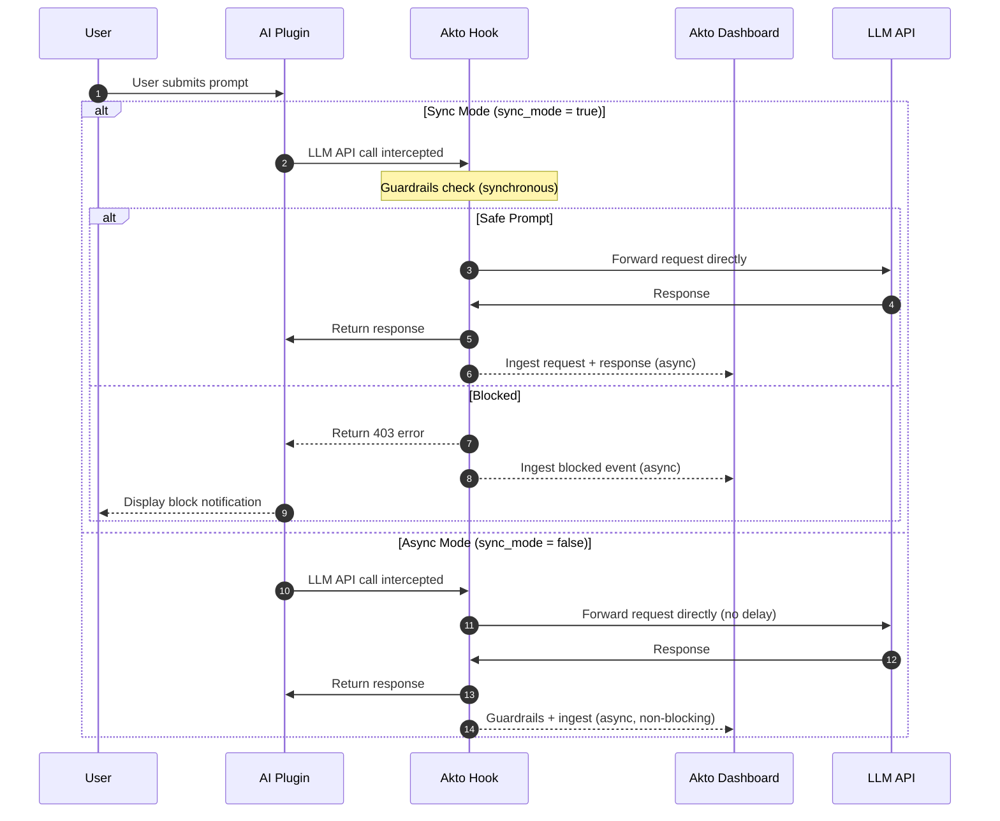

# Neovim Hooks

Akto Guardrails for Neovim provides security validation and observability for AI plugin interactions directly inside Neovim. It intercepts LLM API calls made by Neovim AI plugins, validates prompts against security policies, blocks risky behavior, and reports all events to your Akto dashboard — without proxying or redirecting traffic.

## Key Features

* ✅ **Zero Proxy** - Plugins always talk to LLM APIs directly; no traffic redirection
* ✅ **Broad Plugin Coverage** - Covers 7 major Neovim AI plugins out of the box
* ✅ **Transparent Integration** - Hooks into each plugin's native HTTP/LSP mechanism
* ✅ **Real-time Protection** - Blocks prompts before they reach the LLM in sync mode
* ✅ **Centralized Monitoring** - All events reported to Akto dashboard
* ✅ **Flexible Deployment** - Sync (blocking) or async (observability) modes
* ✅ **Selective Coverage** - Enable or disable hooks per plugin

## Supported Plugins

| Plugin | Stars | Hook Module | How It Works |
| ------ | ----- | ----------- | ------------ |
| avante.nvim | 17.7k | `plenary_hook` | Wraps `plenary.curl` |
| copilot.vim | 11.5k | `copilot_vim_hook` | Wraps `_copilot.lsp_request` |
| codecompanion.nvim | 6.4k | `plenary_hook` | Wraps `plenary.curl` |
| windsurf.vim | 5.1k | `windsurf_hook` | Wraps `vim.fn.jobstart` + `chansend` |
| copilot.lua | 4.0k | `copilot_hook` | Wraps `copilot.api.request` |
| ChatGPT.nvim | 4.0k | `plenary_hook` | Wraps `plenary.job` |
| CopilotChat.nvim | 3.6k | `plenary_hook` | Wraps `plenary.curl` |

## How It Works

The Akto Neovim plugin wraps the HTTP and LSP functions each AI plugin uses internally. When a plugin makes an LLM API call:



**Two Operating Modes:**

1. **Sync mode** (`sync_mode = true`, default) — Guardrails run **before** the LLM call. Blocked prompts never reach the LLM. Adds latency equal to the guardrails check.
2. **Async mode** (`sync_mode = false`) — LLM call goes through immediately. Guardrails and ingestion happen asynchronously after the call. Best for observability without blocking.

**Monitored LLM APIs:**

The plenary hook intercepts calls to the following API hosts:

* `api.openai.com`
* `api.anthropic.com`
* `generativelanguage.googleapis.com`
* `api.cohere.ai`
* `api.mistral.ai`
* `api.groq.com`
* `openrouter.ai`

## File Structure

```
~/.config/nvim/lua/akto/
├── init.lua              # Setup, enable/disable, Neovim commands
├── http.lua              # Shared HTTP helpers (payload builder, Akto API calls)
├── plenary_hook.lua      # Wraps plenary.curl + plenary.job
├── copilot_hook.lua      # Wraps copilot.lua API
├── copilot_vim_hook.lua  # Wraps copilot.vim LSP bridge
├── windsurf_hook.lua     # Wraps vim.fn.jobstart for Codeium/Windsurf
└── events.lua            # Autocmd listeners for plugin events
```

**Key Files:**

* **`init.lua`**: Entry point — `require("akto").setup(...)` configures and activates all hooks
* **`http.lua`**: Shared payload builder and Akto API communication; used by all hook modules
* **`plenary_hook.lua`**: Intercepts `plenary.curl` (avante, codecompanion, CopilotChat) and `plenary.job` (ChatGPT.nvim); supports both sync and async modes
* **`copilot_hook.lua`**: Intercepts `copilot.api.request` for copilot.lua; ingestion-only
* **`copilot_vim_hook.lua`**: Intercepts `_copilot.lsp_request` for copilot.vim; ingestion-only
* **`windsurf_hook.lua`**: Intercepts `vim.fn.jobstart` + `chansend` for Codeium/windsurf.vim; ingestion-only
* **`events.lua`**: Registers autocmd listeners for plugin-level events (CodeCompanion, CopilotChat, avante)

## Setup Guide

### Prerequisites

* Neovim 0.9+
* `curl` on PATH (used for Akto backend calls)
* Akto instance running and accessible (e.g. `https://your-akto-instance.com`)

### Installation Steps



**Create Plugin Directory**

```bash
mkdir -p ~/.config/nvim/lua/akto
```



**Download Plugin Files**

```bash
# Base URL for downloading plugin files
HOOKS_BASE="https://raw.githubusercontent.com/akto-api-security/akto/master/apps/mcp-endpoint-shield/neovim/lua/akto"

curl -o ~/.config/nvim/lua/akto/init.lua              "${HOOKS_BASE}/init.lua"
curl -o ~/.config/nvim/lua/akto/http.lua              "${HOOKS_BASE}/http.lua"
curl -o ~/.config/nvim/lua/akto/plenary_hook.lua      "${HOOKS_BASE}/plenary_hook.lua"
curl -o ~/.config/nvim/lua/akto/copilot_hook.lua      "${HOOKS_BASE}/copilot_hook.lua"
curl -o ~/.config/nvim/lua/akto/copilot_vim_hook.lua  "${HOOKS_BASE}/copilot_vim_hook.lua"
curl -o ~/.config/nvim/lua/akto/windsurf_hook.lua     "${HOOKS_BASE}/windsurf_hook.lua"
curl -o ~/.config/nvim/lua/akto/events.lua            "${HOOKS_BASE}/events.lua"
```



**Add to Your Neovim Config**

Add the following to your `~/.config/nvim/init.lua` **after** your plugin manager setup:

```lua
-- ~/.config/nvim/init.lua
-- Load plugins first (lazy.nvim, packer, etc.), then akto:

require("lazy").setup({ ... })

require("akto").setup({
  akto_url = "https://your-akto-instance.com",
})
```


`require("akto").setup(...)` must be called **after** your plugin manager loads plugins so that the AI plugin modules are available for wrapping.




**Configure Hook Behavior (Optional)**

Customize which hooks are active and how they behave:

```lua
require("akto").setup({
  akto_url         = "https://your-akto-instance.com",  -- ⚠️ REQUIRED
  sync_mode        = true,    -- true: block before LLM call, false: observe after
  timeout          = 5,       -- seconds for guardrails check
  plenary_hook     = true,    -- avante, codecompanion, CopilotChat, ChatGPT
  copilot_hook     = true,    -- copilot.lua
  copilot_vim_hook = true,    -- copilot.vim
  windsurf_hook    = true,    -- windsurf.vim
  events           = true,    -- autocmd listeners for plugin events
})
```

**Mode Options:**

* **`sync_mode = true`** (default): Guardrails check runs synchronously before LLM call. Blocked prompts never reach the LLM.
* **`sync_mode = false`**: LLM call proceeds immediately. Guardrails and ingestion happen asynchronously. Use for observability without blocking.



**Restart Neovim**

```bash
# Restart Neovim to load the plugin
nvim
```

On startup you should see a notification:

```
[akto] enabled (sync): https://your-akto-instance.com
```



**Verify Installation**

Run the status command inside Neovim:

```vim
:AktoStatus
```

Expected output:

```
[akto] ACTIVE (sync): https://your-akto-instance.com
  plenary_hook     = true
  copilot_hook     = true
  copilot_vim_hook = true
  windsurf_hook    = true
  events           = true
```

Test by using any supported AI plugin. Akto will validate the prompt and ingest the interaction.



## Configuration Reference

### Setup Options

```lua
require("akto").setup({
  akto_url         = "",      -- Akto backend URL (required)
  sync_mode        = true,    -- true: block before LLM call, false: observe after
  timeout          = 5,       -- seconds for guardrails check and ingestion calls
  plenary_hook     = true,    -- enable hook for plenary.curl + plenary.job
  copilot_hook     = true,    -- enable hook for copilot.lua
  copilot_vim_hook = true,    -- enable hook for copilot.vim
  windsurf_hook    = true,    -- enable hook for windsurf.vim (Codeium)
  events           = true,    -- enable autocmd event listeners
})
```

### Disabling Specific Hooks

```lua
-- Only cover plenary-based plugins, skip copilot and windsurf
require("akto").setup({
  akto_url         = "https://your-akto-instance.com",
  copilot_hook     = false,
  copilot_vim_hook = false,
  windsurf_hook    = false,
})
```

### Neovim Commands

| Command | Description |
| ------- | ----------- |
| `:AktoEnable` | Enable all hooks (re-enables after `:AktoDisable`) |
| `:AktoDisable` | Disable all hooks, restoring original plugin functions |
| `:AktoStatus` | Show current state, mode, and per-hook configuration |

## Hook Behavior by Plugin

| Plugin | Hook Module | Blocking Support | Ingestion |
| ------ | ----------- | ---------------- | --------- |
| avante.nvim | `plenary_hook` | ✅ (sync mode) | ✅ |
| codecompanion.nvim | `plenary_hook` | ✅ (sync mode) | ✅ |
| CopilotChat.nvim | `plenary_hook` | ✅ (sync mode) | ✅ |
| ChatGPT.nvim | `plenary_hook` | ✅ (sync mode) | ✅ |
| copilot.lua | `copilot_hook` | ❌ (ingestion only) | ✅ |
| copilot.vim | `copilot_vim_hook` | ❌ (ingestion only) | ✅ |
| windsurf.vim | `windsurf_hook` | ❌ (ingestion only) | ✅ |

> **Note:** copilot.lua, copilot.vim, and windsurf.vim hooks intercept at the LSP/process level and operate in ingestion-only mode regardless of `sync_mode`.

## Troubleshooting

### Plugin Not Loading

```vim
" Check if akto module is found
:lua print(require("akto"))

" Check for errors during setup
:messages
```

```bash
# Verify files exist
ls -la ~/.config/nvim/lua/akto/
```

### No Events in Dashboard

```bash
# Test Akto backend connectivity
curl -X POST "https://your-akto-instance.com/api/http-proxy?akto_connector=neovim&ingest_data=true" \
  -H "Content-Type: application/json" \
  -d '{"test": "event"}'

# Verify curl is on PATH
which curl
```

### Hook Not Intercepting Calls

```vim
" Check status
:AktoStatus

" Try disabling and re-enabling
:AktoDisable
:AktoEnable
```

Ensure `require("akto").setup(...)` is called **after** your plugin manager loads AI plugins. If a plugin was already loaded before `setup`, run `:AktoDisable` then `:AktoEnable` to re-wrap.

### Blocked Requests Not Showing Notification

Ensure `events = true` in your setup config. The autocmd listeners register block notifications for CodeCompanion, CopilotChat, and avante.

### Slow Response / High Latency

Switch to async mode to remove guardrails latency from the LLM call path:

```lua
require("akto").setup({
  akto_url  = "https://your-akto-instance.com",
  sync_mode = false,   -- observe only, no blocking latency
})
```

## Uninstallation

To completely remove Akto Neovim hooks:

### Complete Removal

```bash
# 1. Remove Akto plugin files
rm -rf ~/.config/nvim/lua/akto/

# 2. Remove setup call from init.lua
# Edit ~/.config/nvim/init.lua and remove the require("akto").setup(...) block

# 3. Restart Neovim
```

### Selective Removal (Keep Files, Disable)

Add `enabled = false` or simply remove the `setup` call from your config. The plugin files remain on disk but are not loaded.

Alternatively, use the Neovim command while running:

```vim
:AktoDisable
```

This restores all original plugin functions for the current session without removing files.

### Backup Before Removal

```bash
# Backup plugin files
mkdir -p ~/akto-backup
cp -r ~/.config/nvim/lua/akto/ ~/akto-backup/neovim-akto-plugin/

# Then proceed with removal
```

### Verify Removal

```bash
# Check plugin files are removed
test -d ~/.config/nvim/lua/akto && echo "⚠️  Plugin files still exist" || echo "✅ Plugin removed"
```

### Restore to Default

After uninstallation, all AI plugins will operate without Akto security monitoring. No additional configuration is needed beyond removing the files and the `setup` call.

## Enterprise Deployment

### Automated Deployment Script

```bash
#!/bin/bash
# deploy-neovim-hooks.sh

set -e
AKTO_URL="${1:-https://your-akto-instance.com}"
SYNC_MODE="${2:-true}"

echo "🔧 Installing Akto Guardrails for Neovim..."

# Create plugin directory
mkdir -p ~/.config/nvim/lua/akto

# Download plugin files
HOOKS_BASE="https://raw.githubusercontent.com/akto-api-security/akto/master/apps/mcp-endpoint-shield/neovim/lua/akto"
for f in init.lua http.lua plenary_hook.lua copilot_hook.lua copilot_vim_hook.lua windsurf_hook.lua events.lua; do
  curl -s "${HOOKS_BASE}/${f}" -o ~/.config/nvim/lua/akto/${f}
done

# Add setup call to init.lua if not already present
INIT_FILE="$HOME/.config/nvim/init.lua"
if ! grep -q 'require("akto").setup' "${INIT_FILE}" 2>/dev/null; then
  cat >> "${INIT_FILE}" << EOFLUA

-- Akto Guardrails
require("akto").setup({
  akto_url  = "${AKTO_URL}",
  sync_mode = ${SYNC_MODE},
})
EOFLUA
fi

echo "✅ Installation complete! Restart Neovim."
echo "📍 Akto instance: ${AKTO_URL}"
echo "📍 Sync mode: ${SYNC_MODE}"
echo "Run :AktoStatus inside Neovim to verify."
```

**Deploy to developers:**

```bash
curl -fsSL https://your-org.com/deploy-neovim-hooks.sh | bash -s https://your-akto-instance.com true
```

## Quick Setup Summary

```bash
# 1. Create plugin directory
mkdir -p ~/.config/nvim/lua/akto

# 2. Download all plugin files from GitHub (see step 2 above)

# 3. Add to ~/.config/nvim/init.lua (after plugin manager):
# require("akto").setup({ akto_url = "https://your-akto-instance.com" })

# 4. Restart Neovim

# 5. Verify with :AktoStatus
```

## Resources

* **GitHub**: [https://github.com/akto-api-security/akto](https://github.com/akto-api-security/akto)
* **Support**: [support@akto.io](mailto:support@akto.io)
* **Community**: [https://www.akto.io/community](https://www.akto.io/community)
