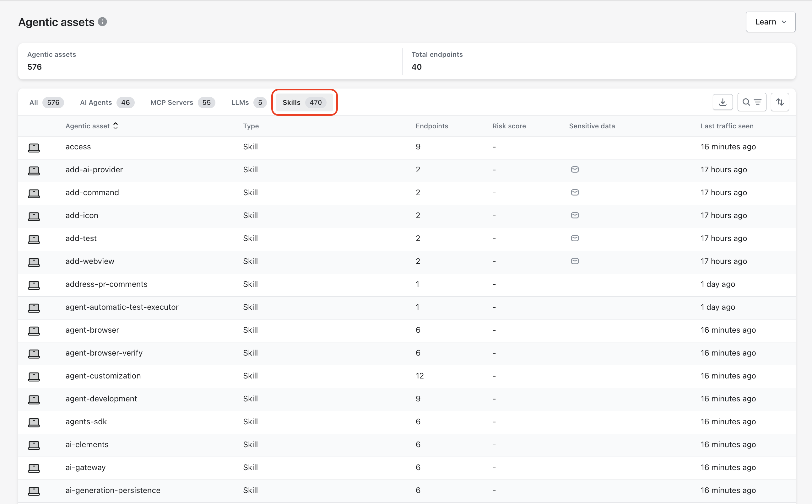

# OpenClaw (Clawdbot) Visibility

## Overview

Akto Atlas provides visibility into **employee usage of OpenClaw (Clawdbot)** by observing agent activity at the endpoint level.\
Visibility is enabled through the **MCP Endpoint Shield**, which operates locally on enterprise-managed devices.


Akto Atlas does not require direct integration with Clawdbot services, APIs, or SaaS infrastructure.


## MCP Endpoint Shield Observation Model

MCP Endpoint Shield runs on enterprise endpoints and observes local agent connections that use the MCP protocol. When Clawdbot connects to the local MCP endpoint, MCP Endpoint Shield captures usage metadata and forwards the metadata to Akto Atlas for analysis.

<figure><figcaption></figcaption></figure>

### Data Flow from Endpoint to Akto Atlas

1. **MCP Endpoint Shield Deployment**\
   MCP Endpoint Shield is deployed on employee endpoints through MDM or manual installation.
2. **Local MCP Connection**\
   Clawdbot establishes a local MCP protocol connection to MCP Endpoint Shield.
3. **Endpoint-Level Metadata Collection**\
   MCP Endpoint Shield records agent presence and usage signals associated with the connection.
4. **Secure Metadata Ingestion**\
   MCP Endpoint Shield sends observed metadata to Akto Atlas over a secure ingestion channel.
5. **Asset Registration in Atlas**\
   Akto Atlas registers Clawdbot as an enterprise-used asset based on observed activity.

## Attributes Detected by Akto Atlas

After Clawdbot successfully connects to MCP Endpoint Shield, Akto Atlas can identify:

* Presence of Clawdbot on enterprise-managed endpoints
* Endpoints where Clawdbot is actively used
* Enterprise users associated with each endpoint
* First observed connection timestamp
* Most recent observed connection timestamp
* Frequency of observed usage sessions

## Prerequisites for Clawdbot Visibility

Clawdbot visibility requires:

* [MCP Endpoint Shield installed](mcp-endpoint-shield/) and running on endpoints
* Clawdbot configured to connect to the local MCP endpoint
* Akto Atlas ingestion enabled for endpoint data

## Visibility Location in Akto Atlas

### Assets Inventory

Clawdbot appears in the **Agentic** **Assets** inventory within Akto Atlas.

For each Clawdbot asset, Akto Atlas displays:

* Asset name: <kbd>Clawdbot</kbd>
* Detection source: <kbd>AI Agent</kbd>
* Associated endpoints
* Risk Score
* First seen timestamp
* Last seen timestamp

<figure><figcaption></figcaption></figure>

## Data Scope and Enforcement Boundaries

Akto Atlas enforces strict boundaries on observed data:

* Data collection begins only after MCP Endpoint Shield installation
* Visibility is limited to endpoints where MCP Endpoint Shield is active
* Only usage metadata is collected
* No inspection of prompts, internal logic, or generated outputs
* No modification, blocking, or interference with Clawdbot execution

## Outcome for Enterprise Teams

By using MCP Endpoint Shield as the observation layer, Akto Atlas provides reliable, endpoint-based visibility into Clawdbot usage across the enterprise.\
This approach enables asset awareness without requiring direct access to Clawdbot services or altering agent behavior.
