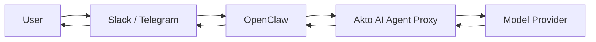

# OpenClaw (Clawdbot) Visibility

## Overview

Akto Atlas provides visibility into **employee usage of OpenClaw (Clawdbot)** by observing agent activity at the endpoint level.\
Visibility is enabled through the **MCP Endpoint Shield**, which operates locally on enterprise-managed devices.


Akto Atlas does not require direct integration with Clawdbot services, APIs, or SaaS infrastructure.


## Observation Model

Akto Atlas observes OpenClaw interactions through request and response guardrail validation.

<figure><figcaption></figcaption></figure>

Requests originating from OpenClaw channels such as AI models, chat applications, productivity tools, and automation platforms first pass through **Akto Endpoint Shield** for input guardrail validation before reaching **OpenClaw (Clawdbot)**.

Responses generated by OpenClaw pass through **Akto Endpoint Shield** again for response guardrail validation. Metadata from both validation stages is sent to the **Akto Dashboard** for monitoring and visibility.

## Attributes Detected by Akto Atlas

After Clawdbot successfully connects to MCP Endpoint Shield, Akto Atlas can identify:

* Presence of Clawdbot on enterprise-managed endpoints
* Endpoints where Clawdbot is actively used
* Enterprise users associated with each endpoint
* First observed connection timestamp
* Most recent observed connection timestamp
* Frequency of observed usage sessions

## Visibility Mechanisms

Akto Atlas provides visibility into OpenClaw activity through proxy-based request monitoring and event-based hook integrations.

### Through AI Agent Proxy

Akto Atlas can observe OpenClaw model requests when OpenClaw routes LLM traffic through the **Akto AI Agent Proxy**.

The AI Agent Proxy operates as a middleware layer between OpenClaw and the configured model provider. OpenClaw sends model requests to the proxy endpoint instead of directly calling the LLM provider.

The request flow becomes:


```mermaid
flowchart LR

User[User]
Channel[Slack / Telegram]
OpenClaw[OpenClaw]
Proxy[Akto AI Agent Proxy]
Model[Model Provider]

User --> Channel
Channel --> OpenClaw
OpenClaw --> Proxy
Proxy --> Model
Model --> Proxy
Proxy --> OpenClaw
OpenClaw --> Channel
Channel --> User
```

The proxy records request metadata, applies guardrails, and forwards the request to the configured model provider. **Akto Atlas** receives the recorded metadata and associates the activity with the OpenClaw agent and the enterprise user.

Enterprise teams must configure OpenClaw to route model traffic through the proxy endpoint. Following are the configuration steps:



#### **Set Up the AI Agent Proxy**

Deploy the Akto AI Agent Proxy in the environment where OpenClaw sends model requests. The proxy acts as the intermediary between OpenClaw and the actual model provider.

Deployment instructions and architecture details are available in the following documentation: [akto-agent-proxy.md](../../agentic-guardrails/overview/akto-agent-proxy.md "mention")

After completing the proxy deployment, note the proxy endpoint URL. OpenClaw uses the proxy endpoint as the model provider base URL.



#### **Update the `openclaw.json` Configuration File**

OpenClaw uses the `openclaw.json` configuration file to define model providers. Add a provider entry that routes model requests to the Akto AI Agent Proxy.

Example configuration:

```json
"models": {
  "providers": {
    "secure-local": {
      "api": "openai-completions",
      "apiKey": "${OPENAI_API_KEY}; X-Original-Provider: openai/gpt-4o-mini",
      "baseUrl": "<AKTO_AI_AGENT_PROXY_URL>/v1",
      "models": [
        {
          "id": "gpt-4o-mini",
          "name": "gpt-4o-mini"
        }
      ]
    }
  }
}
```

* The `baseUrl` parameter must reference the AI Agent Proxy endpoint instead of the direct model provider endpoint.
* The `X-Original-Provider` header allows the proxy to forward the request to the correct model provider after applying guardrails.



#### **Register the Provider in the Authentication Profile**

OpenClaw requires an authentication profile entry for every configured provider. The authentication profile allows OpenClaw to activate the configured model provider.

Create or update the file `auth.profile.json` with the following configuration:

```json
{
  "version": 1,
  "profiles": {
    "secure-local:dummy": {
      "provider": "secure-local",
      "type": "token"
    }
  },
  "lastGood": {
    "secure-local": "secure-local:dummy"
  }
}
```

The authentication profile registers the proxy-backed provider so OpenClaw can route model requests through the AI Agent Proxy.



After completing the configuration steps, OpenClaw sends model requests through the proxy. Akto Atlas observes the requests and records model interaction metadata.

### Through Hooks

Akto Atlas can observe OpenClaw interaction events through message lifecycle hooks when the OpenClaw platform exposes **message send and message receive hooks**.

Hook-based visibility depends on OpenClaw providing those hooks. Akto Atlas can subscribe to hook endpoints only after OpenClaw exposes the hook interface.

When OpenClaw triggers the message send or message receive hook, interaction metadata can be sent to Akto Atlas to record OpenClaw activity associated with enterprise users.

## Observability Location in Akto Atlas

### Assets Inventory

Clawdbot appears in the **Agentic** **Assets** inventory within Akto Atlas.

For each Clawdbot asset, Akto Atlas displays:

* Asset name: <kbd>Clawdbot</kbd>
* Detection source: <kbd>AI Agent</kbd>
* Associated endpoints
* Risk Score
* First seen timestamp
* Last seen timestamp

<div data-with-frame="true"><figure><figcaption></figcaption></figure></div>

## Supported Operating Systems

Akto Atlas supports OpenClaw visibility on enterprise-managed endpoints running:

* macOS
* Windows
* Linux

When MCP Endpoint Shield runs on any of these operating systems, Akto Atlas can observe OpenClaw connections to the local MCP endpoint and register usage metadata.

## Data Scope and Enforcement Boundaries

Akto Atlas enforces strict boundaries on observed data:

* Data collection begins only after MCP Endpoint Shield installation
* Visibility is limited to endpoints where MCP Endpoint Shield is active
* Only usage metadata is collected
* No inspection of prompts, internal logic, or generated outputs
* No modification, blocking, or interference with Clawdbot execution

## Get Support for your Akto setup

There are multiple ways to request support from Akto. We are 24X7 available on the following:

1. In-app `intercom` support. Message us with your query on intercom in Akto dashboard and someone will reply.
2. Join our [discord channel](https://www.akto.io/community) for community support.
3. Contact `support@akto.io` for email support.
