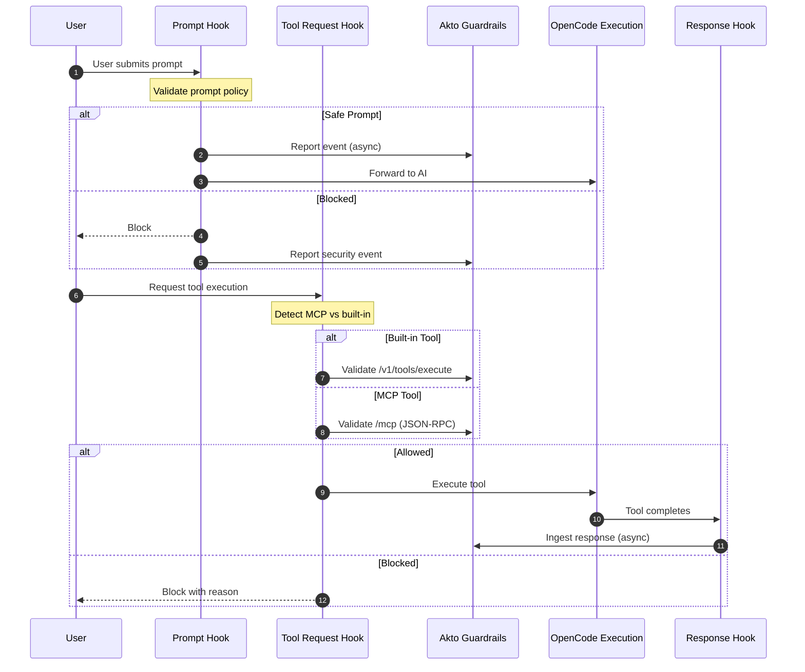

# OpenCode Hooks

Akto Guardrails for OpenCode provides security validation for AI coding agent interactions. It intercepts prompts and tool calls before execution, validates against security policies, blocks risky behavior, and reports all events to your Akto dashboard.

## Key Features

* ✅ **Built-in & MCP Tool Support** - Validates both OpenCode built-in tools (read, glob) and MCP server tools
* ✅ **Real-time Protection** - Validates every prompt and tool call before execution
* ✅ **JSON-RPC Compliance** - Full JSON-RPC 2.0 support for MCP protocol
* ✅ **Centralized Monitoring** - All events reported to Akto dashboard
* ✅ **Configurable Behavior** - Blocking or observation modes

## How It Works

OpenCode plugin hooks into three critical points in the AI coding agent lifecycle:



**3 Hook Points:**

1. `experimental.chat.messages.transform` - Validates user prompts before sending to AI
2. `tool.execute.before` - Validates tool calls (MCP and built-in) before execution
3. `tool.execute.after` - Logs tool responses for audit trail

## File Structure

```
~/.opencode/
├── plugins/
│   ├── akto-guardrails-plugin.js         # Main plugin (hooks orchestrator)
│   ├── akto-validate-prompt.py           # Prompt validation logic
│   ├── akto-validate-tool-request.py     # Tool request validation
│   ├── akto-validate-tool-response.py    # Response logging
│   ├── akto-mcp-request.py               # MCP tool request handler (JSON-RPC)
│   ├── akto-mcp-response.py              # MCP tool response handler
│   ├── akto_machine_id.py                # Device ID utility
│   └── settings.json                     # Plugin metadata
├── akto/
│   └── logs/
│       ├── akto-guardrails.log           # Main plugin logs
│       ├── akto-validate-prompt.log      # Prompt validation logs
│       ├── akto-validate-tool-request.log # Tool validation logs
│       ├── akto-validate-tool-response.log # Response ingestion logs
│       ├── akto-mcp-request.log          # MCP request logs
│       └── akto-mcp-response.log         # MCP response logs
└── .bashrc/.zshrc (environment variable)
```

**Key Files:**

* **`akto-guardrails-plugin.js`**: Main plugin that registers hooks with OpenCode
* **`akto-validate-*.py`**: Python handlers for prompt/tool/response validation
* **`akto-mcp-request.py`**: MCP tool request handler — converts to JSON-RPC format and sends to `/mcp` endpoint
* **`akto-mcp-response.py`**: MCP tool response handler — logs responses for audit
* **`akto_machine_id.py`**: Generates unique device identifiers for Akto dashboard
* **`settings.json`**: Plugin metadata (name, version, hook descriptions) — OpenCode uses this for plugin discovery

## Setup Guide

### Prerequisites

* OpenCode installed on your system
* Python 3.6+ available
* Akto instance with guardrails API endpoint
* Network access to your Akto server
* macOS, Linux, or Windows with bash/zsh

### Installation Steps



**Obtain Plugin Files**

Clone the Akto repository or download the plugin files:

```bash
# Clone repository
git clone https://github.com/akto-api-security/akto.git
cd akto/apps/mcp-endpoint-shield/opencode
```

Alternatively, download individual files from GitHub:

```bash
OPENCODE_BASE="https://raw.githubusercontent.com/akto-api-security/akto/master/apps/mcp-endpoint-shield/opencode"

# Create directories
mkdir -p ~/.opencode/plugins

# Download all files
for file in akto-guardrails-plugin.js akto-validate-prompt.py akto-validate-tool-request.py akto-validate-tool-response.py akto-mcp-request.py akto-mcp-response.py akto_machine_id.py settings.json; do
  curl -o ~/.opencode/plugins/$file "${OPENCODE_BASE}/${file}"
done
```



**Copy Plugin to OpenCode**

Create the plugins directory and copy all files:

```bash
# Create plugins directory if it doesn't exist
mkdir -p ~/.opencode/plugins

# Copy all production files
cp akto-guardrails-plugin.js ~/.opencode/plugins/
cp akto-validate-prompt.py ~/.opencode/plugins/
cp akto-validate-tool-request.py ~/.opencode/plugins/
cp akto-validate-tool-response.py ~/.opencode/plugins/
cp akto-mcp-request.py ~/.opencode/plugins/
cp akto-mcp-response.py ~/.opencode/plugins/
cp akto_machine_id.py ~/.opencode/plugins/
cp settings.json ~/.opencode/plugins/

# Make Python scripts executable
chmod +x ~/.opencode/plugins/akto-*.py
```

**Verify installation:**

```bash
ls -la ~/.opencode/plugins/akto-*
# Should show 8 files + settings.json
```



**Configure Akto Server URL** ⚠️ **CRITICAL STEP**

Set your Akto instance URL as an environment variable:

```bash
# For bash
echo 'export AKTO_DATA_INGESTION_URL="https://your-akto-instance.com/guardrails"' >> ~/.bashrc
source ~/.bashrc

# For zsh
echo 'export AKTO_DATA_INGESTION_URL="https://your-akto-instance.com/guardrails"' >> ~/.zshrc
source ~/.zshrc
```

**Verify the URL is set:**

```bash
echo $AKTO_DATA_INGESTION_URL
# Should output: https://your-akto-instance.com/guardrails
```


This environment variable is **REQUIRED**. Without it, the plugin will run in fail-open mode (allows all execution but won't send data to Akto).




**(Optional) Configure MCP Servers**

If you use MCP servers with OpenCode, add them to `~/.config/opencode/opencode.json`:

```bash
# Create OpenCode config directory if needed
mkdir -p ~/.config/opencode

# Create/edit opencode.json
cat > ~/.config/opencode/opencode.json << 'EOF'
{
  "$schema": "https://opencode.ai/config.json",
  "mcp": {
    "git": {
      "type": "local",
      "command": ["npx", "-y", "@modelcontextprotocol/server-git"],
      "enabled": true
    },
    "memory": {
      "type": "local",
      "command": ["npx", "-y", "@modelcontextprotocol/server-memory"],
      "enabled": true
    }
  }
}
EOF
```

The plugin will automatically detect MCP tools (format: `server_tool`) and route them to the `/mcp` endpoint.



**Start OpenCode**

Kill any existing instance and start fresh:

```bash
# Kill existing instance
killall opencode 2>/dev/null || true
sleep 2

# Start OpenCode
opencode
```

**Verify plugin is loaded:**

```bash
tail -f ~/.config/opencode/akto/logs/akto-guardrails.log
# Should see: [PLUGIN_INIT] {"message":"Akto guardrails plugin initialized"}
```



**Verify Installation**

Check all components are working:

```bash
# 1. Plugin files copied
ls -la ~/.opencode/plugins/akto-*

# 2. Akto URL configured
echo $AKTO_DATA_INGESTION_URL

# 3. Log directory created
mkdir -p ~/.config/opencode/akto/logs
ls -la ~/.config/opencode/akto/logs/

# 4. Test with built-in tool (in OpenCode prompt)
read some_file.txt

# 5. Check logs for activity
tail -f ~/.config/opencode/akto/logs/akto-guardrails.log
# Should show: [TOOL_EXECUTE_BEFORE] {"tool":"read",...}
```



## Configuration Reference

### Environment Variables

Set these to customize the plugin behavior:

```bash
# REQUIRED
export AKTO_DATA_INGESTION_URL="https://your-akto-instance.com/guardrails"

# OPTIONAL - Authentication
export AKTO_API_TOKEN=""                    # Bearer token sent as the Authorization header

# OPTIONAL - Logging
export LOG_LEVEL="INFO"                     # DEBUG, INFO, WARNING, ERROR
export LOG_PAYLOADS="false"                 # Set to "true" for verbose payload logging
export LOG_DIR="~/.config/opencode/akto/logs"

# OPTIONAL - Advanced
export AKTO_TIMEOUT="5"                     # Request timeout in seconds
export AKTO_SYNC_MODE="true"                # "true" (blocking) or "false" (async)
export MODE="atlas"                         # "argus" or "atlas"
export CONTEXT_SOURCE="ENDPOINT"            # Request classification
```

### OpenCode Plugin Settings

Edit `~/.opencode/plugins/settings.json` to customize (optional):

```json
{
  "name": "Akto Guardrails for OpenCode",
  "description": "Security guardrails plugin for OpenCode AI agent",
  "version": "1.0.0",
  "configuration": {
    "required": ["AKTO_DATA_INGESTION_URL"],
    "optional": ["AKTO_API_TOKEN", "AKTO_TIMEOUT", "LOG_LEVEL", "LOG_PAYLOADS", "MODE"]
  },
  "hooks": {
    "experimental.chat.messages.transform": {
      "description": "Validates user prompts before sending to AI",
      "blocking": true
    },
    "tool.execute.before": {
      "description": "Validates tool calls before execution",
      "blocking": true
    },
    "tool.execute.after": {
      "description": "Logs tool responses after execution",
      "blocking": false
    }
  }
}
```

## Monitoring & Logs

### View Real-time Activity

```bash
# Watch main plugin activity
tail -f ~/.config/opencode/akto/logs/akto-guardrails.log

# Watch prompt validation
tail -f ~/.config/opencode/akto/logs/akto-validate-prompt.log

# Watch tool validation
tail -f ~/.config/opencode/akto/logs/akto-validate-tool-request.log

# Watch MCP requests (if using MCP)
tail -f ~/.config/opencode/akto/logs/akto-mcp-request.log

# Watch MCP responses (if using MCP)
tail -f ~/.config/opencode/akto/logs/akto-mcp-response.log
```

### Log Format

Each log entry includes:

* **Timestamp**: When the event occurred
* **Hook**: Which hook point was triggered (PLUGIN_INIT, TOOL_EXECUTE_BEFORE, MCP_TOOL_DETECTED, etc.)
* **Details**: JSON object with relevant context (tool name, args, API responses)

### Enable Debug Logging

For verbose logging with full payloads:

```bash
export LOG_LEVEL="DEBUG"
export LOG_PAYLOADS="true"

# Restart OpenCode
killall opencode
opencode
```

## Troubleshooting

### Plugin Not Loading

**Symptom:** No logs appear in `~/.config/opencode/akto/logs/`

**Solution:**

```bash
# Verify plugin files exist
ls -la ~/.opencode/plugins/akto-*

# Check Python is available
python3 --version

# Create log directory
mkdir -p ~/.config/opencode/akto/logs

# Restart OpenCode
killall opencode 2>/dev/null || true
sleep 2
opencode
```

### Akto Server Unreachable

**Symptom:** Logs show "API CALL FAILED"

**Solution:**

```bash
# Verify URL is correct
echo $AKTO_DATA_INGESTION_URL

# Test connectivity
curl -I https://your-akto-instance.com/guardrails

# Check if Akto is running
curl -v https://your-akto-instance.com/health
```

### MCP Tools Not Detected

**Symptom:** MCP tool doesn't appear as `server_tool` format

**Solution:**

```bash
# Check opencode.json is valid
python3 -m json.tool ~/.config/opencode/opencode.json

# Verify MCP server is configured
cat ~/.config/opencode/opencode.json | grep -A5 "mcp"

# Restart OpenCode to reload config
killall opencode 2>/dev/null || true
sleep 2
opencode
```

### Python Script Errors

**Symptom:** Errors in `akto-mcp-request.log`

**Solution:**

```bash
# Check Python version (need 3.6+)
python3 --version

# Check if Python script is executable
chmod +x ~/.opencode/plugins/akto-*.py

# Test Python script directly
python3 ~/.opencode/plugins/akto-mcp-request.py << 'EOF'
{"tool_name": "calculator_add", "tool_input": {"a": 5, "b": 3}}
EOF

# Enable debug logging
export LOG_LEVEL="DEBUG"
export LOG_PAYLOADS="true"
killall opencode 2>/dev/null || true
opencode
```

### No Events in Dashboard

**Symptom:** Plugin runs but events don't appear in Akto dashboard

**Solution:**

```bash
# Verify URL is set and correct
echo $AKTO_DATA_INGESTION_URL

# Check logs for API errors
grep "API CALL" ~/.config/opencode/akto/logs/akto-mcp-request.log

# Test API connectivity
curl -X POST "${AKTO_DATA_INGESTION_URL}/api/http-proxy?akto_connector=opencode" \
  -H "Content-Type: application/json" \
  -d '{"test": "payload"}'

# Check firewall/network
ping $(echo $AKTO_DATA_INGESTION_URL | sed 's|https://||; s|/.*||')
```

## Quick Setup Summary

```bash
# 1. Create directories
mkdir -p ~/.opencode/plugins
mkdir -p ~/.config/opencode/akto/logs

# 2. Copy plugin files (from cloned repo or download from GitHub)
cp akto-*.py akto-*.js settings.json ~/.opencode/plugins/

# 3. Make Python scripts executable
chmod +x ~/.opencode/plugins/akto-*.py

# 4. ⚠️ Set Akto URL (REQUIRED)
echo 'export AKTO_DATA_INGESTION_URL="https://your-akto-instance.com/guardrails"' >> ~/.zshrc
source ~/.zshrc

# 5. (Optional) Configure MCP servers in ~/.config/opencode/opencode.json

# 6. Restart OpenCode
killall opencode 2>/dev/null || true
opencode

# 7. Test with a tool
# In OpenCode: read some_file.txt

# 8. Verify logs
tail -f ~/.config/opencode/akto/logs/akto-guardrails.log
```


## Data Flow

### Built-in Tools (read, glob, etc.)

```
OpenCode User
  ↓ (tool.execute.before hook)
Plugin detects: tool="read" (non-MCP)
  ↓
Sends HTTP POST to: /v1/tools/execute
  ↓
Akto evaluates policy
  ↓
Allows/Blocks execution
```

### MCP Tools (calculator_add, git_status, etc.)

```
OpenCode User
  ↓ (tool.execute.before hook)
Plugin detects: tool="calculator_add" (MCP format)
  ↓
Spawns: python3 akto-mcp-request.py
  ↓
Python converts to JSON-RPC 2.0:
  {"jsonrpc": "2.0", "method": "tools/call", "params": {...}}
  ↓
Sends HTTP POST to: /mcp
  ↓
Akto evaluates policy
  ↓
Allows/Blocks execution
```

## Resources

* **GitHub**: [https://github.com/akto-api-security/akto](https://github.com/akto-api-security/akto)
* **Plugin Source**: [https://github.com/akto-api-security/akto/tree/master/apps/mcp-endpoint-shield/opencode](https://github.com/akto-api-security/akto/tree/master/apps/mcp-endpoint-shield/opencode)
* **Support**: [support@akto.io](mailto:support@akto.io)
* **Community**: [https://www.akto.io/community](https://www.akto.io/community)
