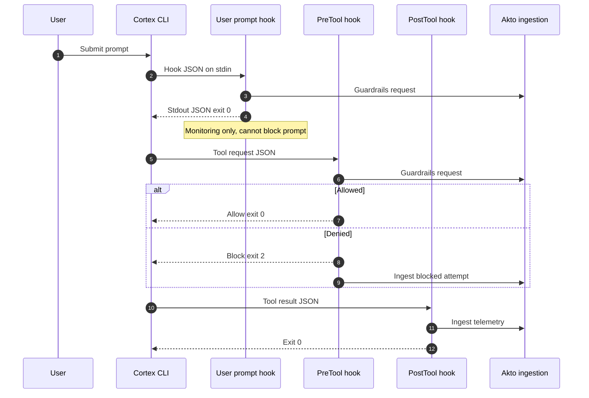

# Snowflake Cortex Code CLI Hooks

Akto Guardrails for [Snowflake Cortex Code CLI](https://docs.snowflake.com/en/user-guide/cortex-code/extensibility) sends prompts and tool activity to Akto using the same `/api/http-proxy` ingestion path as Claude Code CLI, GitHub Copilot CLI, Cursor hooks, and Codex CLI. Hooks run locally on the employee machine, validate policy where Snowflake allows blocking, and record events in your Akto dashboard.

## Key Features

* ✅ **Native Cortex hooks** – Uses Snowflake’s documented hook events and JSON stdin/stdout contract
* ✅ **Atlas and Argus** – `MODE=atlas` uses a per-device synthetic host (`ai-agent.cortex`) for employee endpoint inventory
* ✅ **Guardrails + ingestion** – `UserPromptSubmit` and `PreToolUse` call Akto guardrails; `PostToolUse` ingests tool results
* ✅ **Blocking where supported** – `PreToolUse` can deny tool execution (exit code `2` per Snowflake); prompt hook is monitoring-only for that event (non-blocking in Cortex)
* ✅ **Centralized visibility** – Events appear alongside other Atlas discovery agents

## How It Works

Cortex Code CLI loads hook definitions from `~/.snowflake/cortex/hooks.json` or from project `.cortex/settings.json` / `.cortex/settings.local.json` (see [hook configuration](https://docs.snowflake.com/en/user-guide/cortex-code/extensibility#configuring-hooks)). Akto ships command hooks for three lifecycle points:



**Hook points (Akto package):**

1. **`UserPromptSubmit`** – Runs guardrails; on violation emits a `systemMessage`, ingests the event, always exits `0` (Snowflake does not treat this hook as blocking).
2. **`PreToolUse`** – Runs guardrails; on deny prints `{"decision":"block","reason":...}` and exits `2` to block the tool.
3. **`PostToolUse`** – Ingests tool input/output for inventory and analytics (observational).

For security practices (credentials, MCP, permissions), see [Security best practices for Cortex Code CLI](https://docs.snowflake.com/en/user-guide/cortex-code/security).

## File layout

Recommended install directory:

```
~/.snowflake/cortex/akto-hooks/
├── .env                                    # Your AKTO_DATA_INGESTION_URL and options (chmod 600)
├── cortex_common.py
├── akto_machine_id.py
├── akto-validate-prompt.py
├── akto-validate-prompt-wrapper.sh
├── akto-validate-pre-tool.py
├── akto-validate-pre-tool-wrapper.sh
├── akto-validate-post-tool.py
├── akto-validate-post-tool-wrapper.sh
└── hooks.json.example                      # Reference only; merge into global hooks.json
```

Logs default to `~/.snowflake/cortex/akto/logs` (or a temp-dir fallback if that path cannot be created).

**Sources in the Akto repo:** `apps/mcp-endpoint-shield/snowflake-cortex-cli-hooks/` ([browse on GitHub](https://github.com/akto-api-security/akto/tree/master/apps/mcp-endpoint-shield/snowflake-cortex-cli-hooks)).

## Setup guide

### Prerequisites

* Cortex Code CLI installed and working ([Cortex Code CLI](https://docs.snowflake.com/en/user-guide/cortex-code/extensibility))
* Akto data ingestion base URL (from your Akto deployment / Quick Start)
* Python 3 as `python3`
* macOS, Linux, or Windows (bash recommended for wrappers)

### Installation steps



**Create install directory**

```bash
mkdir -p ~/.snowflake/cortex/akto-hooks
cd ~/.snowflake/cortex/akto-hooks
```



**Download hook scripts**

```bash
HOOKS_BASE="https://raw.githubusercontent.com/akto-api-security/akto/feature/snowflake-cortex-atlas-integration/apps/mcp-endpoint-shield/snowflake-cortex-cli-hooks"

for f in \
  cortex_common.py \
  akto_machine_id.py \
  akto_heartbeat.py \
  akto-validate-prompt.py \
  akto-validate-prompt-wrapper.sh \
  akto-validate-pre-tool.py \
  akto-validate-pre-tool-wrapper.sh \
  akto-validate-post-tool.py \
  akto-validate-post-tool-wrapper.sh \
  hooks.json.example \
  .env.example \
  fixtures/sample-pretool.json
do
  mkdir -p "$(dirname "$f")"
  curl -fsSL -o "$f" "${HOOKS_BASE}/${f}"
done

chmod +x ./*.sh
```



**Configure URLs and API token (CRITICAL)**

The wrapper scripts ship with placeholders that must be replaced before hooks can authenticate to Akto (ingestion + cyborg heartbeat), unless you override everything via `.env` in the next step.

| Placeholder | Purpose |
| --- | --- |
| `{{AKTO_DATA_INGESTION_URL}}` | Akto data ingestion base URL (no trailing slash) |
| `{{AKTO_API_TOKEN}}` | API token sent as `Authorization` on ingestion `POST` and on cyborg heartbeat |
| `{{DATABASE_ABSTRACTOR_SERVICE_URL}}` | Cyborg / database-abstractor base URL for heartbeat; for Akto SaaS replace with `https://cyborg.akto.io` |

**macOS / Linux (`sed`):**

```bash
cd ~/.snowflake/cortex/akto-hooks

AKTO_URL="https://your-akto-ingestion.example.com"
AKTO_TOKEN="your-akto-api-token"
CYBORG_URL="https://cyborg.akto.io"

sed -i.bak "s|{{AKTO_DATA_INGESTION_URL}}|${AKTO_URL}|g" ./*-wrapper.sh
sed -i.bak "s|{{AKTO_API_TOKEN}}|${AKTO_TOKEN}|g" ./*-wrapper.sh
sed -i.bak "s|{{DATABASE_ABSTRACTOR_SERVICE_URL}}|${CYBORG_URL}|g" ./*-wrapper.sh

grep -E "AKTO_DATA_INGESTION_URL|AKTO_API_TOKEN|DATABASE_ABSTRACTOR" ./*-wrapper.sh
```


If you use a `.env` file in the same directory, variables set there **override** these exports when the wrapper runs (the wrapper sources `.env` after the `export` lines).




**Configure Akto environment file**


Create `~/.snowflake/cortex/akto-hooks/.env` (do not commit it) if you prefer env-based config instead of `sed` on wrappers. Set `AKTO_DATA_INGESTION_URL` with **no** trailing slash, and `AKTO_API_TOKEN` as provided by your Akto deployment. You can start from the downloaded `.env.example`.


Minimal example:

```bash
cat > ~/.snowflake/cortex/akto-hooks/.env << 'EOF'
AKTO_DATA_INGESTION_URL=https://your-akto-ingestion.example.com
AKTO_API_TOKEN=your-akto-api-token
DATABASE_ABSTRACTOR_SERVICE_URL=https://cyborg.akto.io
MODE=atlas
AKTO_SYNC_MODE=true
AKTO_TIMEOUT=5
AKTO_CONNECTOR=cortex_code_cli
CONTEXT_SOURCE=ENDPOINT
LOG_DIR=~/.snowflake/cortex/akto/logs
LOG_LEVEL=INFO
EOF

chmod 600 ~/.snowflake/cortex/akto-hooks/.env
chmod 700 ~/.snowflake/cortex/akto-hooks
```



**Register hooks in Cortex**

Merge Akto commands into your Cortex hooks configuration.

* **Global:** `~/.snowflake/cortex/hooks.json`
* **Project:** `.cortex/settings.json` or `.cortex/settings.local.json`

Replace `INSTALL_DIR` below with the absolute path to `akto-hooks` (for example `/Users/you/.snowflake/cortex/akto-hooks`):

```json
{
  "hooks": {
    "UserPromptSubmit": [
      {
        "hooks": [
          {
            "type": "command",
            "command": "bash INSTALL_DIR/akto-validate-prompt-wrapper.sh",
            "timeout": 60
          }
        ]
      }
    ],
    "PreToolUse": [
      {
        "matcher": "*",
        "hooks": [
          {
            "type": "command",
            "command": "bash INSTALL_DIR/akto-validate-pre-tool-wrapper.sh",
            "timeout": 60
          }
        ]
      }
    ],
    "PostToolUse": [
      {
        "matcher": "*",
        "hooks": [
          {
            "type": "command",
            "command": "bash INSTALL_DIR/akto-validate-post-tool-wrapper.sh",
            "timeout": 60
          }
        ]
      }
    ]
  }
}
```

If a `hooks` key already exists, merge these three events with your existing entries so other hook scripts are preserved.




**Verify**

```bash
cd ~/.snowflake/cortex/akto-hooks
# Optional: pipe sample PreTool JSON (see repo fixtures/sample-pretool.json) through the pre-tool wrapper
tail -f ~/.snowflake/cortex/akto/logs/*.log
```

Run a short Cortex Code CLI session and confirm new lines in the Akto logs and dashboard inventory.



## Configuration reference

### Environment variables (`.env` or shell)

| Variable | Description |
|----------|-------------|
| `AKTO_DATA_INGESTION_URL` | **Required.** Akto ingestion base URL (no trailing `/`). |
| `AKTO_API_TOKEN` | **Required for authenticated SaaS.** Sent as `Authorization` on ingestion and cyborg heartbeat (same as Copilot hooks). `AKTO_TOKEN` is accepted as an alias. |
| `DATABASE_ABSTRACTOR_SERVICE_URL` | Cyborg base URL for heartbeat; defaults to `https://cyborg.akto.io` when unset or still a `{{...}}` placeholder. |
| `MODE` | `atlas` (employee endpoints) or `argus`. |
| `DEVICE_ID` | Optional Atlas device id; defaults to generated machine id. |
| `AKTO_SYNC_MODE` | `true` to enforce guardrails on `PreToolUse`; `false` observes only where applicable. |
| `AKTO_CONNECTOR` | Default `cortex_code_cli` (sent as `akto_connector` query param). |
| `CONTEXT_SOURCE` | Default `ENDPOINT`. |
| `AKTO_TIMEOUT` | HTTP timeout seconds (default `5`). |
| `LOG_DIR` | Log directory; defaults under `~/.snowflake/cortex/akto/logs`. |
| `LOG_LEVEL` | `INFO`, `DEBUG`, etc. |

Wrappers export `{{AKTO_DATA_INGESTION_URL}}`, `{{AKTO_API_TOKEN}}`, and `{{DATABASE_ABSTRACTOR_SERVICE_URL}}` (replace with `sed` or override via `.env`). They `source` `~/.snowflake/cortex/akto-hooks/.env` when present **after** those exports so `.env` wins.

### Synthetic traffic (Atlas)

In Atlas mode, hooks tag traffic with host pattern `https://{DEVICE_ID}.ai-agent.cortex` and metadata `ai-agent: cortexcli` so it aligns with other CLI discovery agents in Akto.

## Troubleshooting

| Issue | What to check |
|-------|----------------|
| Hooks never run | JSON path in `command` must be absolute; merge did not overwrite unrelated keys incorrectly. |
| Python errors | `python3` on `PATH`; all `.py` files live in the same directory as wrappers (`cortex_common` import). |
| No data in Akto | `AKTO_DATA_INGESTION_URL`, `AKTO_API_TOKEN`, network egress, and Akto account mapping for your org. |
| `401` / auth errors on ingestion | Set `AKTO_API_TOKEN` (or replace `{{AKTO_API_TOKEN}}` in wrappers). Include `Bearer ` prefix in the token value if your deployment expects it. |
| Permission errors on `~/.snowflake` | Ensure home directory permissions; logs may fall back to the system temp directory. |

## Related

* [Claude CLI Hooks](claude-cli-hooks.md)
* [Copilot Hooks](copilot-cli-hooks.md)
* [Codex CLI Hooks](codex-cli-hooks.md)
* [Gemini CLI Hooks](gemini-cli-hooks.md)
* [Cursor Hooks](cursor-hooks.md)
