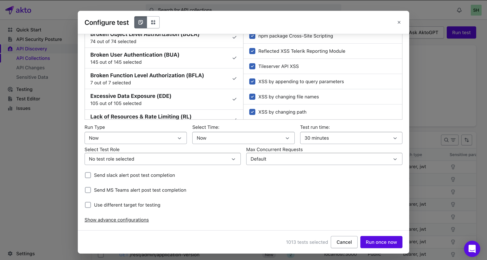
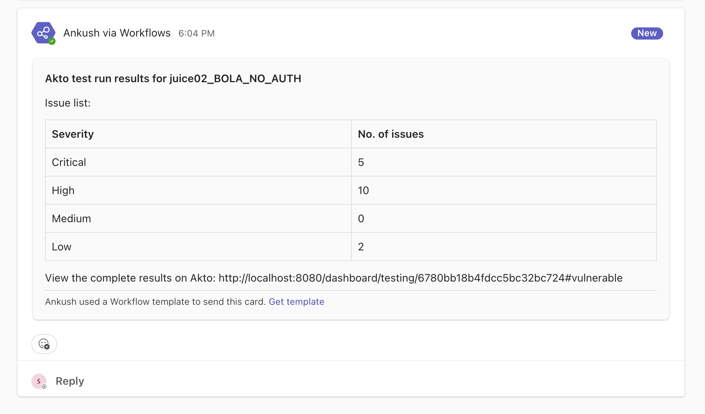

# Setup alerts for Akto test run results

You can setup alerts for Akto test run results by following the steps given below:

1. Configure alerts. You can configure [Slack Webhook](slack-webhook.md) or [Microsoft Teams Webhook](microsoft-teams-webhook.md) according to your requirement.
2.  Once configured, in the `Run test` dialog box, select the option to send alerts for test results.

    <figure><figcaption></figcaption></figure>
3.  Voila you have configured test alerts. Once the tests are completed, you will receive test run summary directly in your preferred medium.

    <figure><figcaption></figcaption></figure>

### Reminders for Scheduled Tests

Akto also supports **reminder alerts** to help you stay prepared for upcoming scheduled tests. By enabling the **Pending tests alerts** option in the Webhook settings, you will receive a notification **one hour before** any scheduled test is set to run. This ensures your team is aware and can take any necessary preparatory actions before the security test begins.

<figure><figcaption></figcaption></figure>

## Get Support for your Akto setup

There are multiple ways to request support from Akto. We are 24X7 available on the following:

1. In-app `intercom` support. Message us with your query on intercom in Akto dashboard and someone will reply.
2. Join our [discord channel](https://www.akto.io/community) for community support.
3. Contact `help@akto.io` for email support.
4. Contact us [here](https://www.akto.io/contact-us).
