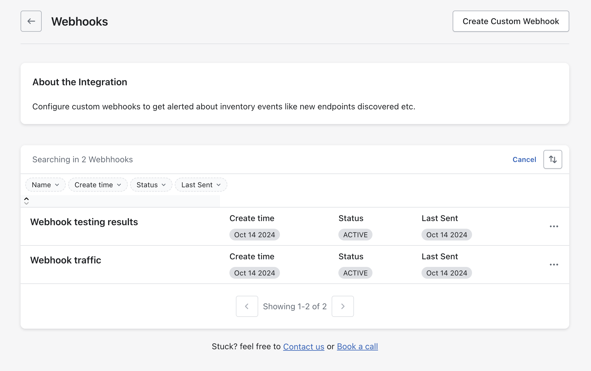
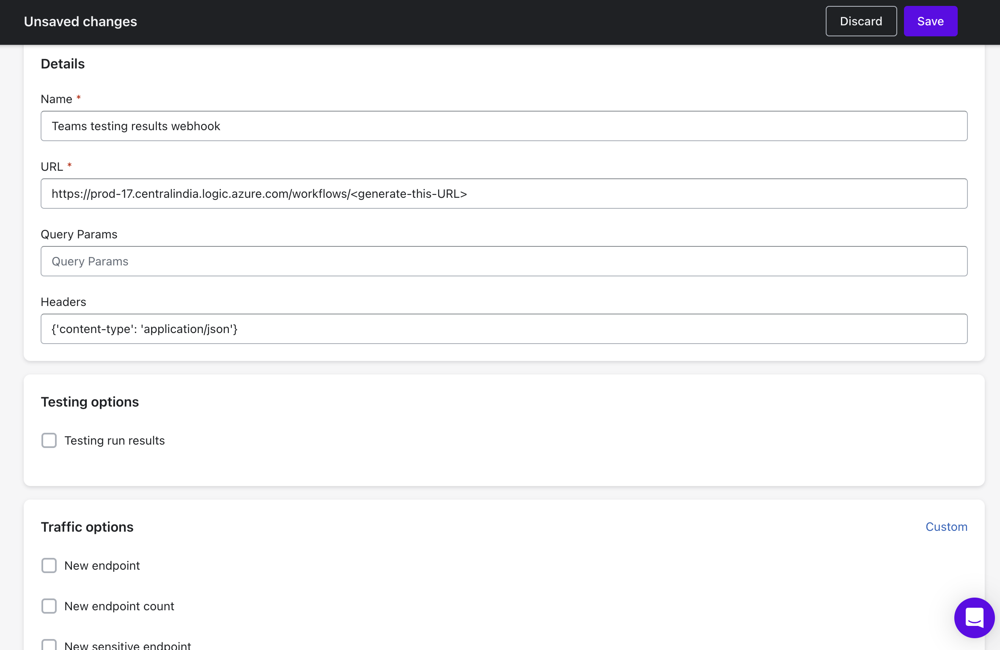

# Microsoft Teams Webhook

Microsoft Teams Webhook integration allows Akto to send automated notifications about API security events, test results, and important alerts directly to your specified Teams channels. This creates a centralized location for your team to monitor and respond to API security concerns without switching between multiple platforms.

<figure><figcaption></figcaption></figure>

### How to configure:

1. **Log into Akto Dashboard**
   1. Open your web browser
   2. Navigate to your Akto dashboard ([https://app.akto.io](https://app.akto.io))
   3. Sign in with your credentials
2. **Navigate to Integrations**
   1. Click on "Settings" in the left sidebar
   2. Select "Integrations" from the menu options
   3. You will see various integration options categorized by type
3. **Locate Teams Integration**
   1. Find "Microsoft Teams Webhooks" in the integrations list
   2. Click the "Configure" button next to it
4. Click on `Create Custom Webhook`.
   <figure><figcaption></figcaption></figure>
5. Fill in the details of your webhook. Select options from `Testing options` if you want to send testing run results using this webhook and select options from `Traffic options` if you want to send traffic alerts using this webhook. Then click on save to save the webhook.
   <figure><figcaption></figcaption></figure>

Notes:
1. For on-premise setups, ensure that the webhook URL is accessible from the VM/cluster/pods.
2. To create webhook, refer to this official guide from Microsoft, [Create incoming webhooks](https://support.microsoft.com/en-us/office/create-incoming-webhooks-with-workflows-for-microsoft-teams-8ae491c7-0394-4861-ba59-055e33f75498)

## Get Support for your Akto setup

There are multiple ways to request support from Akto. We are 24X7 available on the following:

1. In-app `intercom` support. Message us with your query on intercom in Akto dashboard and someone will reply.
2. Join our [discord channel](https://www.akto.io/community) for community support.
3. Contact `help@akto.io` for email support.
4. Contact us [here](https://www.akto.io/contact-us).
