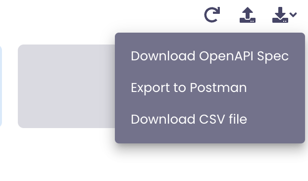
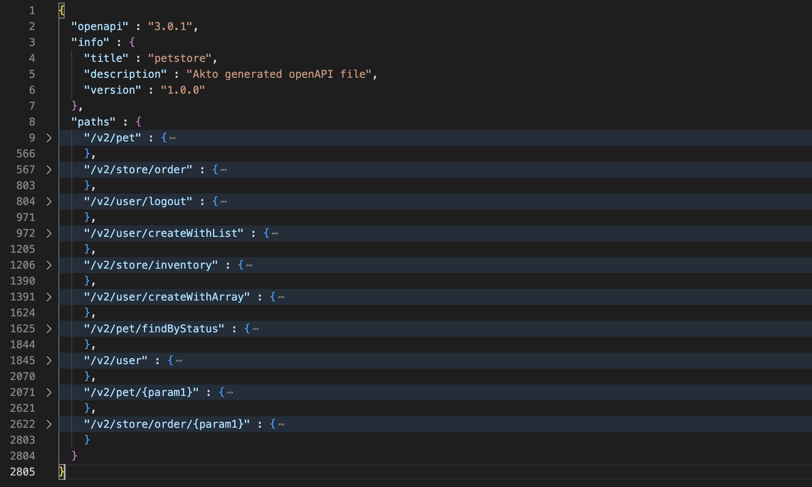

# API documentation

You can document all your APIs using akto in OpenAPI Spec, Postman spec and csv. To generate an API documentation go to any API collection and and click on your desired format. 

<figure><figcaption></figcaption></figure>

This is an example OpenAPI spec generated by akto for a sample website. As you can see, akto successfully generates a comprehensive openAPI spec for the traffic.

<figure><figcaption></figcaption></figure>
