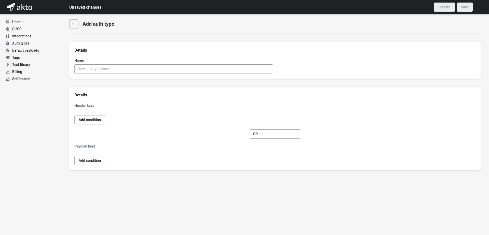

# Auth types

Most of the time organizations have different types of authentication types. For example, some organization may use a pair of two keys, say ```AUTH-KEY``` and ```AUTH-KEY-2``` in headers as authentication mechanism. Simillarly some other organization may use a single key in the payload as an authentication mechanism. Akto allows you to define custom auth mechanism based on where you send the auth key. We support auth key detection in header, payload and even cookies.

1. To add a custom auth type, go to ```Auth types``` under settings and click on plus icon.

   <figure><figcaption></figcaption></figure>

2. Add details for your auth type and click on save.

   <figure><figcaption></figcaption></figure>

3. Akto will now start detecting your custom auth types. It appears as `custom` under the Auth Type column for any API Collection.
   <figure><figcaption></figcaption></figure>
