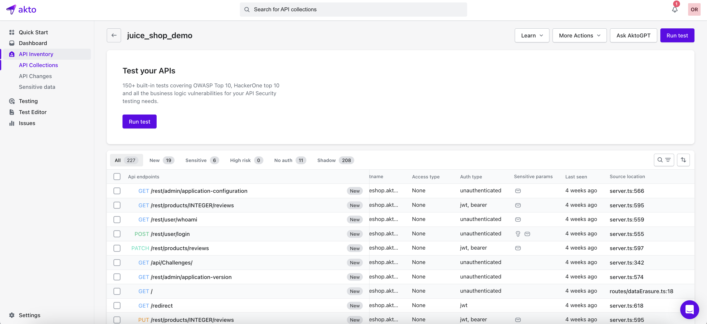
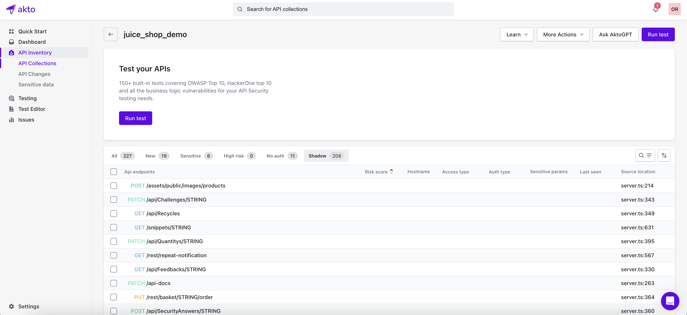

# API inventory from source code

Akto supports creating API inventory from source code with the help of our code analysis tool. Simply run our code analysis tool on your source code repositories to discover APIs, including shadow API detection. This source code-based API inventory integrates seamlessly with the traffic-based API inventory.

### Why create API inventory from source code?

1. Discover APIs directly from source code.
2. Discover new APIs in PRs by integrating our code analysis tool in your CI/CD pipelines.
3. Discover shadow APIs in your applications.
4. Review the API source code using the provided source code links (if available).

<figure><figcaption>
The source location field displays the source code file name, line number and the source code file link.
</figcaption></figure>

<figure><figcaption>
Click on the shadow tab to view the shadow APIs
</figcaption></figure>

### How to use

To get started with creating API inventory from source code, choose between the following two methods depending on where your source code is hosted:
1. [Extract APIs from github hosted source code using our Github Action](../how-to/extract-apis-from-source-code-gha.md)
2. [Extract APIs from source code using our Docker based CLI](../how-to/extract-apis-from-source-code-docker-cli.md)

The following web application frameworks are currently supported:
1. Spring Boot 
2. Django
3. ExpressJS
4. Mux

If your application is using a framework not listed above, please reach out to `help@akto.io`.