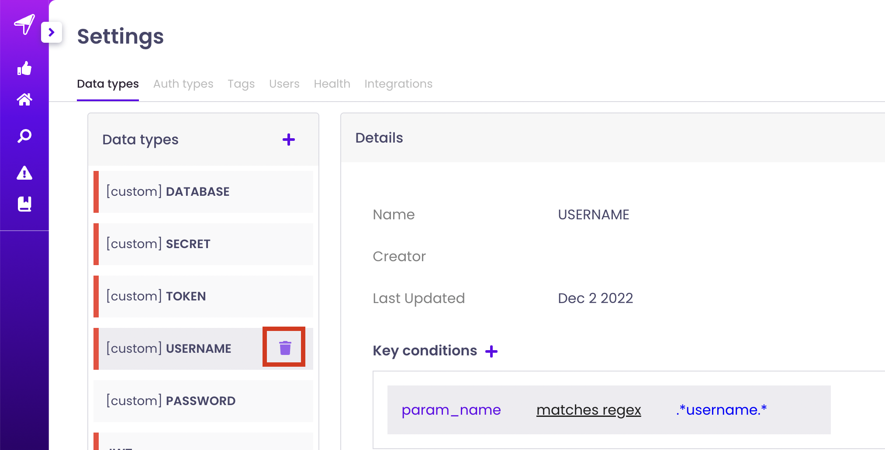
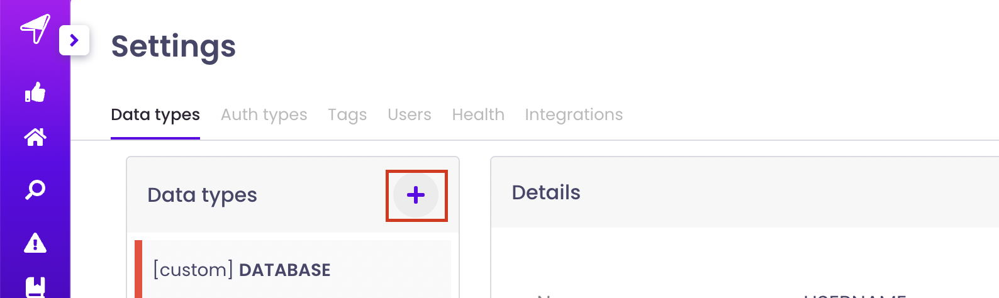
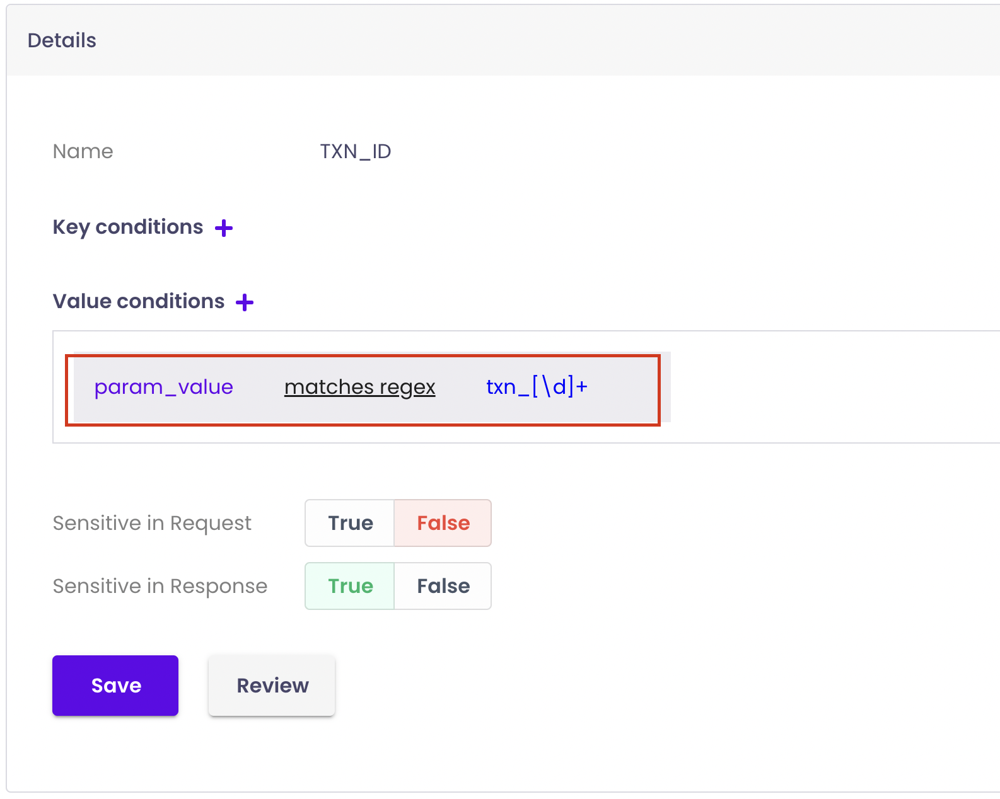

# Data types

Akto comes with a set of pre-defined data types already eg Email, Phone number, IP address etc. 
You can find the list of data types in your dashboard by checking out `Settings` > `Data types`.

<figure></figure>

Akto provides a lot of ways to customize data types.
1. [Set or unset a data type as sensitive](#modify-sensitive-settings)
2. [Activate or deactivate a data type](#activate-or-deactivate)
3. [Add your own data types](#add-custom-types)

## Modify sensitive settings
1. Go to `My accounts` > `Settings` > select `Data types`
   <figure></figure>

2. Select the data type you want to modify
   <figure></figure>

3. Look for the `Sensitive in Request` and `Sensitive in Response` options
   <figure></figure>

4. If you set it to `True`, Akto will start marking the pattern as sensitive across all your APIs for all your collections.
   Note that the new type will be detected as new data is processed. No old data will be processed.
   <figure></figure>

5. If both are set to `False`, Akto will still detect it, but won't show up in sensitive data

## Activate or deactivate
1. Go to `My accounts` > `Settings` > select `Data types`
   <figure></figure>

2. Hover on the data type and click on the `Trash` icon to deactivate the data type. 
   <figure></figure>

3. Akto will stop detecting this type as new data comes in. 

4. If you want to reactivate it, you can scroll to the bottom to find the deactivated type and click on the `Check` icon to activate. 
   <figure></figure>

## Add custom types
1. Go to `My accounts` > `Settings` > select `Data types`
   <figure></figure>

2. Click on the `Plus` button at the top
   <figure></figure>

3. Name your data type eg. `TXN_ID`

4. Add patterns to identify it. You can match against the key (eg. key contains `txn_id`) or you can match against the value as shown. 
   <figure></figure>

5. Adjust the sensitivity. Here, we want `TXN_ID` to be sensitive only in responses

6. Click on `Save`
