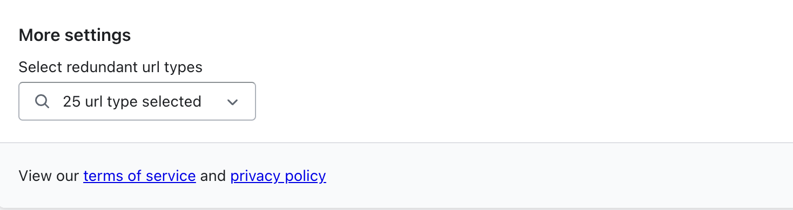
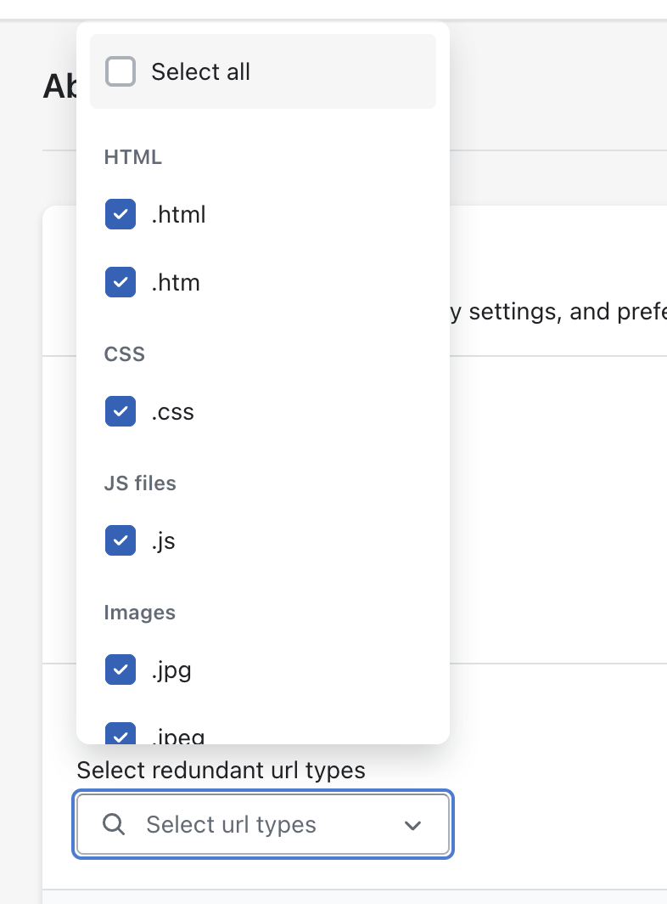
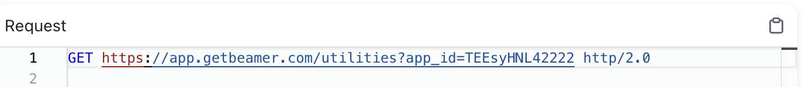
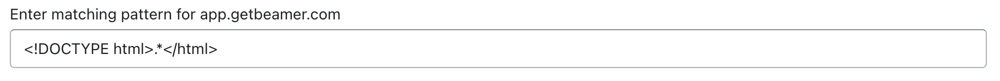
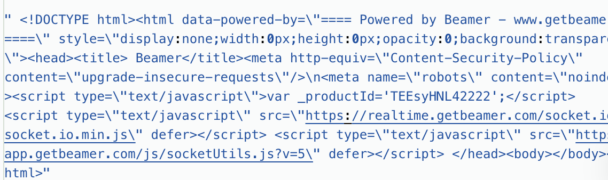
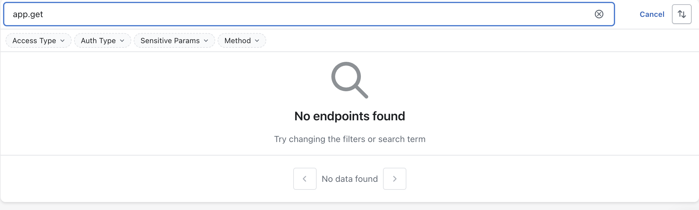

# Remove Bad Endpoints

Akto gives user options to ignore the static files endpoints or endpoints having default payloads.This documentation is essential for users looking to maintain a clean and efficient endpoint inventory in their Akto setup.
 
We have two methods for removing bad endpoints from your inventory:
1. [Select file type](remove-bad-endpoints.md#selecting-static-endpoints-file-type)
2. [Add default payloads](remove-bad-endpoints.md#adding-default-payloads)
## Ways to remove bad endpoints in Akto

### Selecting static endpoints file type

1. Navigate to `Settings`. Then open `About` tab in the left nav.

2. Click on the `Select redundant url types` button in `More settings` section on the page.

<figure><figcaption>File type button</figcaption></figure>

3. Select the `File types` which you want to ignore and akto will ignore those endpoints from the future.
You can also remove some default types we ignore.

<figure><figcaption>Options present</figcaption></figure>

### Adding default payloads

1. Navigate to `Settings`. Then open `Default payloads` tab in the left nav.

2. Click on `Add your own` and then enter the domain name of the urls you want to ignore.

<figure><figcaption>The above example has 'app.getbeamer.com' as domain name</figcaption></figure>

3. After adding domain name, `enter the regex` for response payload.

<figure></figure>

4. Now akto will ignore urls in which response payload matches the above regex.

<figure><figcaption>The above url has 'html type payload' as domain name</figcaption></figure>

5. On re-uploading the Traffic via Har, we observer the api was ignored and thus was not stored in the inventory.

<figure>Api with the hostname on reload was ignored.</figure>

### Summary
The guide includes detailed step-by-step instructions, complete with visual aids and examples, to assist users in navigating through the Akto settings and applying these configurations effectively.

## Get Support for your Akto setup

There are multiple ways to request support from Akto. We are 24X7 available on the following:

1. In-app `intercom` support. Message us with your query on intercom in Akto dashboard and someone will reply.
2. Join our [discord channel](https://www.akto.io/community) for community support.
3. Contact `help@akto.io` for email support.
4. Contact us [here](https://www.akto.io/contact-us).