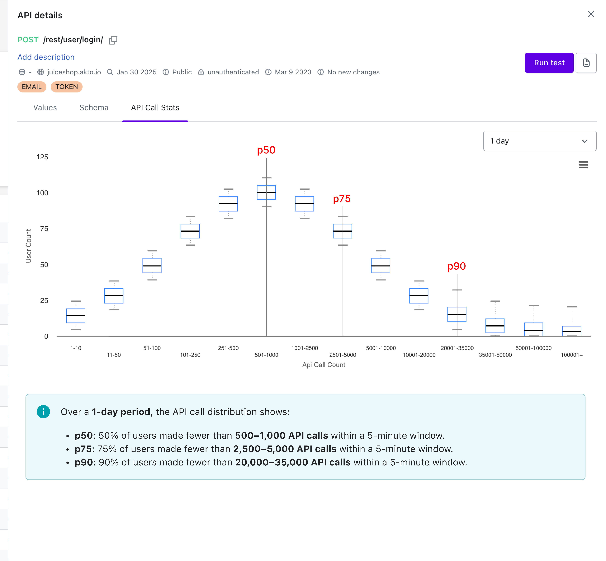
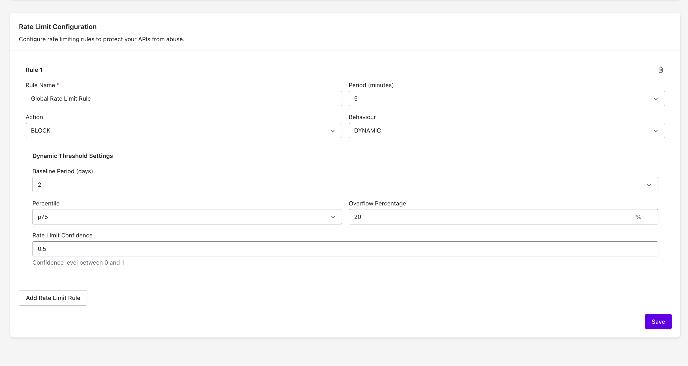

# API Abuse 

### Akto's Next Gen API RateLimits Discovery:

Traditional ratelimits rely on knowing the number of rpm allowed or supported ahead of time. In large organisations with 100s of APIs this is very difficult to do reliably.

For instance, an API may experience varying traffic volumes to endpoints like `/cancel-booking` compared to `/book`. Furthermore, the `/book` endpoint could see an uptick in usage following a successful marketing push.

These examples illustrate the drawbacks of conventional rate limiting. Traffic not only differs across endpoints but can also fluctuate over time for a single endpoint. Akto's state of the art algorithms overcomes these challenges establishing unique baselines for each API and adapting more effectively to evolving user patterns.

#### Key Innovations
**Adaptive Learning:** Unlike static rate limits, Akto's system learns from actual usage patterns over time.

**Endpoint-Specific Baselines:** Recognizes that different endpoints (like `/book` vs `/cancel-booking`) have different traffic patterns

**Dynamic Adaptation:** Adjusts to changing usage patterns, such as traffic spikes after marketing campaigns

<figure><figcaption></figcaption></figure>

## How to configure 

By default Akto's Threat Protection will apply a default global rate limit rule. 

To configure rate limit rules, navigate to the **Settings -> Threat Configuration** section in left nav bar and scroll down.

### Default Configuration
This global, dynamic rule auto-learns normal traffic per endpoint over a 2-day baseline and adapts limits without manual tuning.
It uses the 75th percentile with a 20% overflow and a 0.5 confidence threshold to throttle anomalies while minimizing false positives.

- **Rule Name**: `Global Rate Limit Rule`
- **Period**: `5 minutes`
    - Period to
- **Behaviour**: `Dynamic`
    - Dynamic behaviour will use the auto learned limit's by Akto.
- **Baseline Period**: `2 days`
    - Duration in days to learn the API usage patterns. 
- **Percentile**: `p75`
    - Number of requests made by 75% of users.
- **Overflow Percentage**: `20`
    - Allow overflow to limit the impact.
- **Rate Limit Confidence**: `0.5`
    - Threshold of confidence to Akto's learned patterns 

<figure><figcaption></figcaption></figure>