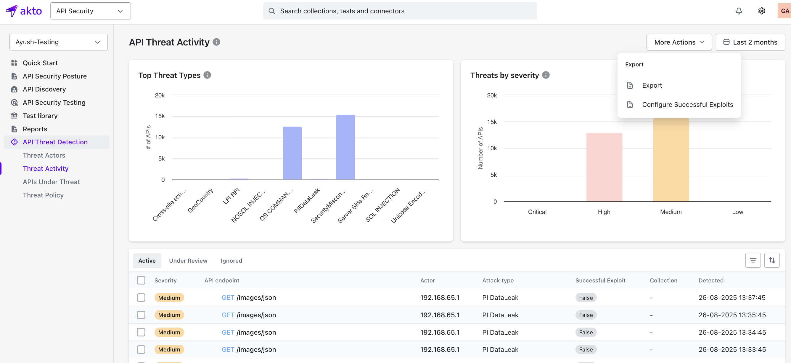
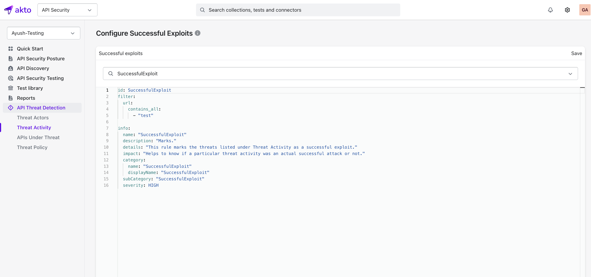

#### Successful Exploits Policy

Customizable filters that mark detected security threats by Akto's Runtime Threat Protection as successful exploits in the Threat Activity dashboard. 


#### How to configure
Go to **API Threat Detection → Threat Activity** in the left sidebar. Click **More Actions → Configure Successful Exploit**.

**Note:** Policies must use category name `SuccessfulExploit`

**Syntax Reference:** For detailed syntax on how to define API selection filters, see [API Selection Filters](https://docs.akto.io/test-editor/concepts/test-yaml-syntax-detailed/api-selection-filters).

<figure><figcaption></figcaption></figure>

#### Example Successful Exploit Policy
Marks all threats as successful exploits when the URL contains `test`.
```
id: SuccessfulExploit
filter:
  url:
    contains_all:
      - "test"

info:
  name: "SuccessfulExploit"
  description: "Marks threats as successful exploits"
  details: "Identifies which threat activities were actual successful attacks"
  impact: "Distinguishes real attacks from false positives"
  category:
    name: "SuccessfulExploit"
    displayName: "SuccessfulExploit"
  subCategory: "SuccessfulExploit"
  severity: HIGH
```

<figure><figcaption></figcaption></figure>