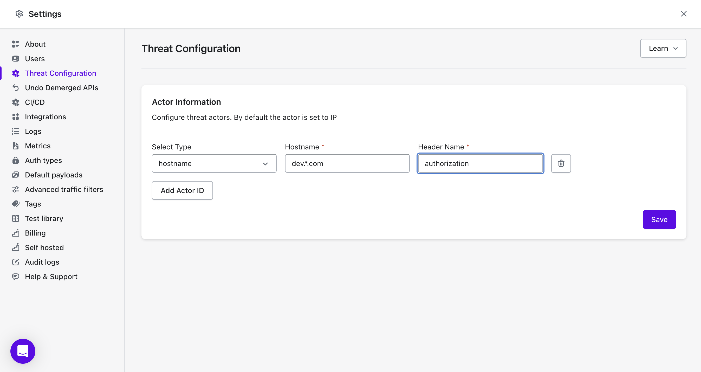

#### Understanding Threat Actors 

Threat actors are individuals, groups, or entities responsible for carrying out malicious activities that can harm systems, networks, or data. They are often motivated by financial gain, espionage, ideology, or disruption. Threat actors can range from lone hackers to organized crime groups, nation-states, or insider threats.

#### Key Metrics to Monitor:

**Critical Actors**: Threat actors posing a high risk due to their capability and intent.  

**Active Actors**: The total number of threat actors currently engaging in malicious activities.  

**Threat Activity Timeline**: Tracks the frequency and volume of attacks over time (e.g., API hits).  

**Threat Actor Map**: Geographically maps the origin of threat actors.

<figure><figcaption></figcaption></figure>

#### How to configure Threat Actors

By default Akto's Threat Protection module uses the client's IP address to identify a threat actor.   

To configure threat actors, navigate to the Settings -> Threat Threat Policy section under API Protection in left nav bar on your Akto Dashboard.

##### Example Configuration
- **Type**: `hostname`
- **Hostname**: `dev.*com`
- **Header Name**: `authorization`

This configuration will monitor any requests from hostnames matching dev.*com (e.g., dev.example.com) that include an authorization header, identifying the threat actors uniquely based on the value of authorization header.

<figure><figcaption></figcaption></figure>