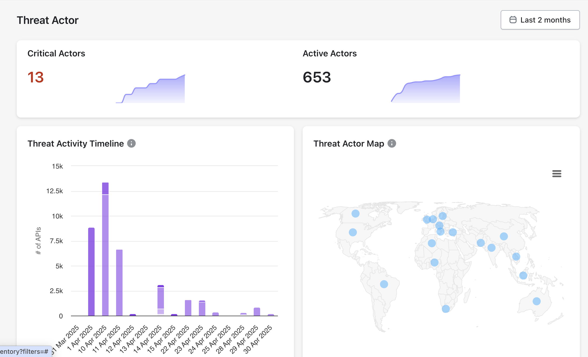

# Threat Actors

## **Understanding Threat Actors**

Threat actors are individuals, groups, or entities responsible for carrying out malicious activities that can harm systems, networks, or data. They are often motivated by financial gain, espionage, ideology, or disruption. Threat actors can range from lone hackers to organized crime groups, nation-states, or insider threats.

### **Key Metrics to Monitor**

**Critical Actors**: Threat actors posing a high risk due to their capability and intent.

**Active Actors**: The total number of threat actors currently engaging in malicious activities.

**Threat Activity Timeline**: Tracks the frequency and volume of attacks over time (e.g., API hits).

**Threat Actor Map**: Geographically maps the origin of threat actors.

<figure><figcaption></figcaption></figure>

### Threat Actor Attributes

Akto derives User threat actors directly from inbound API traffic observed during runtime analysis. Following attributes are presented in the actors list:

<figure><figcaption></figcaption></figure>

<table><thead><tr><th width="140.78515625">Attribute</th><th>Description</th><th>Investigation Value</th></tr></thead><tbody><tr><td>Actor ID</td><td>Unique identifier derived from the source IP address.</td><td>Enables correlation of attack activity across APIs and time.</td></tr><tr><td>Actor IP</td><td>Network address associated with the actor.</td><td>Supports blocking, rate limiting, and forensic analysis.</td></tr><tr><td>Country</td><td>Geolocation inferred from the actor IP.</td><td>Helps identify regional attack patterns.</td></tr><tr><td>IP Reputation</td><td>Reputation metadata associated with the actor IP.</td><td>Provides contextual risk signals for prioritization.</td></tr><tr><td>Latest Host</td><td>Hostname targeted by the actor.</td><td>Identifies the API surface under attack.</td></tr><tr><td>Latest API</td><td>Most recent API endpoint accessed by the actor.</td><td>Shows the affected API operation.</td></tr><tr><td>Latest Attack</td><td>Attack category detected for the request.</td><td>Indicates the security issue type observed.</td></tr><tr><td>Access Type</td><td>Exposure level of the API endpoint.</td><td>Differentiates public and restricted APIs.</td></tr><tr><td>Sensitive Data</td><td>Indicator of sensitive data involvement.</td><td>Highlights potential data exposure risk.</td></tr><tr><td>Status</td><td>Current state of the threat actor.</td><td>Shows whether the actor remains active.</td></tr><tr><td>Detected At</td><td>Timestamp of first detection.</td><td>Supports incident timeline reconstruction.</td></tr></tbody></table>


## Note

IP reputation information is sourced from a third-party threat intelligence provider and includes contextual signals such as ISP, usage type, abuse reports, and whitelist status.&#x20;

Akto consumes this data to enrich threat actor context and does not generate or modify reputation scores.


## **How to configure Threat Actors**

By default Akto's Threat Protection module uses the client's IP address to identify a threat actor.

To configure threat actors, navigate to the Settings -> Threat Configuration section in left nav bar.

**Example Configuration**

* **Type**: `hostname`
* **Hostname**: `dev.*com`
* **Header Name**: `authorization`

This configuration will monitor any requests from hostnames matching dev.\*com (e.g., dev.example.com) that include an authorization header, identifying the threat actors uniquely based on the value of authorization header.

<figure><figcaption></figcaption></figure>
