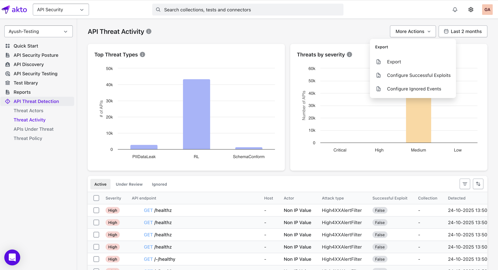
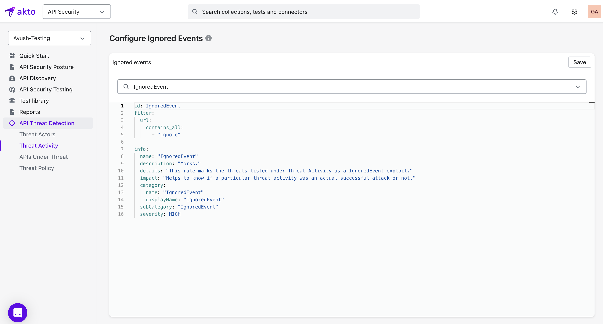

#### Ignored Malicious Events Policy

Customizable filters that mark detected security threats by Akto's Runtime Threat Protection as ignored in the Threat Activity dashboard. 


#### How to configure 
Go to **API Threat Detection → Threat Activity** in the left sidebar. Click **More Actions → Configure Ignored Events**.

**Note:** Policies must use category name `IgnoredEvent`

<figure><figcaption></figcaption></figure>

#### Example Ignored Events Policy
Marks all threats as ignored when when the URL contains `test`.
```
id: IgnoredEvent
filter:
  url:
    contains_all:
      - "test"

info:
  name: "IgnoredEvent"
  description: "Marks threats as successful exploits"
  details: "Identifies which threat activities were actual successful attacks"
  impact: "Distinguishes real attacks from false positives"
  category:
    name: "IgnoredEvent"
    displayName: "IgnoredEvent"
  subCategory: "IgnoredEvent"
  severity: HIGH
```

<figure><figcaption></figcaption></figure>