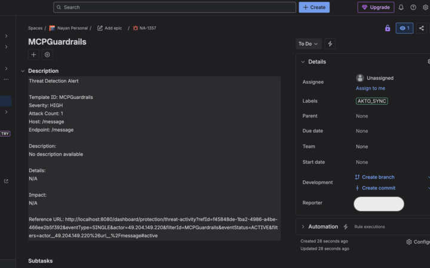

# Create Internal Workflow Item

## **Overview**

When you review a threat activity in Akto, you may need to involve internal teams for deeper investigation, tracking, or coordinated remediation. You can create workflow items directly from the threat activity details, including Jira tickets or internal work items, ensuring smooth cross-team collaboration.

## **Create Jira Ticket**

### **Prerequisites**

* Before creating Jira tickets from Akto, ensure that your Jira account is integrated with Akto.
* If not yet configured, complete the setup here: [jira.md](../../integrations/jira.md "mention")

### Steps



Navigate to **Threat Activity** under **API Threat Detection**.



Open the **activity details** for the threat event you want to send to Jira.



On the right panel, select **Create Jira Ticket**.

<figure><figcaption></figcaption></figure>



In the dialog box, choose the **Jira project** and **issue type** from the dropdown options.

<figure><figcaption></figcaption></figure>



Click **Create Ticket** and Akto will automatically generate the Jira ticket with the selected configuration.



### How the Jira Ticket Appears

After creation, you will see a confirmation summary in Akto. Below is an example of how the ticket typically appears:

<figure><figcaption></figcaption></figure>

## **Create Work Item**

If your team uses internal workflows within Akto, you can log and assign tasks using **Work Items**.

### **Prerequisite**

Before creating Jira tickets from Akto, ensure that your Azure DevOps Board is integrated with Akto. Follow for [**Integrations Setup**](../../integrations/azure-devops-boards.md)

### **Steps**



Open **Threat Activity** under **API Threat Detection**.



Select the threat activity that requires internal follow-up.



Click **Create Work Item** from the action panel.

<figure><figcaption></figcaption></figure>



Choose details such as title, description, severity, assignee, or notes for internal tracking.



Save the work item.


