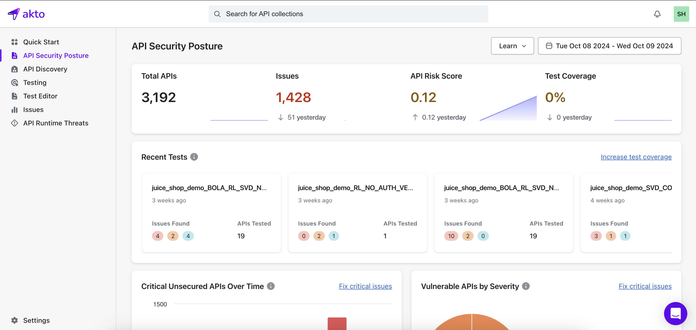

# Overview

Akto's API security posture gives you a comprehensive view of all crucial information such as identified issues, data exposure risks and test coverage, giving you clear visibility into the security of your APIs and enabling proactive management of vulnerabilities.

<figure><figcaption></figcaption></figure>