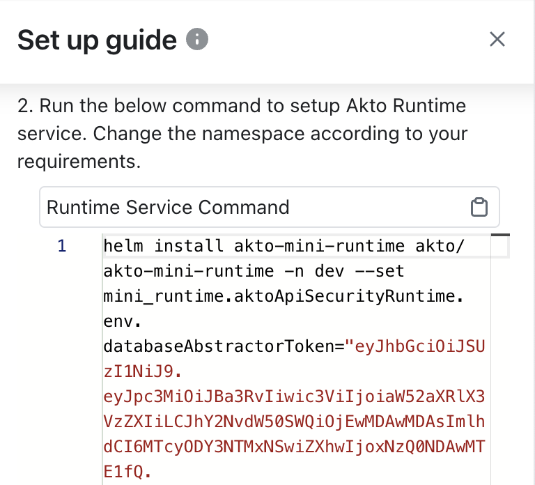

# Run test in Akto with Hybrid Testing

## Get Database abstractor token: 

1\. Go to [app.akto.io](https://app.akto.io)

2\. Login/Signup into your account.

3\. Click on Quick Start tab in left nav.

<figure><figcaption></figcaption></figure>

4\. Search for Hybrid SaaS Connector and click connect.

<figure><figcaption></figcaption></figure>

5. Get the database abstractor value from

<figure><figcaption></figcaption></figure>

## Setup helm chart for hybrid testing:

1. Add akto helm repository.

```bash
helm repo add akto https://akto-api-security.github.io/helm-charts/
```

#### Note: If you've already added akto helm repository, update the helm repository using.

```bash
helm repo update "<akto-repo-name>"
```

<figure><figcaption></figcaption></figure>


2. Using the dashboard abstractor token saved in the above steps, deploy the helm chart below.

```bash
helm install akto-mini-testing akto/akto-mini-testing-kafka -n <your-namespace> --set testing.aktoApiSecurityTesting.env.databaseAbstractorToken="<your-database-abstractor-token>"
```

## Get Support for your Akto setup

There are multiple ways to request support from Akto. We are 24X7 available on the following:

1. In-app `intercom` support. Message us with your query on intercom in Akto dashboard and someone will reply.
2. Join our [discord channel](https://www.akto.io/community) for community support.
3. Contact `help@akto.io` for email support.
4. Contact us [here](https://www.akto.io/contact-us).