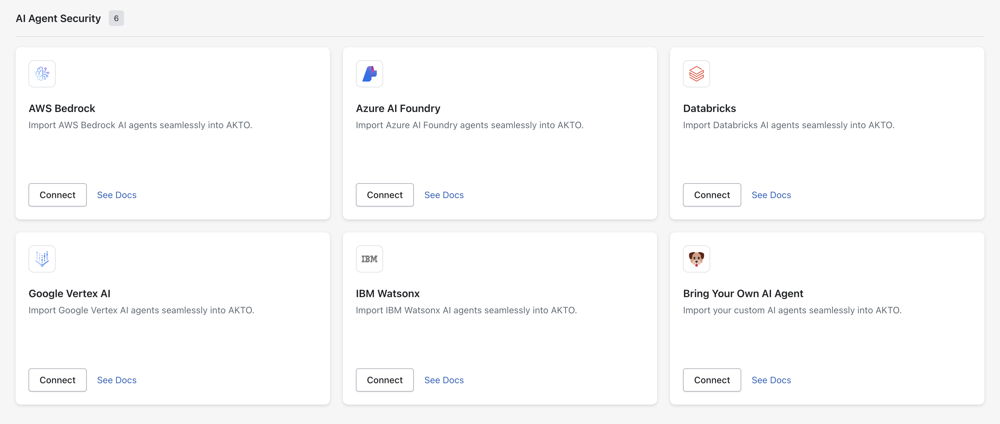

# Create a Test Role

## Overview

If you use role-based access control in your APIs and applications, you should check for privilege escalation issues. This often entails determining if a lower-privilege user has access to all higher-privilege APIs. If such an API exists, the development team should fix its privileges.

Akto lets you automate privilege escalation security tests. The information can also be used to create custom tests using Test YAML templates.

You should define as many roles as there are in your application. For example, if you're running a B2B SaaS program, you might have ADMIN, BILLING, MEMBER, and GUEST. Role creation is a one-time configuration.

In the demonstration below, let's create a Test Role and specify the role endpoint conditions.

## Create a Test Role

Go to **Testing > Test Roles**. Click on the **Create New Test Role** button. Enter the details for the new test role, including the **name** and specific **role endpoint conditions**.


Create a Test Role


In the above demonstration, we created a test role with the condition that it **“Belongs to”** the **"juice\_shop\_demo"** API collection. We chose to apply this role to the endpoints **`rest/basket/6`** and **`rest/languages`**. This setup allows us to simulate and verify the behavior of these endpoints under the defined role's permissions.\\

## Adding Auth token for Role

There are multiple ways you can Auth token with in Akto:

* You can [add a hard-coded token](create-a-test-role.md#hard-coded-auth-token) for quickly executing a test.&#x20;
* However, for daily tests or setting up tests in CI/CD, we highly recommend that you use [Automated Auth setup](create-a-test-role.md#automated-auth-token-generation).
* And, If you have a TLS based authentication, you can configure that using [TLS Authentication](create-a-test-role.md#tls-authentication)


You can configure **multiple authentication methods within a single Test Role**.

And using [**Advanced Settings**](create-a-test-role.md#advance-settings), you can control exactly which token should be applied to which API requests.&#x20;


### 1. Hard-coded Auth token

You can add a hard-coded auth token using the following steps -



Click on a particular **Test Roles.**



Click on `Add Auth` button.

<div data-with-frame="true"><figure><figcaption></figcaption></figure></div>



Under the hard coded section, enter the auth header key and the auth header value (eg. `Authorization` and `Bearer some.auth.token`)

<div data-with-frame="true"><figure><figcaption></figcaption></figure></div>



Click on `Save` button and verify that the auth is created.




## Note

If you want to use the auth token only for a specific account, you can add `API Header condition`.&#x20;

For example, `X-Account-Id: 10000` would mean the the auth token will be used only if the API request has `X-Account-Id: 10000` in its headers.


### 2. Use Tokens from Traffic

Akto allows you to automatically use authentication tokens observed in your API traffic. This is useful when valid tokens are already present in captured traffic and you want to reuse them for testing without manually configuring or generating new ones.

To use tokens from traffic, follow these steps:



Go to **Test Roles** and create or edit a Test Role.



Click on **Add Auth**.



Select **From traffic**.



Under **Use tokens from traffic**, configure the following:

* **Location (Header / Query / Body)**\
  Select where the token is expected in the request. In most cases, this will be **Header**.
* **Key**\
  Enter the name of the parameter that contains the token.\
  Example: `Authorization`
* **Value (Optional)**\
  Specify a value pattern if you want to filter tokens.\
  Example: `Bearer .*`\
  This ensures only tokens matching the defined pattern are used.

<div data-with-frame="true"><figure><figcaption></figcaption></figure></div>



You can click the **+** icon to add multiple token extraction rules if required.



Click **Save** to apply the configuration.



Once configured, Akto will automatically pick matching tokens from observed traffic and use them during test execution.

### 3. Automated Auth token generation

For one-time testing or a quick tryout, you might need to manually add an auth token, because the token expires quickly, within a day. This means you can only use it occasionally for testing. Instead, you can set Akto to automatically fetch a fresh auth token to ensure that tests are always up-to-date before each test run. This way, Akto uses a new token for every test, ensuring the tests are always valid.

To add an auth token automatically while performing API testing, you need to follow these steps:



#### Configure API Call Details

Configuring API call details ensures that the server knows how to process the request and can generate and return a new auth token. This is key for keeping tests current and valid, as it allows the system to automatically get a fresh token before each test run.

In the demonstration, we're setting up the details for an API call, including the URL, method, headers, and body, to ensure the request is correctly configured and can successfully obtain the token.





#### **Execute the API Call**

After configuring the details, execute the API call. If successful, the server will respond with an auth token.

In the demonstration below, we make an API call and receive an authentication token from the server.





#### **Extract Token**

After testing the API call, you need to extract the auth token from the response. This typically involves identifying the header or body parameter where the token is located. For example, if the token is returned in a header named Authorization, you would extract it.

In the demonstration below, we extract the auth token from the response. This token can then be used for subsequent API calls that require authentication.



Once you have extracted the token, Akto will automatically use it for subsequent API calls in your tests.



Akto will now execute this entire API sequence before running a test to fetch a fresh auth token. You can now execute all the daily tests and CI/CD tests without worrying about the expiry of the hard-coded token.

### 4. TLS Authentication

You can add TLS authentication configuration to any role using the following steps:



Create a [test role](create-a-test-role.md#create-a-test-role). Click on the test role and click on `Add auth`.

<div data-with-frame="true"><figure><figcaption></figcaption></figure></div>



Click on `TLS Authentication` to reveal the configuration inputs.

<div data-with-frame="true"><figure><figcaption></figcaption></figure></div>



For `PEM` certificate type:

1. Input the client certificate

<div data-with-frame="true"><figure><figcaption></figcaption></figure></div>

2\. Input the client private key

<div data-with-frame="true"><figure><figcaption></figcaption></figure></div>

3\. Input the certificate authority certificate (optional, leave the input blank if you do not have one)

<div data-with-frame="true"><figure><figcaption></figcaption></figure></div>



Click on `Save`

<div data-with-frame="true"><figure><figcaption></figcaption></figure></div>




## **Notes**

1. Please enter the keys only in the format shown in the images. Do not enter any additional details.
2. If you have a `P12` type key you can convert it to a `PEM` key using the commands given below. Here `client.p12` is your original key, `client.crt` is the client certificate and `client.key` is the client private key. While running these commands, you may be asked for an `Import Password`. You can leave that blank.

```bash
openssl pkcs12 -in ./client.p12 -out client.crt -clcerts -nokeys
openssl pkcs12 -in ./client.p12 -out client.key -nocerts -nodes
```



You can now limit visibility of a Test Role using RBAC. Use the **"Scope Role"** dropdown while creating or editing a Test Role. For details, see [Restrict Access to a Test Role Using RBAC](restrict-test-role-rbac.md).


## Advance Settings

### API Header Conditions

Advanced Settings allow you to control **which authentication configuration is applied to which API request** when multiple auth methods are configured within the same Test Role.

Since a Test Role can have multiple auth setups (Hard-coded token, Automated token, TLS Authentication, Tokens from Traffic, etc.), Advanced Settings help Akto determine **which token should be used for a specific request**.


## Use case

* The same role is used across multiple accounts.
* You want to apply an auth token only for specific tenants.
* You need fine-grained control over which endpoints use a particular authentication setup.


#### **Configure API Header Conditions**

Follow these steps to configure API Header Conditions:



While creating or editing a Test Role, navigate to **Advanced Settings**.



*   Enter the following details:

    * **Header key**\
      Specify the request header name.\
      Example: `X-Account-Id`
    * **Header value**\
      Specify the expected value of the header.\
      Example: `10000`
    *   **URL path regex**\
        Provide a regular expression to match specific API paths.\
        Example: `/api/v1/.*`\
        This ensures the condition applies only to endpoints matching the defined pattern.

        Leave this empty to skip path matching.

    <figure><figcaption></figcaption></figure>



Click on **Save** to apply the configuration.




## Important Behaviour

* Advanced Settings act as conditional routing for auth configurations.
* An auth configuration without Advanced Settings behaves as a fallback/default.
* This enables fine-grained authentication control within a single Test Role.
* You can combine different auth types (Hard-coded, Automated, TLS, From Traffic) and control exactly when each one should apply.


## Auth Selection Flow

A Test Role can have multiple authentication methods configured simultaneously. Akto determines which token to use at runtime based on Advanced Settings.

#### Execution Flow

When the Test Role runs on a collection:

1. For each API request, Akto evaluates all configured auth setups.
2. If a request matches the Advanced Settings of a specific auth configuration:
   * That auth configuration is applied.
3. If multiple auth configurations exist:
   * The one whose conditions match the request is used.
4. If no Advanced Settings match:
   * The auth configuration without any Advanced Settings acts as the default.


## Example Scenario

A Test Role has two auth configurations:

1. **Hard-coded token**
   * Advanced Setting: URL path regex = `.*v1.*`
2. **Automated Auth token**
   * No Advanced Settings configured

**Based on the Example**

* For APIs whose path matches `.*v1.*`\
  → The **Hard-coded token** (with Advanced Settings) is used.
* For APIs that do not match the regex\
  → The **Automated Auth token** (without Advanced Settings) is used by default.


## Get Support for your Akto setup

There are multiple ways to request support from Akto. We are 24X7 available on the following:

1. In-app `intercom` support. Message us with your query on intercom in Akto dashboard and someone will reply.
2. Join our [discord channel](https://www.akto.io/community) for community support.
3. Contact [support@akto.io](mailto:support@akto.io) for email support.
4. Contact us [here](https://www.akto.io/contact-us).

