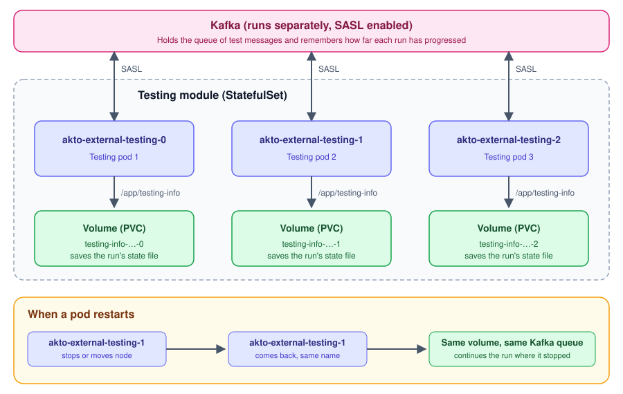

# Install testing module as a StatefulSet

## Introduction

You can install the Akto testing module in your Kubernetes cluster using the `akto-stateful-mini-testing` Helm chart. It runs the testing module as a Kubernetes **StatefulSet** and connects it to a Kafka broker that uses SASL authentication.

Use this chart when you want a testing pod that keeps a stable name and can continue a running test after a restart.

## How it works

A regular Kubernetes Deployment gives pods random names, and a replacement pod starts with no history. This chart works differently:

* **Stable pod names**: pods are named `akto-external-testing-0`, `akto-external-testing-1`, and so on. A pod keeps the same name when it restarts or moves to another node.
* **One storage volume per pod**: each testing pod saves the state of its current test run in the `/app/testing-info` folder. The chart creates a separate PersistentVolumeClaim (PVC) for every pod, 100Mi by default. Pods never share a volume.
* **Kafka runs separately**: the queue of test messages and the progress of each run are kept in a Kafka broker that runs outside the testing pod. The testing pod connects to it using SASL.
* **Restarts are safe**: when a pod restarts, it re-attaches to its own volume, reconnects to Kafka, and continues the run where it stopped instead of starting over.
* **Scaling up**: each extra pod gets its own new volume.
* **Scaling down or uninstalling**: volumes are not deleted automatically, so nothing is lost by accident. See [Uninstall](install-testing-module-as-a-statefulset.md#uninstall) to remove them.

<figure><figcaption></figcaption></figure>

## Prerequisites

1. A Kubernetes cluster where you have permission to deploy.
2. [Helm](https://helm.sh/docs/intro/install/) installed.
3. A default storage class in your cluster that can create volumes. Most managed clusters (EKS, GKE, AKS) already have one. You can check with `kubectl get storageclass`.
4. A Kafka broker with SASL enabled that the testing pod can reach. See [Step 1](install-testing-module-as-a-statefulset.md#step-1-set-up-kafka).
5. Network access from the cluster to `https://cyborg.akto.io`.
6. Your Database Abstractor Token:
   1. Log in to the Akto dashboard at [app.akto.io](https://app.akto.io).
   2. Go to **Quick Start** > **Hybrid Saas** and click **Connect**.
   3. Copy the JWT token. It is also called the `Database Abstractor Token`.

## Step 1: Set up Kafka

The testing module needs a Kafka broker that it can reach from inside the cluster. You need:

* the broker address, for example `kafka-sasl.<your-namespace>.svc.cluster.local:9092`
* the SASL mechanism: `PLAIN`, `SCRAM-SHA-256` or `SCRAM-SHA-512`
* a SASL username and password


Kafka keeps the queue of test messages. Use a Kafka that stores its data on a persistent volume. If Kafka restarts and loses its data while a run is in progress, the run cannot continue.


If you do not have a Kafka broker yet, you can use the example below. It starts a single broker with SCRAM-SHA-512 authentication. It does not use a persistent volume, so use it for trying things out, or add a volume for `/var/lib/kafka/data` for long-term use.

1. Create a secret with the Kafka username and password. The testing module will use the same secret.

```bash
kubectl create secret generic kafka-sasl-credentials -n <your-namespace> \
  --from-literal=username=akto \
  --from-literal=password="<choose-a-password>"
```

2. Save the following as `kafka-sasl.yaml`, replace `<your-namespace>`, and apply it with `kubectl apply -f kafka-sasl.yaml`.

```yaml
apiVersion: apps/v1
kind: Deployment
metadata:
  name: kafka-sasl
  namespace: <your-namespace>
spec:
  replicas: 1
  strategy:
    type: Recreate
  selector:
    matchLabels:
      app: kafka-sasl
  template:
    metadata:
      labels:
        app: kafka-sasl
      annotations:
        sidecar.istio.io/inject: "false"
    spec:
      containers:
      - name: kafka
        image: public.ecr.aws/aktosecurity/confluentinc-cp-kafka:8.2.2-1-ubi9
        command:
        - bash
        - -c
        - |
          cat > /tmp/kafka_server_jaas.conf <<JAAS
          KafkaServer {
            org.apache.kafka.common.security.scram.ScramLoginModule required
            username="${KAFKA_SCRAM_USERNAME}"
            password="${KAFKA_SCRAM_PASSWORD}";
          };
          JAAS
          /etc/confluent/docker/configure
          kafka-storage format \
            --config /etc/kafka/kafka.properties \
            --cluster-id "${CLUSTER_ID}" \
            --add-scram "SCRAM-SHA-512=[name=${KAFKA_SCRAM_USERNAME},password=${KAFKA_SCRAM_PASSWORD}]" || exit 1
          exec /etc/confluent/docker/run
        env:
        - name: KAFKA_SCRAM_USERNAME
          valueFrom: {secretKeyRef: {name: kafka-sasl-credentials, key: username}}
        - name: KAFKA_SCRAM_PASSWORD
          valueFrom: {secretKeyRef: {name: kafka-sasl-credentials, key: password}}
        - name: CLUSTER_ID
          value: "d7b2c9f3-5a3b-4c3b-8d4a-2b3c4d5e6f7a"
        - name: KAFKA_OPTS
          value: "-Djava.security.auth.login.config=/tmp/kafka_server_jaas.conf"
        - name: KAFKA_NODE_ID
          value: "1"
        - name: KAFKA_BROKER_ID
          value: "1"
        - name: KAFKA_PROCESS_ROLES
          value: "broker,controller"
        - name: KAFKA_CONTROLLER_QUORUM_VOTERS
          value: "1@localhost:9094"
        - name: KAFKA_CONTROLLER_LISTENER_NAMES
          value: "CONTROLLER"
        - name: KAFKA_LISTENERS
          value: "CONTROLLER://0.0.0.0:9094,SASL://0.0.0.0:9092"
        - name: KAFKA_ADVERTISED_LISTENERS
          value: "SASL://kafka-sasl.<your-namespace>.svc.cluster.local:9092"
        - name: KAFKA_LISTENER_SECURITY_PROTOCOL_MAP
          value: "CONTROLLER:PLAINTEXT,SASL:SASL_PLAINTEXT"
        - name: KAFKA_INTER_BROKER_LISTENER_NAME
          value: "SASL"
        - name: KAFKA_SASL_ENABLED_MECHANISMS
          value: "SCRAM-SHA-512"
        - name: KAFKA_SASL_MECHANISM_INTER_BROKER_PROTOCOL
          value: "SCRAM-SHA-512"
        - name: KAFKA_CREATE_TOPICS
          value: "akto.test.messages:1:1"
        - name: KAFKA_CLEANUP_POLICY
          value: "delete"
        - name: KAFKA_LOG_CLEANER_ENABLE
          value: "true"
        - name: KAFKA_LOG_RETENTION_BYTES
          value: "10737418240"
        - name: KAFKA_LOG_RETENTION_CHECK_INTERVAL_MS
          value: "60000"
        - name: KAFKA_LOG_RETENTION_HOURS
          value: "5"
        - name: KAFKA_LOG_SEGMENT_BYTES
          value: "104857600"
        - name: KAFKA_OFFSETS_TOPIC_REPLICATION_FACTOR
          value: "1"
        - name: KAFKA_TRANSACTION_STATE_LOG_MIN_ISR
          value: "1"
        - name: KAFKA_TRANSACTION_STATE_LOG_REPLICATION_FACTOR
          value: "1"
        ports:
        - containerPort: 9092
        resources:
          requests: {cpu: "500m", memory: 1Gi}
          limits: {cpu: "2", memory: 4Gi}
---
apiVersion: v1
kind: Service
metadata:
  name: kafka-sasl
  namespace: <your-namespace>
spec:
  selector:
    app: kafka-sasl
  ports:
  - name: tcp-kafka
    port: 9092
    targetPort: 9092
```

3. Check that Kafka is running.

```bash
kubectl get pods -n <your-namespace> -l app=kafka-sasl
```

The broker address is now `kafka-sasl.<your-namespace>.svc.cluster.local:9092`.

## Step 2: Install the testing module

1. Add the Akto Helm repository.

```bash
helm repo add akto https://akto-api-security.github.io/helm-charts/
```

If you have already added it, update it instead:

```bash
helm repo update akto
```

2. Install the chart. Use the broker address from Step 1 and the secret that holds the Kafka username and password.

```bash
helm install akto-stateful-mini-testing akto/akto-stateful-mini-testing -n <your-namespace> \
  --set testing.aktoApiSecurityTesting.env.databaseAbstractorToken="<your-database-abstractor-token>" \
  --set testing.aktoApiSecurityTesting.env.kafkaBrokerUrl="<kafka-host>:9092" \
  --set testing.kafka1.env.saslMechanism="SCRAM-SHA-512" \
  --set testing.kafka1.env.useSecretsForSaslCredentials=true \
  --set testing.kafka1.env.saslCredentialsSecrets.existingSecret="kafka-sasl-credentials"
```

3. Check that it is running.

```bash
kubectl get pods -n <your-namespace>
kubectl get pvc -n <your-namespace>
```

You should see:

* a pod named `akto-external-testing-0` in the `Running` state, and
* a PVC named `testing-info-akto-external-testing-0` in the `Bound` state.

## Database Abstractor Token

By default, the token is passed directly with `--set ...databaseAbstractorToken=<token>`, as in the install command above. You can store it in a Kubernetes secret instead. Pick one option and add its flags to the `helm install` command.

| Option | Flags |
| --- | --- |
| **Use a secret you created (recommended)**. The secret needs the key `token`. | `--set testing.aktoApiSecurityTesting.env.useSecretsForDatabaseAbstractorToken=true --set testing.aktoApiSecurityTesting.env.databaseAbstractorTokenSecrets.existingSecret=<secret-name>` |
| **Let the chart create the secret** | `--set testing.aktoApiSecurityTesting.env.useSecretsForDatabaseAbstractorToken=true --set testing.aktoApiSecurityTesting.env.databaseAbstractorTokenSecrets.token=<token>` |
| **Pass the token directly** | `--set testing.aktoApiSecurityTesting.env.databaseAbstractorToken=<token>` |

To create your own secret:

```bash
kubectl create secret generic akto-database-abstractor-token -n <your-namespace> \
  --from-literal=token="<your-database-abstractor-token>"
```

Passing the token directly makes it visible in the pod's configuration, so a secret is the better choice for production.

## Kafka credentials

The testing module reads the Kafka username and password in one of three ways. Pick one and add its flags to the `helm install` command.

| Option | Flags |
| --- | --- |
| **Use a secret you created (recommended)**. The secret needs the keys `username` and `password`. | `--set testing.kafka1.env.useSecretsForSaslCredentials=true --set testing.kafka1.env.saslCredentialsSecrets.existingSecret=<secret-name>` |
| **Let the chart create the secret** | `--set testing.kafka1.env.useSecretsForSaslCredentials=true --set testing.kafka1.env.saslCredentialsSecrets.username=<username> --set testing.kafka1.env.saslCredentialsSecrets.password=<password>` |
| **Pass the values directly** | `--set testing.kafka1.env.saslUsername=<username> --set testing.kafka1.env.saslPassword=<password>` |

Passing the password directly makes it visible in the pod's configuration, so a secret is the better choice for production.

The default SASL mechanism is `SCRAM-SHA-512`. To use another one, set `testing.kafka1.env.saslMechanism` to `PLAIN` or `SCRAM-SHA-256`. If your Kafka does not use SASL, set `testing.kafka1.useSasl=false`.

## Options

Add these flags to the `helm install` command as needed.

| Goal | Flag |
| --- | --- |
| Run more than one testing pod | `--set testing.replicas=<count>` |
| Run multiple tests in parallel | `--set testing.aktoApiSecurityTesting.env.concurrentTesting=true` |
| Use a specific storage class | `--set testing.persistence.storageClass=<storage-class>` |
| Change the volume size (default `100Mi`) | `--set testing.persistence.size=<size>` |
| Change the pod name prefix (default `akto-external-testing`) | `--set testing.aktoApiSecurityTesting.env.miniTestingName=<name>` |
| Use a proxy | `--set tokens.env.proxyUri="<proxy-uri>" --set tokens.env.noProxy="<no-proxy-urls>"` |

For example, to run 3 pods that run tests in parallel:

```bash
helm install akto-stateful-mini-testing akto/akto-stateful-mini-testing -n <your-namespace> \
  --set testing.aktoApiSecurityTesting.env.databaseAbstractorToken="<your-database-abstractor-token>" \
  --set testing.aktoApiSecurityTesting.env.kafkaBrokerUrl="<kafka-host>:9092" \
  --set testing.kafka1.env.useSecretsForSaslCredentials=true \
  --set testing.kafka1.env.saslCredentialsSecrets.existingSecret="kafka-sasl-credentials" \
  --set testing.replicas=3 \
  --set testing.aktoApiSecurityTesting.env.concurrentTesting=true
```

This creates pods `akto-external-testing-0`, `-1` and `-2`, each with its own volume.

## Uninstall

1. Remove the testing module.

```bash
helm uninstall akto-stateful-mini-testing -n <your-namespace>
```

2. The volumes are kept after uninstall. If you no longer need the data, delete them too.

```bash
kubectl delete pvc -n <your-namespace> -l app=<release-name>-akto-stateful-mini-testing
```


Deleting the volumes removes the saved state of each testing pod. A pod installed again afterwards starts fresh.


If you created Kafka with the example in Step 1, remove it with `kubectl delete -f kafka-sasl.yaml`.

## Troubleshooting

| Problem | What to check |
| --- | --- |
| Pod stays `Pending` | Run `kubectl describe pvc -n <your-namespace>`. The cluster likely has no default storage class. Set one with `testing.persistence.storageClass`. |
| Pod cannot connect to Kafka | Check `kafkaBrokerUrl` and that the pod can reach the broker. Look for connection errors in the logs: `kubectl logs <pod-name> -c akto-api-security-testing -n <your-namespace>`. |
| Kafka authentication fails | Check that the username, password and mechanism match what the broker expects. A message like `SaslAuthenticationException` in the logs means the credentials or mechanism are wrong. |
| Pod fails with `CreateContainerConfigError` | The secret named in `existingSecret` does not exist in the namespace, or it is missing a key. The Kafka secret needs `username` and `password`. The token secret needs `token`. |
| Run stays at 0% after a restart | Kafka lost its data. Use a Kafka that stores its data on a persistent volume. |
| Pod cannot reach Akto | Make sure the cluster can reach `https://cyborg.akto.io`. If you use a proxy, set `tokens.env.proxyUri`. |

## Need help?

Contact us at `help@akto.io` or on [Discord](https://www.akto.io/community).
