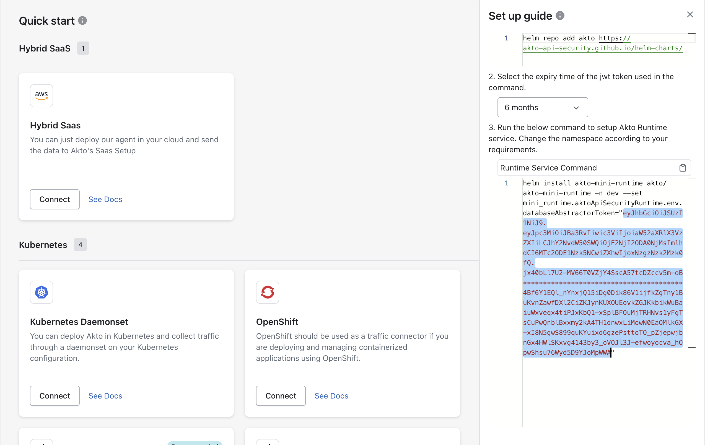

# Getting Started with Akto DAST

Akto DAST (Dynamic Application Security Testing) allows you to automatically scan and collect API endpoints and traffic data directly from your machine. This enables effective security testing without traffic mirroring or cloud agent setup.

<figure><figcaption></figcaption></figure>

## **Pre-requisite**

**Start Akto DAST Module**: Deploy DAST modules on your infrastructure using the following Docker Compose file:

```yaml
version: '3.3'

services:
  aktojax:
    image: aktosecurity/aktojax:latest
    ports:
      - "8088:8088"
    environment:
      - DATABASE_ABSTRACTOR_URL=<CYBORG_URL>
      - DATABASE_ABSTRACTOR_SERVICE_TOKEN=<SERVICE_TOKEN>
      - DAST_MODULE_NAME=<UNIQUE_MODULE_NAME>
    restart: always

  zoo1:
    image: confluentinc/cp-zookeeper:6.2.1
    restart: always
    hostname: zoo1
    user: "0"
    volumes:
      - ./data-zoo-data:/var/lib/zookeeper/data
      - ./data-zoo-logs:/var/lib/zookeeper/log
      - ./data-zoo-secrets:/etc/zookeeper/secrets
    container_name: zoo1
    ports:
      - "2181:2181"
    environment:
      ZOOKEEPER_CLIENT_PORT: 2181
      ZOOKEEPER_SERVER_ID: 1
      ZOOKEEPER_SERVERS: zoo1:2888:3888
    labels:
      com.centurylinklabs.watchtower.enable: "false"

  kafka1:
    image: confluentinc/cp-kafka:6.2.1
    restart: always
    hostname: kafka1
    user: "0"
    ports:
      - "9092:9092"
      - "19092:19092"
      - "29092:29092"
      - "9999:9999"
    environment:
      KAFKA_ADVERTISED_LISTENERS: LISTENER_DOCKER_EXTERNAL_DIFFHOST://${AKTO_KAFKA_IP}:9092, LISTENER_DOCKER_INTERNAL://kafka1:19092,LISTENER_DOCKER_EXTERNAL_LOCALHOST://localhost:29092
      KAFKA_LISTENER_SECURITY_PROTOCOL_MAP: LISTENER_DOCKER_EXTERNAL_DIFFHOST:PLAINTEXT, LISTENER_DOCKER_INTERNAL:PLAINTEXT,LISTENER_DOCKER_EXTERNAL_LOCALHOST:PLAINTEXT
      KAFKA_INTER_BROKER_LISTENER_NAME: LISTENER_DOCKER_INTERNAL
      KAFKA_ZOOKEEPER_CONNECT: "zoo1:2181"
      KAFKA_BROKER_ID: 1
      KAFKA_OFFSETS_TOPIC_REPLICATION_FACTOR: 1
      KAFKA_TRANSACTION_STATE_LOG_REPLICATION_FACTOR: 1
      KAFKA_TRANSACTION_STATE_LOG_MIN_ISR: 1
      KAFKA_CREATE_TOPICS: "akto.api.logs:3:3"
      KAFKA_LOG_RETENTION_CHECK_INTERVAL_MS: 60000
      KAFKA_LOG_RETENTION_HOURS: 5
      KAFKA_LOG_SEGMENT_BYTES: 104857600
      KAFKA_LOG_CLEANER_ENABLE: "true"
      KAFKA_CLEANUP_POLICY: "delete"
      KAFKA_LOG_RETENTION_BYTES: 10737418240
    volumes:
      - ./data-kafka-data:/var/lib/kafka/data
      - ./data-kafka-secrets:/etc/kafka/secrets
    depends_on:
      - zoo1
    labels:
      com.centurylinklabs.watchtower.enable: "false"

  akto-api-security-runtime:
    image: public.ecr.aws/aktosecurity/akto-api-security-mini-runtime:testruntime
    env_file: ./docker-mini-runtime.env
    mem_limit: 8g
    restart: always
    depends_on:
      - kafka1
    logging:
      driver: "json-file"
      options:
        max-size: "100m"
        max-file: "2"

  akto-puppeteer-replay:
    image: public.ecr.aws/aktosecurity/akto-puppeteer-replay:latest
    ports:
      - "3000:3000"
    restart: always

  watchtower:
    image: containrrr/watchtower
    restart: always
    volumes:
      - /var/run/docker.sock:/var/run/docker.sock
    env_file: ./watchtower.env
    labels:
      com.centurylinklabs.watchtower.enable: "false"
```

**Environment Files**:

Create `watchtower.env`:
```bash
WATCHTOWER_CLEANUP=true
WATCHTOWER_POLL_INTERVAL=1800
```

Create `docker-mini-runtime.env`:
```bash
AKTO_CONFIG_NAME=staging
AKTO_KAFKA_TOPIC_NAME=akto.api.logs
AKTO_KAFKA_BROKER_URL=kafka1:19092
AKTO_KAFKA_BROKER_MAL=localhost:29092
AKTO_KAFKA_GROUP_ID_CONFIG=asdf
AKTO_KAFKA_MAX_POLL_RECORDS_CONFIG=100
AKTO_ACCOUNT_NAME=<YOUR_ACCOUNT_NAME>
AKTO_TRAFFIC_BATCH_SIZE=100
AKTO_TRAFFIC_BATCH_TIME_SECS=10
USE_HOSTNAME=true
AKTO_INSTANCE_TYPE=RUNTIME
DATABASE_ABSTRACTOR_SERVICE_URL=https://cyborg.akto.io
DATABASE_ABSTRACTOR_SERVICE_TOKEN=<YOUR_SERVICE_TOKEN>
RUNTIME_MODE=hybrid
AKTO_THREAT_ENABLED=false
```

**Environment Variables**:
- `DATABASE_ABSTRACTOR_URL`: URL of database abstractor service (a.k.a. cyborg)
- `DATABASE_ABSTRACTOR_SERVICE_TOKEN`: Your database abstractor service token (You can find this from **Akto dashboard > Quick Start > Hybrid Saas (click connect button) > databaseAbstractorToken under Runtime Service Command section**)
  <figure><figcaption></figcaption></figure>
- `DAST_MODULE_NAME`: A unique name for this DAST module (e.g., `prod-dast-01`, `staging-dast`)
- `AKTO_ACCOUNT_NAME`: Your organization or account name


**Note**: If no modules are available, Akto automatically uses the internal DAST service for your crawl.


**Akto X-API-Key**: Generate this from your Akto dashboard under **Settings > Integrations > Akto API.**

## **Steps to Start**

To start a DAST crawl for your application, follow the steps below:



Open the DAST section from the top-left product selector in your Akto account.



In the left sidebar, select Quick Start under the DAST feature.



In the Akto DAST card, select Connect to open the configuration form.



Select a DAST Module from the available list.


The dropdown shows all active DAST modules (If you have). If no modules appear, the internal DAST service will be used automatically.




Configure your crawl settings using the available DAST options:

<details>

<summary>Options Available</summary>

| Option                           | Description                                                                                                                   |
| -------------------------------- | ----------------------------------------------------------------------------------------------------------------------------- |
| **Out-of-Scope URLs**            | List of URLs the crawler must not visit. For example: adding `/admin/*` prevents crawling admin pages.                        |
| **Maximum Page Visits**          | Limits how many pages the crawler explores. For example: setting _200_ restricts the crawl to the first 200 discovered pages. |
| **DOM Load Timeout (ms)**        | Maximum wait time for a page's DOM to load before moving on. For example: _3000 ms_ waits up to 3 seconds.                    |
| **Wait Time After Timeout (ms)** | Additional wait time after DOM timeout before the crawler proceeds. For example: _1000 ms_ adds a 1-second buffer.            |
| **Enable JavaScript Rendering**  | Allows the crawler to load and execute JavaScript content. Useful for SPAs like React or Vue apps.                            |
| **Parse SOAP Web Services**      | Enables the crawler to detect and process SOAP endpoints.                                                                     |
| **Parse REST Web Services**      | Enables the crawler to identify REST API patterns, such as `/v1/users`.                                                       |
| **Click External Link**          | Allows the crawler to follow links that point outside the primary hostname. Helpful on apps that redirect to subdomains.      |

</details>


All configuration fields are optional. You can proceed without modifying them.




Enter your Website URL and Akto-X-API-Key.



Select either of the Authentication Type:

* **None**
*   **Email & Password** (enter your credentials when selected)

    <div align="left"><figure><figcaption></figcaption></figure></div>
*   **Test Role** that matches your expected access level.

    <div align="left"><figure><figcaption></figcaption></figure></div>





Select Crawl to begin the capturing traffic and discovering APIs.



## After Crawling

Akto begins exploring your application based on the configurations you provided and discovers all reachable APIs for further testing. Once the crawl is complete:

* A new **Collection** will be created based on your domain name.\
  For example, if your website is `https://app.akto.io`, a collection named **`app.akto.io`** will be created.
* If a collection with that domain name already exists, the new data will be **merged** into the existing collection instead of creating a duplicate.

You can view and manage this collection under the **API Discovery > Collections** page in your Akto dashboard.

## Get Support for your Akto setup

There are multiple ways to request support from Akto. We are 24X7 available on the following:

1. In-app `intercom` support. Message us with your query on intercom in Akto dashboard and someone will reply.
2. Join our [discord channel](https://www.akto.io/community) for community support.
3. Contact `help@akto.io` for email support.
4. Contact us [here](https://www.akto.io/contact-us).
