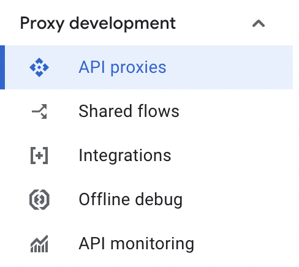

# Connect Akto with Apigee

Apigee is Google Cloud's full-lifecycle API management platform that helps enterprises design, secure, and scale APIs. Integrating Apigee with Akto enables automatic discovery and security testing of all APIs managed through your Apigee gateway, providing comprehensive visibility and continuous security assessment of your API infrastructure.

<figure><figcaption></figcaption></figure>

***

## Step 1: Deploy the Akto Data-Ingestion Service

Before setting up the Apigee connector, deploy the Akto Data-Ingestion Service by following these steps:

### 1.1 Download the Required Files

SSH into the instance where you want to deploy the data-ingestion service and run these commands:

```bash
wget https://raw.githubusercontent.com/akto-api-security/infra/refs/heads/feature/quick-setup/docker-compose-data-ingestion-runtime.yml
wget https://raw.githubusercontent.com/akto-api-security/infra/refs/heads/feature/quick-setup/data-ingestion-docker.env
wget https://raw.githubusercontent.com/akto-api-security/infra/refs/heads/feature/quick-setup/docker-mini-runtime.env
wget https://raw.githubusercontent.com/akto-api-security/infra/refs/heads/feature/quick-setup/watchtower.env

```

### 1.2 Retrieve the `DATABASE_ABSTRACTOR_SERVICE_TOKEN`

* Log in to the [Akto Dashboard](https://app.akto.io/).
*   Navigate to the **Quick Start** tab in the left panel.

    <figure><figcaption></figcaption></figure>
*   Select **Hybrid SaaS Connector** and copy the token from the **Runtime Service Command** section.

    <figure><figcaption></figcaption></figure>

### 1.3 Update the `docker-mini-runtime.env` File

* Open the `docker-mini-runtime.env` file and replace `token` with the `DATABASE_ABSTRACTOR_SERVICE_TOKEN` you retrieved earlier.

```plaintext
DATABASE_ABSTRACTOR_SERVICE_TOKEN=token
```

### 1.4 Deploy the Data-Ingestion Service

Run the following command to start the data-ingestion service:

```bash
docker-compose -f docker-compose-data-ingestion-runtime.yml up -d
```

### 1.5 Note the IP Address of the Data-Ingestion Service

Ensure the instance is accessible from the network where your Apigee API proxy is configured. Note the instance's IP address, as it will be required by the Apigee connector to send traffic data.

***

## Step 2: Configure Apigee to Use the Akto Data-Ingestion Service

### 2.1 Create or Choose an Apigee Environment

To configure the Akto connector, you need an **Intermediate** or **Comprehensive** environment in Apigee, as the JavaScript policy is not supported in the **Base** environment.

#### Steps to Create an Environment:

1. Log in to the [Apigee Management Console](https://console.cloud.google.com/apigee/overview).
2.  Navigate to **Management → Environments** from the left-side navigation bar.

    <figure><figcaption></figcaption></figure>
3.  Click **+ Create Environment**.

    <figure><figcaption></figcaption></figure>
4. Provide the required details:
   * **Name**: Specify a name for your environment.
   * **Environment Type**: Choose **Intermediate** or **Comprehensive**.
5.  Click **Create** to finalize your environment setup.

    <figure><figcaption></figcaption></figure>

If you already have an **Intermediate** or **Comprehensive** environment, you can skip this step and proceed to the next section.

### 2.2 Create a New API Proxy

1.  Navigate to **Proxy Development → API Proxies** from the left-side navigation bar.

    <figure><figcaption></figcaption></figure>
2.  Click **+ Create** to start creating a new API proxy.

    <figure><figcaption></figcaption></figure>
3. Configure the proxy with the following details:
   * **Proxy Name**: Enter a unique name for your proxy.
   * **Base Path**: Specify the base path for the proxy (e.g., `/api/v1`). This path will be used as the prefix for all API calls.
   * **Target (Existing API)**: Provide the URL of your backend service (e.g., `https://your-backend-service.com`).
   * **Proxy Template**: Select **Reverse Proxy** as the proxy template.
   * **Environment**: Select an **Intermediate** or **Comprehensive** environment where the proxy will be deployed.
4. Do **not deploy the proxy yet**, as you will need to configure policies before deploying.
5.  Click **Create** to complete the proxy setup. You will then be directed to the proxy editor to configure additional settings.

    <figure><figcaption></figcaption></figure>

### 2.3 Upload the JavaScript Policy

* Copy the following JavaScript policy code and save it as `AktoPolicy.js`:

```javascript
var friendlyHttpStatus = {
    '200': 'OK',
    '201': 'Created',
    '202': 'Accepted',
    '203': 'Non-Authoritative Information',
    '204': 'No Content',
    '205': 'Reset Content',
    '206': 'Partial Content',
    '300': 'Multiple Choices',
    '301': 'Moved Permanently',
    '302': 'Found',
    '303': 'See Other',
    '304': 'Not Modified',
    '305': 'Use Proxy',
    '306': 'Unused',
    '307': 'Temporary Redirect',
    '400': 'Bad Request',
    '401': 'Unauthorized',
    '402': 'Payment Required',
    '403': 'Forbidden',
    '404': 'Not Found',
    '405': 'Method Not Allowed',
    '406': 'Not Acceptable',
    '407': 'Proxy Authentication Required',
    '408': 'Request Timeout',
    '409': 'Conflict',
    '410': 'Gone',
    '411': 'Length Required',
    '412': 'Precondition Required',
    '413': 'Request Entry Too Large',
    '414': 'Request-URI Too Long',
    '415': 'Unsupported Media Type',
    '416': 'Requested Range Not Satisfiable',
    '417': 'Expectation Failed',
    '418': 'I\'m a teapot',
    '429': 'Too Many Requests',
    '500': 'Internal Server Error',
    '501': 'Not Implemented',
    '502': 'Bad Gateway',
    '503': 'Service Unavailable',
    '504': 'Gateway Timeout',
    '505': 'HTTP Version Not Supported',
};

var requestPath = context.getVariable("request.uri");
var queryString = context.getVariable("request.querystring");
var requestHeaders = context.getVariable("request.headers.names");
var requestPayload = context.getVariable("request.content");
var clientIp = context.getVariable("request.header.x-forwarded-for");
var method = context.getVariable("request.verb");

var responseHeaders = context.getVariable("response.headers.names");
var responsePayload = context.getVariable("response.content");
var statusCode = context.getVariable("response.status.code");
var statusText = friendlyHttpStatus[statusCode];
if (statusText == undefined) {
    statusText = "OK";
}
var httpVersion = "1.1";

var rawTime = context.getVariable("system.timestamp");
var epochTime = Math.floor(rawTime / 1000);

var aktoAccountId = "1000000";
var aktoVxlanId = "0";
var isPending = "false";
var source = "MIRRORING";

var requestHeadersRes = {}
requestHeaders = requestHeaders + '';
requestHeaders = requestHeaders.slice(1, -1).split(', ');
requestHeaders.forEach(function(x){
  var a = context.getVariable("request.header." + x );
  requestHeadersRes[x] = a;
});

var responseHeadersRes = {}
responseHeaders = responseHeaders + '';
responseHeaders = responseHeaders.slice(1, -1).split(', ');
responseHeaders.forEach(function(x){
  var a = context.getVariable("response.header." + x );
  responseHeadersRes[x] = a;
});

var trafficData = {
    path: requestPath + (queryString ? "?" + queryString : ""),
    requestHeaders: JSON.stringify(requestHeadersRes, null, 2),
    responseHeaders: JSON.stringify(responseHeadersRes, null, 2),
    method: method,
    requestPayload: requestPayload || "",
    responsePayload: responsePayload || "",
    ip: clientIp || "0.0.0.0",
    time: "" + epochTime,
    statusCode: "" + statusCode,
    type: "HTTP/" + httpVersion,
    status: statusText,
    akto_account_id: aktoAccountId,
    akto_vxlan_id: aktoVxlanId,
    is_pending: isPending,
    source: source
};

// Store the traffic data as a variable for further processing
context.setVariable("traffic.data", JSON.stringify(trafficData));

var payload = {
    batchData: [trafficData]
};

var ingestionUrl = "http://<data-ingestion-service-ip>:9091/api/ingestData";
var requestBody = JSON.stringify(payload);
var headers = {
    "Content-Type": "application/json"
};

var req = new Request(ingestionUrl, 'POST', headers, requestBody);
var exchange = httpClient.send(req);
```

* In the Apigee Management Console, go to your API proxy's **Develop** tab.
* Click on **Proxy Endpoints → PostFlow**.
*   Click on the `+` symbol of **PostFlow**.

    <figure><figcaption></figcaption></figure>
*   Select **Create New Policy** and choose **Extensible Policies** → **JavaScript**.

    <figure><figcaption></figcaption></figure>
* Enter a name for your policy and, in the `JavaScript file` option, click **Create New Resource**.
* Upload your saved `AktoPolicy.js` file and click **Add**.
*   Select the uploaded file as your JavaScript policy and click **Add**.

    <figure><figcaption></figcaption></figure>

### 2.4 Configure the Policy Parameters

Edit the JavaScript policy to set the ingestion URL (from Step 1.5):

```javascript
var ingestionUrl = "https://<data-ingestion-service-ip>:9091/api/ingestData";
```

### 2.5 Save and Deploy the API Proxy

* Save your changes.
*   Deploy the proxy to your selected environment.

    <figure><figcaption></figcaption></figure>

### 2.6 Test the Integration

* Make a test API call through the Apigee proxy.
* Verify in the Akto dashboard that the traffic is being ingested correctly.

***

### Get Support for your Akto setup

There are multiple ways to request support from Akto. We are 24X7 available on the following:

1. In-app `intercom` support. Message us with your query on intercom in Akto dashboard and someone will reply.
2. Join our [discord channel](https://www.akto.io/community) for community support.
3. Contact `help@akto.io` for email support.
4. Contact us [here](https://www.akto.io/contact-us).
