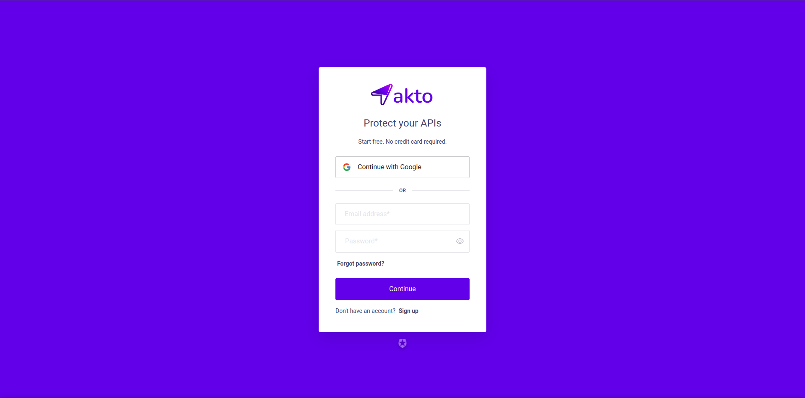

# Add subdomain to Akto on AWS

[Akto](https://www.akto.io/) creates a load balancer for your akto dashboard. You can put this dashboard behind your organization's subdomain for easier access across teams. Moreover, adding SSL certificate make the dashboard more secure.

## To configure HTTPS and add SSL certificate to akto dashboard load-balancer

1. Navigate to AWS dashboard > EC2 > load balancers and select the akto dashboard load balancer.

<figure><figcaption></figcaption></figure>

2. Go to `Listeners and rules` and select the `HTTP:80` rule.

<figure><figcaption></figcaption></figure>

3. Click on `Edit listener` 

<figure><figcaption></figcaption></figure>

4. Change protocol from `HTTP` to `HTTPS`.

<figure><figcaption></figcaption></figure>

5. Add your SSL certificate to the listener.

<figure><figcaption></figcaption></figure>

6. Click on save changes. The protocol should be changed by this. To make it reachable by the load balancer we would edit its security group.

<figure><figcaption></figcaption></figure>

7. On the same page, click on security and click on the associated security group.

<figure><figcaption></figcaption></figure>

8. Click on edit inbound rules.

<figure><figcaption></figcaption></figure>

9. Change the type of protocol from HTTP to HTTPS and save the inbound rule of the security group.

<figure><figcaption></figcaption></figure>

10. You should now be able to access akto dashboard's load-balancer IP on HTTPS and it should give an invalid SSL certificate error, because the certificate belongs to your organization and would have been mapped to your organization's domain name.

<figure><figcaption></figcaption></figure>
<figure><figcaption></figcaption></figure>

## To configure custom subdomain for akto dashboard load-balancer

1. Navigate to Route 53 on the AWS dashboard. Go to hosted zones.

<figure><figcaption></figcaption></figure>

2. Select the hosted zone in which you want to route akto dashboard and click on create record.

<figure><figcaption></figcaption></figure>

3. Select the record name as `akto` and record type as `A - Routes traffic to an IPv4 address and some AWS resources`. Then toggle the alias button.

<figure><figcaption></figcaption></figure>

4. Select on `Application and classic load balancer` in the endpoints menu. 

<figure><figcaption></figcaption></figure>

5. Select the region in which the load balancer is deployed.

<figure><figcaption></figcaption></figure>

6. Choose akto dashboard's load balancer in the menu and click on `Create records`.

<figure><figcaption></figcaption></figure>

Now, you have added a custom subdomain and SSL certificate to your akto deployment on AWS.