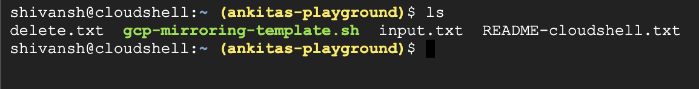
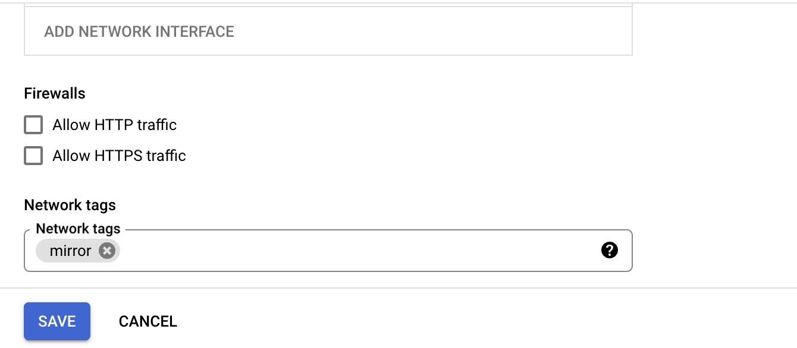
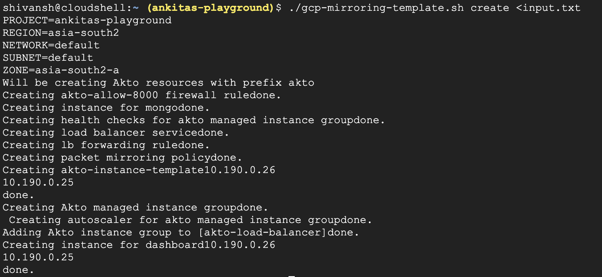
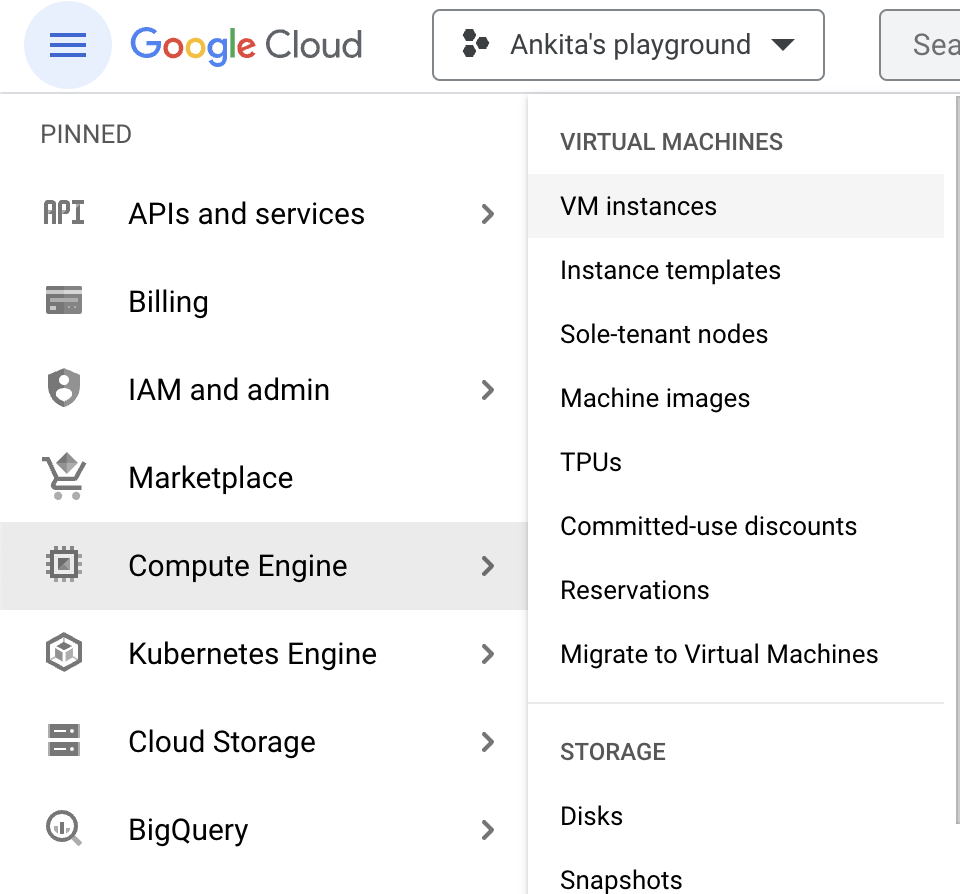
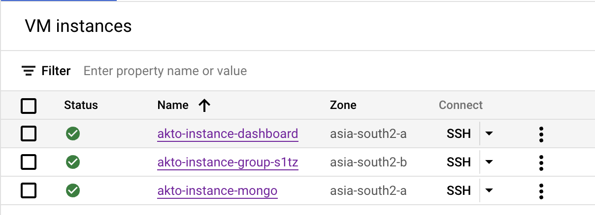
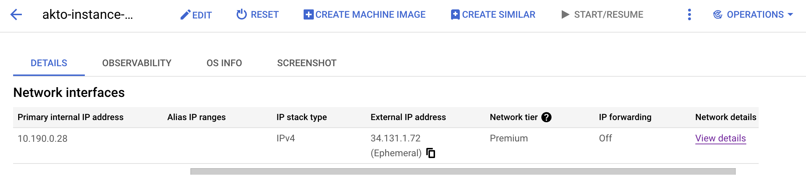
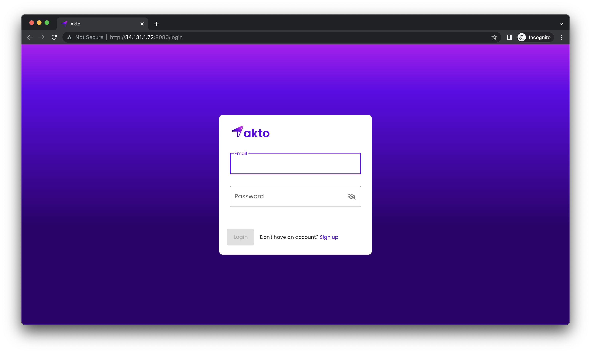
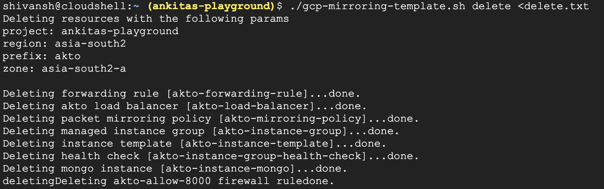

# GCP Deploy

You can deploy Akto using the GCP packet mirroring template. Here are the steps to deploy:

1. Click on this [link](https://raw.githubusercontent.com/akto-api-security/infra/feature/self\_hosting/templates/gcp-mirroring-template.sh) to see the template.
2. Go to your console in GCP and type these commands

```
wget https://raw.githubusercontent.com/akto-api-security/infra/feature/self_hosting/templates/gcp-mirroring-template.sh
chmod +x gcp-mirroring-template.sh
```

This will create a template with name gcp-mirroring-template.sh

3\. Make sure you are in the project where you want create resources.

<figure><figcaption></figcaption></figure>

4\. Create a txt file with name inputs.txt with the following input parameters.

```
project-id
region
network
subnet
zone
```

Here is an example below:

```
ankitas-playground 
us-west4 
vpc-1 
vpc-1-usw4 
us-west4-a
```

5\. Go to the instances you want to mirror and add network tag 'mirror' to them. You can do this by clicking on edit button and scrolling down to the network tags section.

<figure><figcaption></figcaption></figure>

6\. Now start creating resources by writing this command `./gcp-mirroring-template.sh create <inputs.txt`

<figure><figcaption></figcaption></figure>


`Troubleshoot: if you get permission denied error, type and enter the command` chmod +x gcp-mirroring-template.sh


7\. The above command will create the following resources:

* [ ] A load balancer
* [ ] An auto scaled instance group added to the load balancer which receives mirrored packets
* [ ] One instance with mongo
* [ ] One instance with Akto dashboard

8\. Once all the resources are created, go to VM instances in your google cloud.

<figure><figcaption></figcaption></figure>

9\. Click on the akto-dashboard-instance and find the IP.

<figure><figcaption></figcaption></figure>

10\. Copy and paste this IP in your browser and add port 8080 to it ( http://yourIP:8080)

<figure><figcaption></figcaption></figure>

11\. You can signup on Akto dashboard.

<figure><figcaption></figcaption></figure>


To delete all the resources you created with 'akto' prefix, run the command `./gcp-mirroring-template.sh delete <delete.txt`

Before running the above command, make sure you create delete.txt with the following inputs:

```
<your-project-id>
<region>
akto
<zone>
y
```


<figure><figcaption></figcaption></figure>

### Troubleshooting Notes

1. Since the instance group requires health check metrics, please ensure that health check IPs for GCP i.e. 130.211.0.0/22, 35.191.0.0/16 are allowed on port TCP port 8000 for the VM instances.
2. Ensure that internal calls are allowed between created VMs.
3. Open the ports carrying the mirrored traffic on the VMs in the akto-instance-group. Generally traffic is carried on TCP port 80.
4. If you're accessing akto-dashboard from a public network, allow http traffic on it.
