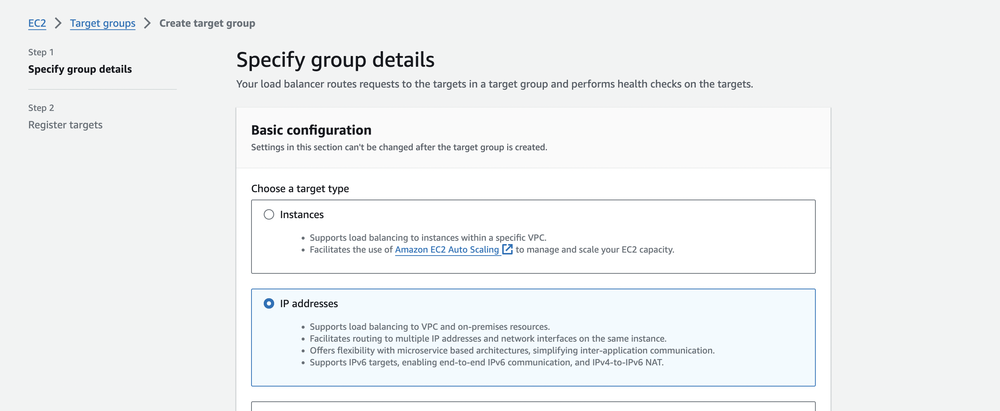
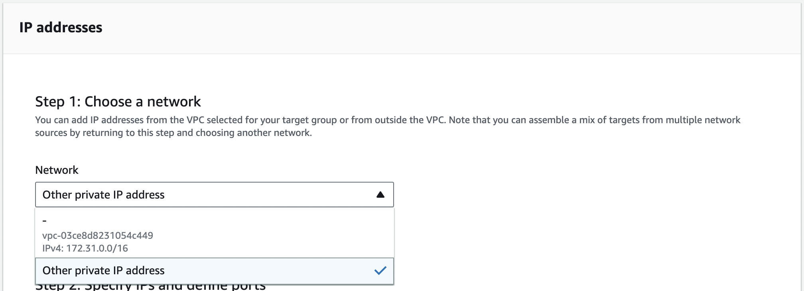
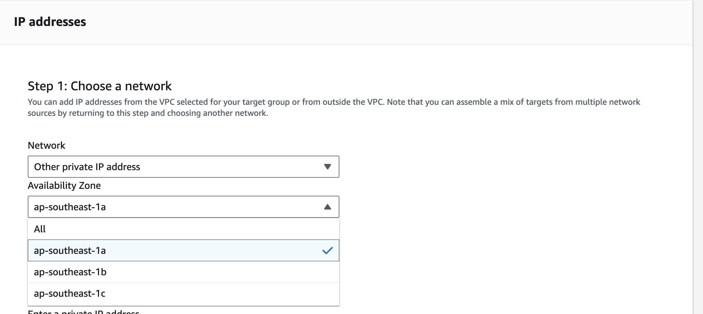
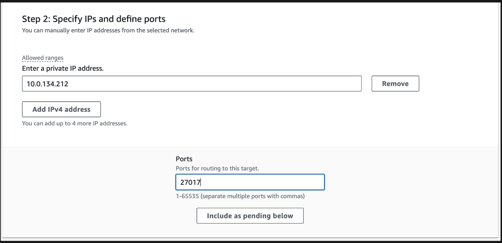
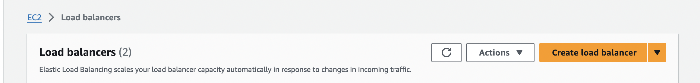
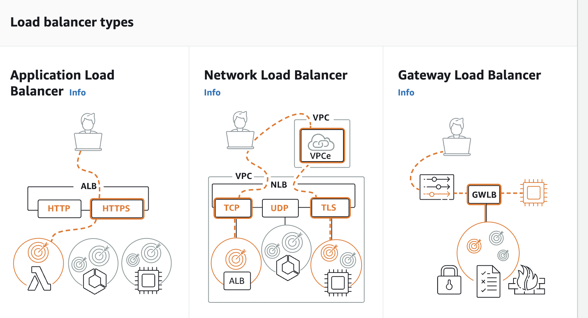
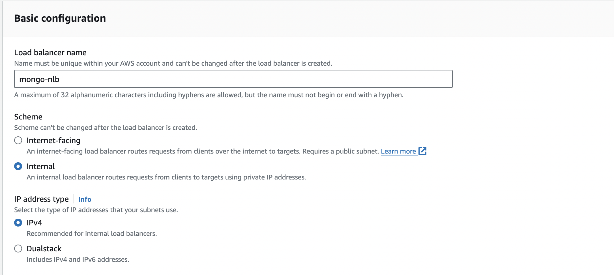
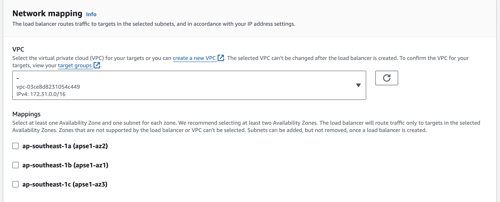
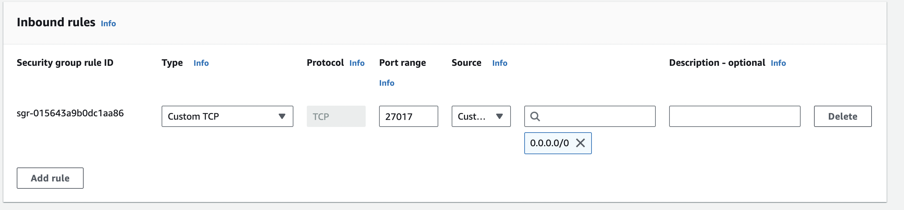
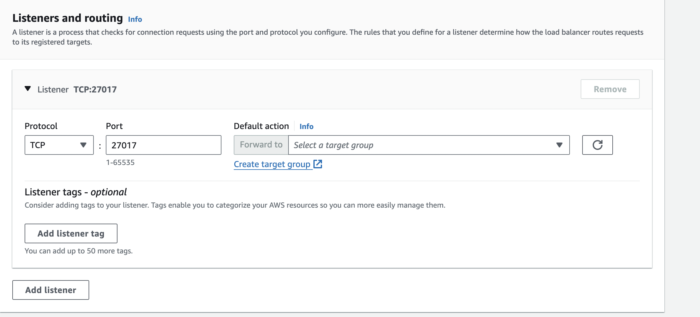

# AWS multi-VPC deploy

## Prerequisites

* Setup Akto in a VPC. We’ll call this Security VPC. 

* Vpc where runtime will be deployed. We’ll call this Application VPC.

## Case 1 - Account and region both are same

<figure><figcaption></figcaption></figure>

### Step 1: Creating a Target Group For Mongo Instance present in Central VPC

* Go to Aws Console and search for target groups. Click on create target group

<figure><figcaption></figcaption></figure>

* In the Basic Configuration section, select IP addresses option. 

<figure><figcaption></figcaption></figure>

* Add a target group name of your choice, and select TCP protocol and add port 27017. Post that, select         Application VPC, and click on next.

<figure><figcaption></figcaption></figure>

* On the next screen, choose “Other private IP address” under Network section. Select the availability zone under Availability zone section

<figure><figcaption></figcaption></figure>

* Enter the private ip of mongo instance present in region 1. Modify the port value to 27017 and click on include as pending below.

<figure><figcaption></figcaption></figure>

* Click on Create target group at the bottom to create the target group

### Step 2: Creating Load Balancer

* Go to Aws Console and search for load balancer. Click on create load balancer.

<figure><figcaption></figcaption></figure>

* On the next page, select Network Load Balancer.

<figure><figcaption></figcaption></figure>

* Add a lb name of your choice, and mark it as Internal in the Scheme section.

<figure><figcaption></figcaption></figure>

* In the VPC section, select Application VPC and select the appropriate availability zones.

<figure><figcaption></figcaption></figure>

* Create a new security group with the below inbound rule

<figure><figcaption></figcaption></figure>

* In the listener section, select the target group created in the above step and add the correct port

<figure><figcaption></figcaption></figure>

* Click on Create Load Balancer at the bottom to create the load balancer.

### Step 3: Setting Up Endpoint Service

* Go to Aws Console and search for endpoint service. Click on create endpoint service.

<figure><figcaption></figcaption></figure>

* Add a name for your endpoint service and select “Network” Load balancer type. In the available load balancers section below select the load balancer created in previous step.

<figure><figcaption></figcaption></figure>

* Click on create at the bottom.

<figure><figcaption></figcaption></figure>

* Go to Allow Principals tab and add the below principal value.

<figure><figcaption></figcaption></figure>

### Step 4: Setting Up Endpoint

* Go to Aws console and search for endpoints. Click on create endpoint

<figure><figcaption></figcaption></figure>

* Add a name for your endpoint and select other endpoint services in the service category. Also mention the service name in the Service Settings section by copying it as mentioned in step 3.

<figure><figcaption></figcaption></figure>

* Copy the service name from the endpoint service created earlier. 

<figure><figcaption></figcaption></figure>

* Select Application VPC and select appropriate subnets

<figure><figcaption></figcaption></figure>

* Create a security group and add cidr blocks of Application VPC

<figure><figcaption></figcaption></figure>

* Click on Create Endpoint.

### Step 5:

* Copy endpoint url from the above created Endpoint. Append /admini at the end of this url.

<figure><figcaption></figcaption></figure>

* While setting up runtime for your application, use this url as Mongo_IP.

### In case there are multiple applications -

* Scenario 1 - All Applications are in same region

No extra steps are required. Use the same Endpoint link as mentioned in Step 5.

* Scenario 2 -  1 or more Application in different regions

Refer to Case 2

## Case 2 - Account or region are different

## Prerequisites

* Setup Akto in a VPC. We’ll call this Security VPC. 

* Vpc where runtime will be deployed. We’ll call this Application VPC.:

* Create/reuse a separate VPC in a different region in the same account as step 1. We’ll call this Relay VPC.

<figure><figcaption></figcaption></figure>

### Step 1:

* Peering Setup - Peer Central And Relay VPC.

### Step 2: Creating a Target Group For Mongo Instance present in Central VPC

* Go to Aws Console and search for target groups. Click on create target group

<figure><figcaption></figcaption></figure>

* In the Basic Configuration section, select IP addresses option. 

<figure><figcaption></figcaption></figure>

* Add a target group name of your choice, and select TCP protocol and add port 27017. Post that, select the vpc which was used for peering connection in region 2, and click on next.
<figure><figcaption></figcaption></figure>

* On the next screen, choose “Other private IP address” under Network section. Select the availability zone under Availability zone section

<figure><figcaption></figcaption></figure>

* Enter the private ip of mongo instance present in region 1. Modify the port value to 27017 and click on include as pending below.

<figure><figcaption></figcaption></figure>

* Click on Create target group at the bottom to create the target group

### Step 2: Creating Load Balancer

* Go to Aws Console and search for load balancer. Click on create load balancer.

<figure><figcaption></figcaption></figure>

* On the next page, select Network Load Balancer.

<figure><figcaption></figcaption></figure>

* Add a lb name of your choice, and mark it as Internal in the Scheme section.

<figure><figcaption></figcaption></figure>

* In the VPC section, select Relay VPC and select the appropriate availability zones.

<figure><figcaption></figcaption></figure>

* Create a new security group with the below inbound rule

<figure><figcaption></figcaption></figure>

* In the listener section, select the target group created in the above step and add the correct port

<figure><figcaption></figcaption></figure>

* Click on Create Load Balancer at the bottom to create the load balancer.

### Step 3: Setting Up Endpoint Service

* Go to Aws Console and search for endpoint service. Click on create endpoint service.

<figure><figcaption></figcaption></figure>

* Add a name for your endpoint service and select “Network” Load balancer type. In the available load balancers section below select the load balancer created in previous step.

<figure><figcaption></figcaption></figure>

* Click on create at the bottom.

<figure><figcaption></figcaption></figure>

* Go to Allow Principals tab and add the below principal value.

<figure><figcaption></figcaption></figure>

### Step 4: Setting Up Endpoint

* Go to Aws console and search for endpoints. Click on create endpoint

<figure><figcaption></figcaption></figure>

* Add a name for your endpoint and select other endpoint services in the service category. Also mention the service name in the Service Settings section by copying it as mentioned in step 3.

<figure><figcaption></figcaption></figure>

* Copy the service name from the endpoint service created earlier. 

<figure><figcaption></figcaption></figure>

* Select Application VPC and select appropriate subnets

<figure><figcaption></figcaption></figure>

* Create a security group and add cidr blocks of Relay Vpc and Application VPC

<figure><figcaption></figcaption></figure>

* Click on Create Endpoint.

### Step 5:

* Copy endpoint url from the above created Endpoint. Append /admini at the end of this url.

<figure><figcaption></figcaption></figure>

* While setting up runtime for your application, use this url as Mongo_IP.

### In case there are multiple applications -

* Scenario 1 - All Applications are in same region

No extra steps are required. Use the same Endpoint link as mentioned in Step 5.

* Scenario 2 - 1 or more Application in different regions

1. Create a new Relay VPC in the different region
2. Repeat all the steps of Case 2
