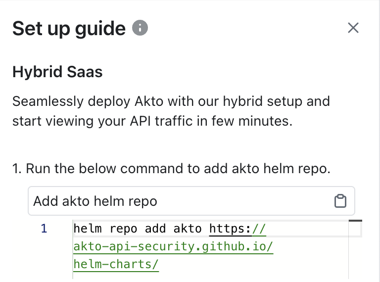
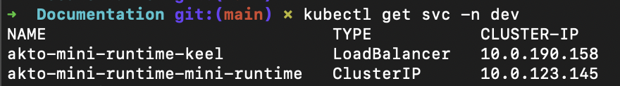
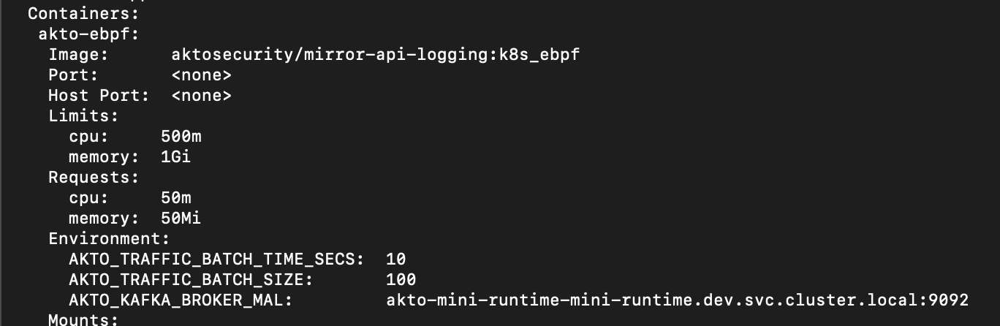

# Connect Akto with Hybrid SaaS

1\. Go to [app.akto.io](https://app.akto.io)

2\. Login/Signup into your account.

3\. Click on Quick Start tab in left nav.

<figure><figcaption></figcaption></figure>

4\. Search for Hybrid SaaS Connector and click connect.

<figure><figcaption></figcaption></figure>

### Installing Traffic connector

You can use either a CloudFormation template, Terraform template or a Helm chart to install Traffic aggregator in your env.

#### Terraform

1. To install using Terraform, use the Terraform script [here](https://github.com/akto-api-security/infra/blob/mini_runtime_tf_script/templates/mini-runtime.tf).
   1. Please make sure you install it in a private subnet from your application VPC.
   2. This private subnet should also have network connectivity (typically via NAT).
2. You can use `https://cyborg.akto.io` as `DatabaseAbstractorUrl` . For `DatabaseAbstractorToken` you can copy it from the helm install command in the above screenshot.
3. Once complete, copy `akto_nlb_dns` from the output.
4. The next step is to install a traffic connector.
   1. You can use the above copied `AktoNLBIP` as `AKTO_KAFKA_BROKER_MAL` in your traffic connectors. Note that `AKTO_KAFKA_BROKER_MAL` is inclusive of port (eg `akto-N-.....amazonaws.com:9092`)

#### CloudFormation template

1. To install using CloudFormation, run the Cloudformation template [here](https://raw.githubusercontent.com/akto-api-security/infra/feature/quick-setup/templates/mini-runtime.yml).

i) Please make sure you install it in a private subnet from your application VPC.

ii) This private subnet should also have network connectivity (typically via NAT).

2. You can use `https://cyborg.akto.io` as `DatabaseAbstractorUrl` . For `DatabaseAbstractorToken` you can copy it from the helm install command in the above screenshot.
3. Once complete, go to the **Output** section of CloudFormation Stack and copy `AktoNLBIP`.
4. The next step is to install a traffic connector.
   1. You can use the above copied `AktoNLBIP` as `AKTO_KAFKA_BROKER_MAL` in your traffic connectors. Note that `AKTO_KAFKA_BROKER_MAL` is inclusive of port (eg `akto-N-.....amazonaws.com:9092`)

#### Helm chart

1\. If you have K8s clusters, you can use helm chart to install Traffic aggregator.

2\. Add akto helm repository.

```bash
helm repo add akto https://akto-api-security.github.io/helm-charts/
```

<figure><figcaption></figcaption></figure>

3. Install akto-mini-runtime helm chart in your kubernetes cluster.
   1.  Directly using database abstractor token

       ```bash
       helm install akto-mini-runtime akto/akto-mini-runtime -n <your-namespace> --set mini_runtime.aktoApiSecurityRuntime.env.databaseAbstractorToken="<your-database-abstractor-token>"
       ```
   2.  Storing the database abstractor token in a secret

       ```bash
       helm install akto-mini-runtime akto/akto-mini-runtime -n <your-namespace> --set mini_runtime.aktoApiSecurityRuntime.env.useSecretsForDatabaseAbstractorToken=true --set mini_runtime.aktoApiSecurityRuntime.env.databaseAbstractorTokenSecrets.token="<your-database-abstractor-token>"
       ```
   3.  Bring your own secret which has the database abstractor token

       ```bash
       helm install akto-mini-runtime akto/akto-mini-runtime -n <your-namespace> --set mini_runtime.aktoApiSecurityRuntime.env.useSecretsForDatabaseAbstractorToken=true --set mini_runtime.aktoApiSecurityRuntime.env.databaseAbstractorTokenSecrets.existingSecret=<my-secret>
       ```

<figure><figcaption></figcaption></figure>

4\. Running the above commands in your k8s cluster will deploy a new Akto Traffic aggregator service.

5\. Run the below command and copy the `CLUSTER-IP` and `PORT` value for Traffic aggregator service. In the below example it will be `10.0.23.145:9092`. You can also use the kubernetes service ip, which in this case will be `akto-mini-runtime-mini-runtime.dev.svc.cluster.local:9092`

```bash
kubectl get svc -n <namespace>
```

<figure><figcaption></figcaption></figure>

6\. The next step is to install a traffic connector.

1. You can use the above copied `IP:PORT` value as `AKTO_KAFKA_BROKER_MAL` in your traffic connectors. Note that `AKTO_KAFKA_BROKER_MAL` is inclusive of port (eg `10.0.23.145:9092` , `akto-mini-runtime-mini-runtime.dev.svc.cluster.local:9092`)

<figure><figcaption></figcaption></figure>

### Linux VM

1. Create a new instance with the following requirements
   1. Platform
      1. Linux
   2. Spec
      1. 16 vCPU
      2. 32GB RAM
      3. 40GB Hard disk
      4. Don’t use burstable instances
   3. Network
      1. Private subnet
      2. connectivity to internet (typically via NAT)
      3. connectivity to your staging service
   4. Security groups
      1. Inbound - Open port 9091 (http), 9092 (kafka)
      2. Outbound - Open all
2. SSH into this new instance in your Cloud
3. Run `sudo su -`
4. Install [docker](https://github.com/akto-api-security/infra/blob/feature/quick-setup/get-docker.sh) and [docker-compose](https://github.com/akto-api-security/infra/blob/feature/quick-setup/get-docker-compose.sh).
5. Run the following commands to download setup files -

```
   wget https://raw.githubusercontent.com/akto-api-security/infra/refs/heads/feature/quick-setup/docker-compose-mini-runtime.yml
   wget https://raw.githubusercontent.com/akto-api-security/infra/refs/heads/feature/quick-setup/watchtower.env
   wget https://raw.githubusercontent.com/akto-api-security/infra/refs/heads/feature/quick-setup/docker-mini-runtime.env
   wget https://raw.githubusercontent.com/akto-api-security/infra/refs/heads/feature/quick-setup/docker-threat-detection.env
   wget https://raw.githubusercontent.com/akto-api-security/infra/refs/heads/feature/quick-setup/data-ingestion-docker.env
```

6. Replace `${AKTO_KAFKA_IP}` in  `docker-compose-mini-runtime.yml` with the the `instance-ip`&#x20;
7. Get your token from Quick Start> Hybrid SaaS > Connect > Copy the token that's in `red` color.
8. Replace the value of `DATABASE_ABSTRACTOR_SERVICE_TOKEN` in `docker-mini-runtime.env` with the token. Don't use double quotes. (The new docker takes double-quotes literally as part of the value!)
9. Replace the value of `AKTO_KAFKA_BROKER_URL` with \<instance\_ip>:9092.&#x20;
10. Replace the value of `AKTO_THREAT_PROTECTION_BACKEND_TOKEN` and `DATABASE_ABSTRACTOR_SERVICE_TOKEN` in `docker-threat-detection.env` with the token.
11. Run `docker-compose -f docker-compose-mini-runtime.yml up -d` . If you are using new version of `docker`, you should use `docker compose` instead of `docker-compose`
12. Run `systemctl enable /usr/lib/systemd/system/docker.service` to ensure Docker starts up in case of instance restarts

## Notes:

1. Ensure internet connectivity in Traffic aggregator service.
2. In case of closed network, please whitelist (https://cyborg.akto.io)
3. Ensure that traffic connector is able to connect to Traffic aggregator service
4. Log levels for Akto services can be configured by setting the environment variable `AKTO_LOG_LEVEL`
   * Supported values include `TRACE`, `DEBUG`, `INFO`, `WARN`, `ERROR` and `OFF`.
   * Default log level is set to `WARN`.

## Get Support for your Akto setup

There are multiple ways to request support from Akto. We are 24X7 available on the following:

1. In-app `intercom` support. Message us with your query on intercom in Akto dashboard and someone will reply.
2. Join our [discord channel](https://www.akto.io/community) for community support.
3. Contact `help@akto.io` for email support.
4. Contact us [here](https://www.akto.io/contact-us).
