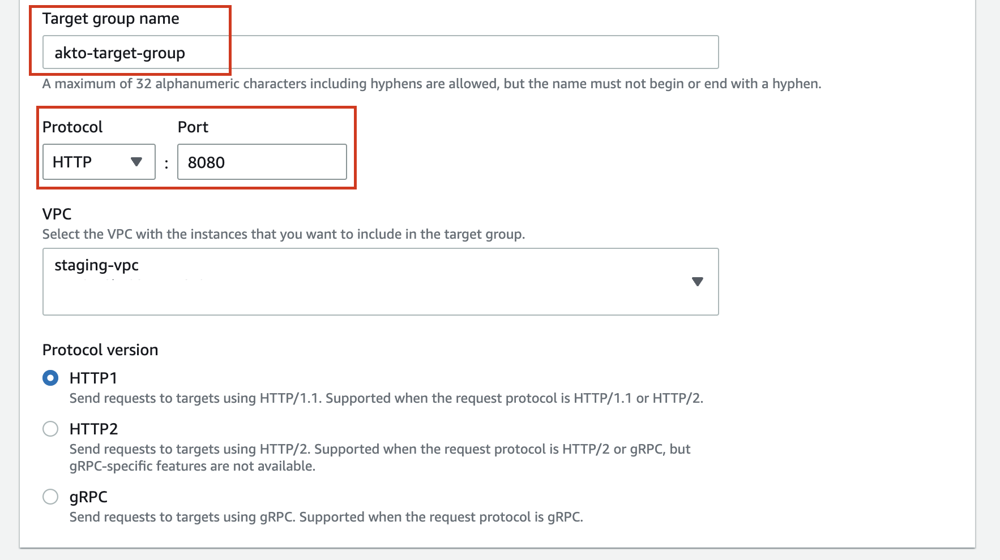

# Creating and attaching a load balancer to an EC2 instance

1. Create a Tagret group for the akto EC2 instance

    a. Go to AWS Management console and search for ```target groups``` in EC2 panel. Then click on ```Create target group```.
    <figure><figcaption></figcaption></figure>

    b. Give the target group name as ```akto-target-group```, protocol as ```HTTP```, port as ```8080``` and the VPC should be the same VPC in which you've deployed akto. Then click on next.
     <figure><figcaption></figcaption></figure>
    
    c. Select the ```Akto Mongo Instance``` 
    <figure><figcaption></figcaption></figure>

    d. Enter the port as ```8080``` and click on ```Include as pending below```
    <figure><figcaption></figcaption></figure>

    e. Click on ```Create target group``` to create the target group.
    <figure><figcaption></figcaption></figure>

2. Go to AWS Management console and search for ```load balancers``` in EC2 panel. Then click on ```Create load balancer```. Then select ```Application load balancer``` in ```load balancer types```
<figure><figcaption></figcaption></figure>
<figure><figcaption></figcaption></figure>

3. Set the load balancer name as ```akto-load-balancer```
<figure><figcaption></figcaption></figure>

4. Set the same vpc in which you've deployed akto in network mapping. Then Select a public subnet in atleast 2 availability Zones.
<figure><figcaption></figcaption></figure>

5. Select a security group with ```8080 inbound rule``` and ```all allowed outbound rule```
<figure><figcaption></figcaption></figure>

6. Set the port to ```8080``` and select ```akto-target-group```, which we created earlier in default action.
<figure><figcaption></figcaption></figure>

7. Click on ```Create load balancer``` to finally create the load balancer.

8. Now go to the load balancer, and copy its DNS name. Akto Dashboard will be available on ```<DNS name>:8080``` . Signup and get started.
<figure><figcaption></figcaption></figure>