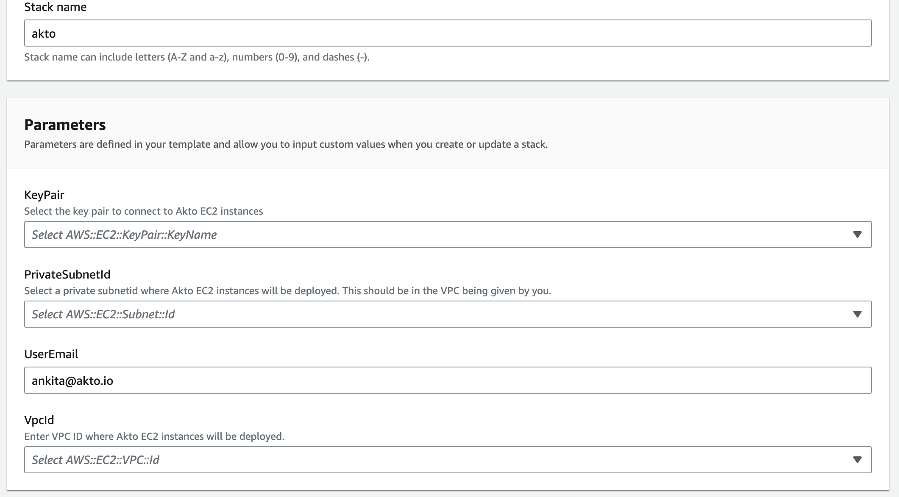
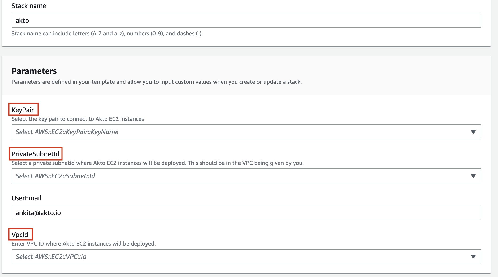

# AWS deploy

### 60 seconds deploy in AWS 🚀



-Page-4.drawio (2).png>)



If your application services are hosted in AWS, follow the steps below to install Akto in your AWS cloud.

### Step 1: Create Account

1. Go to [Akto self hosted](https://stairway.akto.io/).
2. `Signup` if you haven't already done that.
3. Go to AWS section. `Select region` from the dropdown and click on `launch stack.`&#x20;

<figure><figcaption></figcaption></figure>

4\. This will re-direct you to the `AWS screen`.&#x20;

### Step 2: Create stack in AWS

1. Sign into your `AWS account` if you are not logged-in.&#x20;


Note: Akto can't track anything that you do in AWS.



2\. This will take you to a pre-filled `quick create stack` like below. If you don't see the below screen, click on `launch stack` again.

<figure><figcaption></figcaption></figure>

3\.  Add your parameters here - `keypair`, `1 private subnetId` and `1 vpc ID`. The private subnet should be in the vpc id given by you.

<figure><figcaption></figcaption></figure>

4\. Your user email parameter should be the same as the one you used to signup with Akto.

5\. Click on `create stack`.

### Step 3: Launch Akto dashboard

1. `Wait` for a couple of minutes before you stack creation is complete.
2. Once your stack is created, there are multiple ways to access the akto dashboard.

    I. Using SSH port forwarding : To setup SSH Port Forwarding, execute the command below and put the public IP of any AWS EC2 instance with a public subnet in the same region and port 8080 open, as the public-instance-IP, the private IP of the Akto instance created as the private-instance-IP and the path to AWS key-pair .pem file as pemfile. Then navigating to localhost:8080 should connect you to the deployed akto instance on AWS.

    ```ssh -i <pemfile> ec2-user@<public-instance-IP> -L 8080:<private-instance-IP>:8080```

    II. [Creating and attaching a load balancer to the ec2 instance](attaching-an-lb-to-EC2-instance.md)

3. `Signup` and start using Akto.
