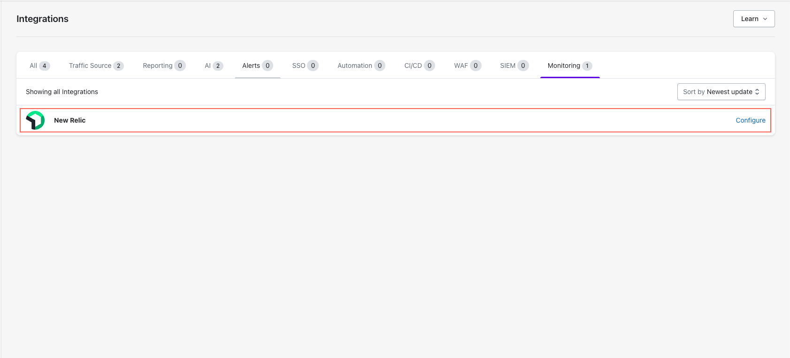
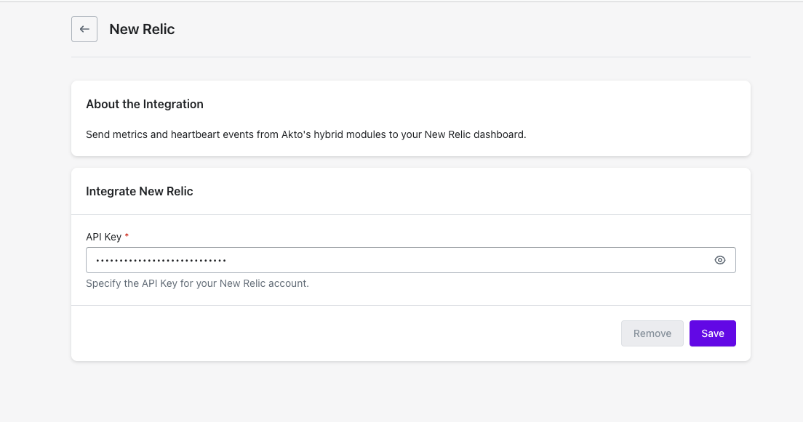

# New Relic

Send metrics and heartbeart events from Akto's hybrid modules to your New Relic dashboard.


### Prerequisites

Before setting up the New Relic Integration, ensure you have a API Key of the type: Ingest - License


## Quick Setup Steps



**Access Integrations**

* Go to **Settings > Integrations**.
*   Find and click **"Configure"** next to New Relic.

    
<figure><figcaption></figcaption></figure>




**Enter New Relic API Key**

<figure><figcaption></figcaption></figure>




**Save Configuration**

* Click **"Save"** to finalise.



## Get Support for your Akto setup

There are multiple ways to request support from Akto. We are 24X7 available on the following:

1. In-app `intercom` support. Message us with your query on intercom in Akto dashboard and someone will reply.
2. Join our [discord channel](https://www.akto.io/community) for community support.
3. Contact `help@akto.io` for email support.
4. Contact us [here](https://www.akto.io/contact-us).