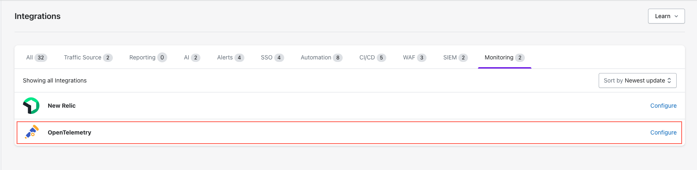
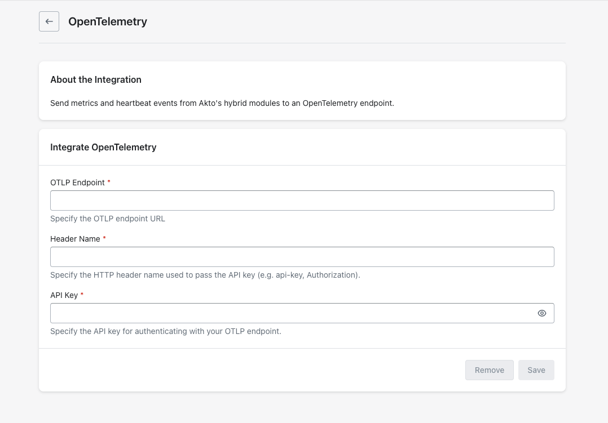

# OpenTelemetry

Send metrics and heartbeat events from Akto's hybrid modules to an OpenTelemetry endpoint.


#### Prerequisites

Before setting up the OpenTelemetry Integration, ensure you have the HTTP header name and value (API key) for authentication with the OpenTelemetry endpoint.


## Quick Setup Steps



**Access Integrations**

* Go to **Settings > Integrations**.
*   Find and click **"Configure"** next to OpenTelemetry.

    <div data-with-frame="true"><figure><figcaption></figcaption></figure></div>



**Enter OpenTelemetry (OTLP) Endpoint Details**

1. Enter **OTLP endpoint**.
2. Enter authentication details.

    1. Enter **Header name**.
    2. Enter **API Key**.

    
    If your OpenTelemetry endpoint requires a prefix before the API Key, please include the prefix when entering the API Key.

    For example: Basic <api-key-here>
    

    <div data-with-frame="true"><figure><figcaption></figcaption></figure></div>



**Save Configuration**

* Click **"Save"** to finalise.



## Data Reference

Akto sends two types of telemetry to New Relic: **metrics** (flushed every 120 seconds) and **heartbeat events** (sent every 30 seconds per module).

### Heartbeat Event

Each Akto module emits a New Relic custom event of type `AktoModuleHeartbeatReceived` every 30 seconds. You can query it with:

```sql
SELECT * FROM AktoModuleHeartbeatReceived SINCE 1 hour ago
```

The event carries the following attributes:

| Attribute                           | Description                                             |
| ----------------------------------- | ------------------------------------------------------- |
| `akto.account.id`                   | Akto account ID                                         |
| `akto.module.id`                    | Unique ID of the module instance                        |
| `akto.module.type`                  | Module type (e.g. `RUNTIME`, `MINI_RUNTIME`, `TESTING`) |
| `akto.module.name`                  | Human-readable module name                              |
| `akto.module.currentVersion`        | Deployed version of the module                          |
| `akto.module.startedTs`             | Unix timestamp when the module started                  |
| `akto.module.lastHeartbeatReceived` | Unix timestamp of the last heartbeat                    |

### Metrics

All metrics are prefixed `akto.metric.` and flushed every **120 seconds**. Each metric includes the same module and account attributes listed in the heartbeat table above.

There are four metric types:

| Type      | New Relic kind | Meaning                                      |
| --------- | -------------- | -------------------------------------------- |
| `SUM`     | `Count`        | Cumulative count over the 120 s flush window |
| `GAUGE`   | `Gauge`        | Point-in-time value at flush time            |
| `LATENCY` | `Gauge`        | Average over the flush window                |
| `MAX`     | `Gauge`        | Maximum value seen in the flush window       |

#### Runtime metrics

Emitted by the **Mini-Runtime** modules.

| New Relic metric name                     | Type    | Description                                                |
| ----------------------------------------- | ------- | ---------------------------------------------------------- |
| `akto.metric.rt_kafka_record_count`       | SUM     | Number of records processed by the runtime module          |
| `akto.metric.rt_kafka_record_size`        | SUM     | Total byte size of records processed by the runtime module |
| `akto.metric.rt_kafka_latency`            | LATENCY | Average processing latency for runtime records             |
| `akto.metric.rt_api_received_count`       | SUM     | Number of APIs received by the mini-runtime module         |
| `akto.metric.kafka_records_lag_max`       | MAX     | Maximum consumer lag across Kafka partitions               |
| `akto.metric.kafka_records_consumed_rate` | GAUGE   | Current rate of Kafka record consumption                   |
| `akto.metric.kafka_fetch_avg_latency`     | GAUGE   | Average fetch latency from Kafka                           |
| `akto.metric.kafka_bytes_consumed_rate`   | GAUGE   | Current byte consumption rate from Kafka                   |
| `akto.metric.cyborg_new_api_count`        | SUM     | Newly discovered APIs detected in the flush window         |
| `akto.metric.cyborg_total_api_count`      | SUM     | Total APIs tracked by Cyborg                               |
| `akto.metric.delta_catalog_new_count`     | SUM     | New items added to the delta catalog                       |
| `akto.metric.delta_catalog_total_count`   | SUM     | Total items in the delta catalog                           |
| `akto.metric.cyborg_api_payload_size`     | SUM     | Total size of API payloads processed by Cyborg             |

#### Testing metrics

Emitted by the **Mini-Testing** module.

| New Relic metric name                            | Type    | Description                                    |
| ------------------------------------------------ | ------- | ---------------------------------------------- |
| `akto.metric.testing_run_count`                  | SUM     | Test runs executed in the flush window         |
| `akto.metric.testing_run_latency`                | LATENCY | Average time to complete a test run            |
| `akto.metric.sample_data_fetch_latency`          | LATENCY | Average latency for single sample-data fetches |
| `akto.metric.multiple_sample_data_fetch_latency` | LATENCY | Average latency for bulk sample-data fetches   |

#### Cyborg metrics

Emitted by any module that calls Cyborg.

| New Relic metric name             | Type    | Description                         |
| --------------------------------- | ------- | ----------------------------------- |
| `akto.metric.cyborg_call_count`   | SUM     | Calls made to Cyborg                |
| `akto.metric.cyborg_call_latency` | LATENCY | Average Cyborg call latency         |
| `akto.metric.cyborg_data_size`    | SUM     | Total data size sent to/from Cyborg |

#### Infrastructure metrics

Emitted by every module, reflecting the JVM process running that module.

| New Relic metric name                  | Type  | Description                            |
| -------------------------------------- | ----- | -------------------------------------- |
| `akto.metric.cpu_usage_percent`        | GAUGE | Process CPU usage (%)                  |
| `akto.metric.heap_memory_used_mb`      | GAUGE | JVM heap memory in use (MB)            |
| `akto.metric.heap_memory_max_mb`       | GAUGE | Maximum JVM heap memory available (MB) |
| `akto.metric.non_heap_memory_used_mb`  | GAUGE | JVM non-heap memory in use (MB)        |
| `akto.metric.thread_count`             | GAUGE | Number of live JVM threads             |
| `akto.metric.available_processors`     | GAUGE | CPU cores available to the JVM         |
| `akto.metric.total_physical_memory_mb` | GAUGE | Total physical host memory (MB)        |

#### Traffic Collector profiling metrics

Emitted per Traffic Collector instance.

| New Relic metric name         | Type  | Description                                        |
| ----------------------------- | ----- | -------------------------------------------------- |
| `akto.metric.tc_cpu_usage`    | GAUGE | CPU usage (%) of the traffic collector instance    |
| `akto.metric.tc_memory_usage` | GAUGE | Memory used (MB) by the traffic collector instance |

## Get Support for your Akto setup

There are multiple ways to request support from Akto. We are 24X7 available on the following:

1. In-app `intercom` support. Message us with your query on intercom in Akto dashboard and someone will reply.
2. Join our [discord channel](https://www.akto.io/community) for community support.
3. Contact `help@akto.io` for email support.
4. Contact us [here](https://www.akto.io/contact-us).
