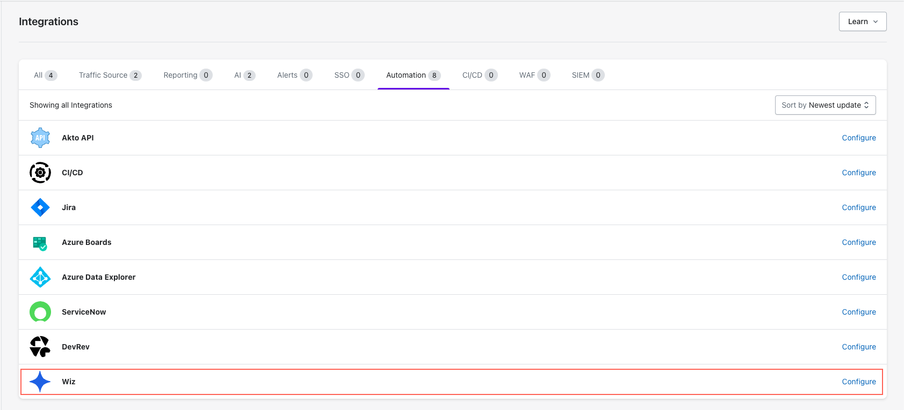
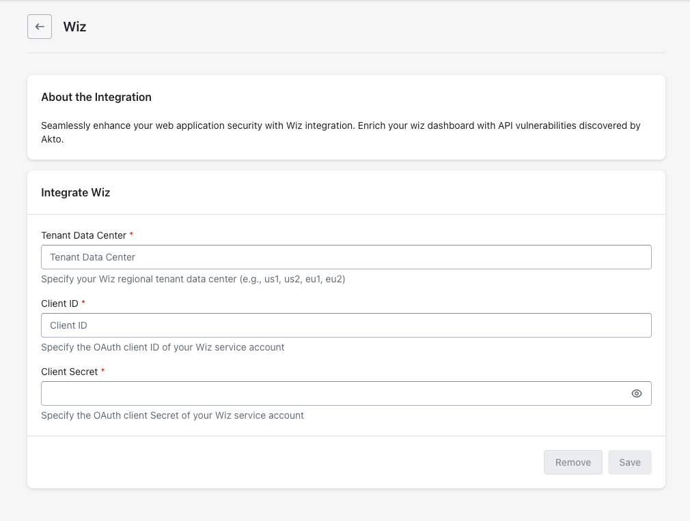
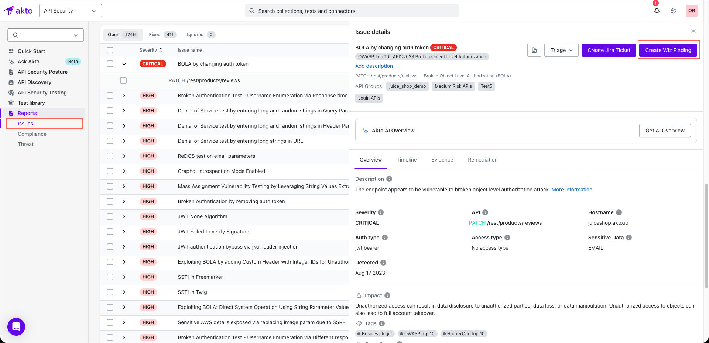

# Wiz

Seamlessly enhance your API security posture with Akto's Wiz integration. Connect Wiz as a traffic source to periodically import your API endpoints into Akto's inventory, and enrich your Wiz dashboard with API vulnerabilities discovered by Akto.


**Prerequisites**

Before setting up the Wiz integration, ensure you have a Wiz service account and your **Tenant Data Center**:

1. At the top right of your Wiz portal, click the user icon > **Tenant Info**.
2. At the left side, click **Data Center and Regions**.
3. Make a note of your **Tenant Data Center**.


## Quick Setup Steps



**Access Integrations**

* Go to **Settings > Integrations**.
*   Find and click **"Configure"** next to Wiz.

    
<figure><figcaption></figcaption></figure>




**Enter Wiz Details**

1. Enter **Tenant Data Center**.
2.  Enter wiz service account details

    1. Enter **Client ID**
    2. Enter **Client Secret**

    
<figure><figcaption></figcaption></figure>




**Save Configuration**

* Click **"Save"** to finalise.



## Connecting Wiz Traffic Source

Once the integration is configured, you can connect Wiz as a traffic source. This will periodically import API endpoints discovered by Wiz into Akto's API inventory.


**Prerequisites**

Your Wiz service account must have the following scope:

* **read:api\_endpoints**




**Connect Traffic Source**

After saving the integration, click **"Connect"** under the **Connect Wiz traffic source** section.



## Creating Wiz Findings


**Prerequisites**

Your Wiz service account must have the following scopes:

* **create:external\_data\_ingestion**
* **read:system\_activities**




**Access Issue**

1. Go to **Reports > Issues**.
2. Click on an **Issue**.



**Create Finding**

Click on the **Create Wiz Finding** button to create a finding in Wiz.

<figure><figcaption></figcaption></figure>




## Get Support for your Akto setup

There are multiple ways to request support from Akto. We are 24X7 available on the following:

1. In-app `intercom` support. Message us with your query on intercom in Akto dashboard and someone will reply.
2. Join our [discord channel](https://www.akto.io/community) for community support.
3. Contact `help@akto.io` for email support.
4. Contact us [here](https://www.akto.io/contact-us).
