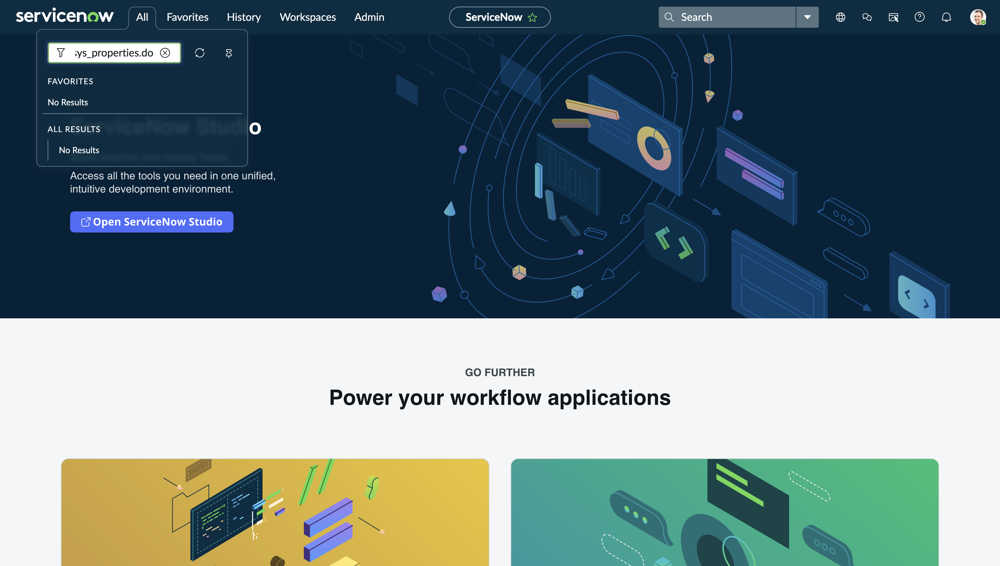
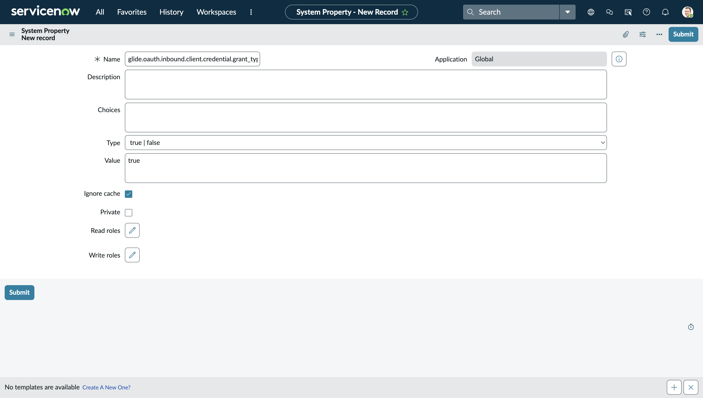
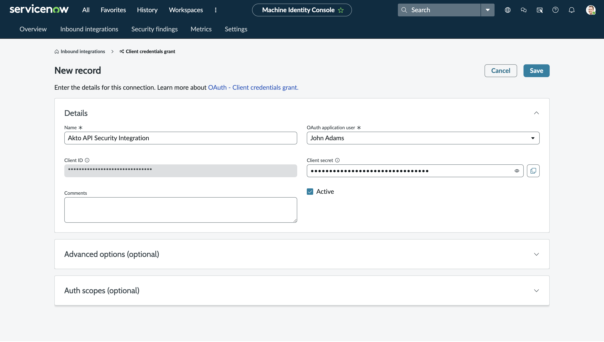
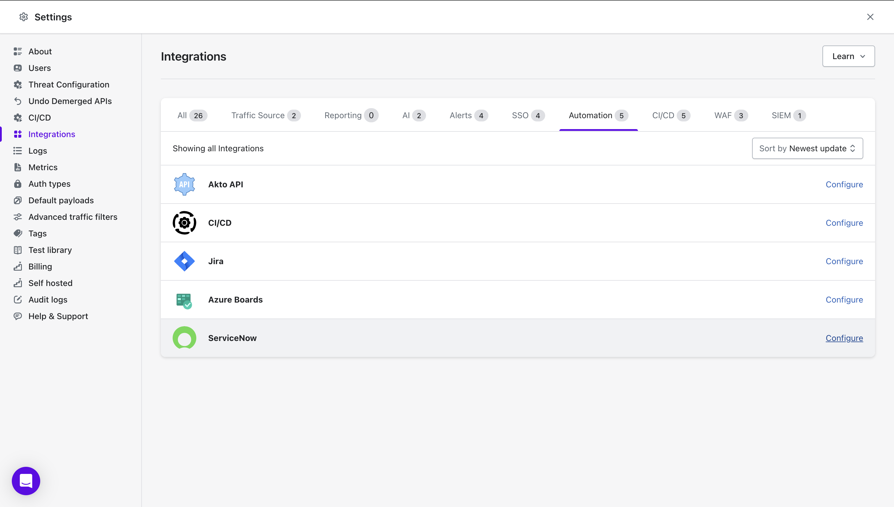
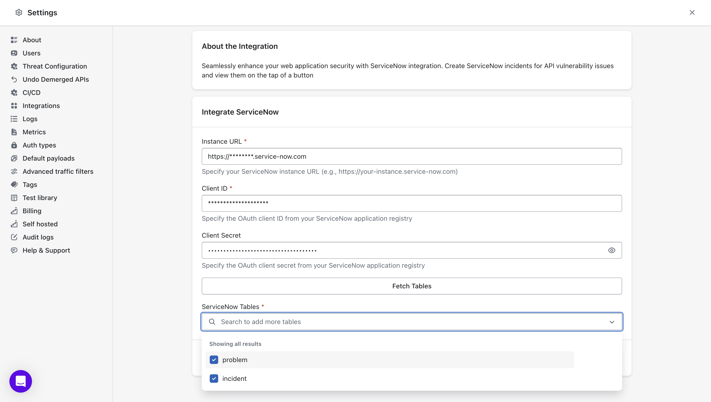

# ServiceNow Integration

Integrate Akto with ServiceNow to streamline your API security workflow by creating tickets for vulnerabilities directly from Akto into your ServiceNow instance.

### Quick Setup Steps

The ServiceNow integration uses OAuth 2.0 Client Credentials flow for secure authentication. Follow these steps to set up the integration:

#### 1. Configure OAuth in ServiceNow

**Step 1.1: Enable Client Credentials Grant Type**

Before creating the OAuth integration, ensure the client credentials grant type is enabled:

1. In your ServiceNow instance, in the filter navigator, search for `sys_properties.do`
    <figure><figcaption></figcaption></figure>
2. Click **New** to create a new system property (or search for existing property)
3. Fill in the following fields:
   * **Name:** `glide.oauth.inbound.client.credential.grant_type.enabled`
   * **Value:** `true`
   * **Type:** `true | false`
4. Click **Save**
    <figure><figcaption></figcaption></figure>
5. This property must be enabled for the OAuth integration to work

**Step 1.2: Create OAuth Integration**

1. In your ServiceNow instance, navigate to **System OAuth** > **Inbound Integrations**
    <figure><figcaption></figcaption></figure>
2. Click **New integration** to create a new integration
3. Choose **OAuth - Client credentials grant type**
4. Fill in the following details:
   * **Name:** Enter a descriptive name (e.g., "Akto API Security Integration")
   * **User:** Select a user account that has all required roles to create and manage tickets
     * Ensure this user has permissions to access and create records in the tables you want to integrate
   * **Active:** Make sure the **Active** checkbox is **enabled**
5. Click **Submit** to create the integration
    <figure><figcaption></figcaption></figure>

**Step 1.3: Save Credentials**

After creating the integration:

1. ServiceNow will display your **Client ID** and **Client Secret**
2. **Important:** Copy and save these credentials securely
   * Client ID
   * Client Secret
3. You will need these credentials to configure the integration in Akto

#### 2. Configure ServiceNow Integration in Akto

**Step 2.1: Access Integrations**

* Go to **Settings > Integrations** in Akto
* Find and click **"Configure"** next to ServiceNow
    <figure><figcaption></figcaption></figure>

**Step 2.2: Enter ServiceNow Details**

* **ServiceNow Instance URL:** Your ServiceNow instance URL (e.g., `https://yourcompany.service-now.com`)
* **Client ID:** Paste the Client ID from the OAuth integration you created in ServiceNow
* **Client Secret:** Paste the Client Secret from the OAuth integration

**Step 2.3: Fetch and Select Tables**

1. After entering the credentials, click **Fetch Tables**
2. Akto will retrieve all available tables from your ServiceNow instance
3. Select the tables where you want to create tickets for API vulnerabilities
   * Common choices include: `incident`, `problem`, `change_request`, or custom tables
   * You can select multiple tables based on your workflow requirements

#### 3. Save

* Click **"Save"** to finalize the integration
    <figure><figcaption></figcaption></figure>

***

### Important Notes

* **OAuth Setup:** This integration uses the **New Inbound Integration Experience** in ServiceNow, which is the recommended approach (not the deprecated OAuth API endpoint)
* **User Permissions:** Ensure the ServiceNow user assigned to the OAuth integration has appropriate permissions to:
  * Create records in the selected tables
  * Read table schemas and metadata
  * Access necessary ServiceNow APIs

***

## Get Support for your Akto setup

There are multiple ways to request support from Akto. We are 24X7 available on the following:

1. In-app `intercom` support. Message us with your query on intercom in Akto dashboard and someone will reply.
2. Join our [discord channel](https://www.akto.io/community) for community support.
3. Contact `help@akto.io` for email support.
4. Contact us [here](https://www.akto.io/contact-us).
