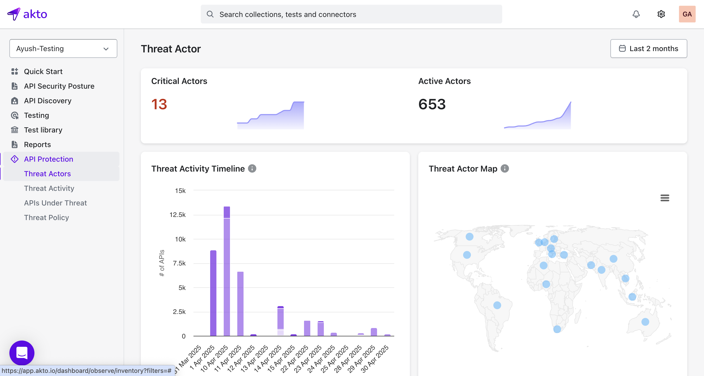

# Overview

Akto's runtime protection identifies and monitors malicious requests in real-time, empowering you to stay ahead of threats. With customizable filters, you can tailor the monitoring to meet your specific security needs.

#### Getting Started

To enable Akto Runtime Protection, simply set the following environment variable in your deployment configuration: `AKTO_THREAT_ENABLED=true`

For detailed installation and deployment instructions, refer to the [Akto Installation Guide](https://docs.akto.io/~/revisions/eqYVJ1sHpYidDKSYAxzJ/getting-started/deployment-types).

#### Dashboard
<figure><figcaption></figcaption></figure>

