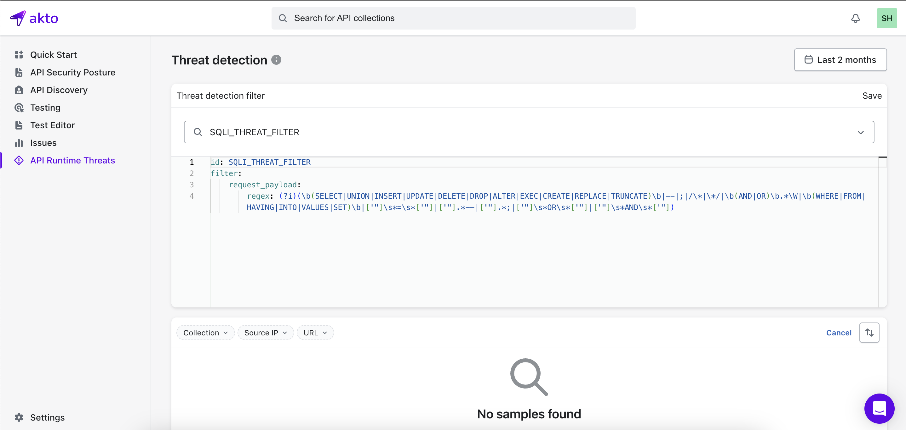

# Overview

Akto's runtime protection identifies and monitors malicious requests in real-time, empowering you to stay ahead of threats. With customizable filters, you can tailor the monitoring to meet your specific security needs.

<figure><figcaption></figcaption></figure>
