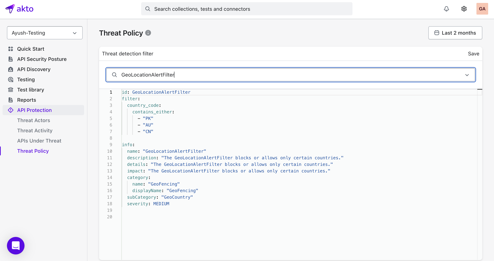

#### Threat Policy

Threat policies are customizable filters that monitor and analyze your network traffic in real-time to detect and mitigate security threats. These policies help protect your applications by identifying and blocking malicious activities, such as attacks outlined in the OWASP Core Rule Set, including Cross-Site Scripting (XSS) and SQL Injection. Additionally, you can configure policies to enforce geofencing or block traffic based on IP CIDR ranges.

### Key Features

- **Real-Time Threat Detection**: Identify and respond to security threats as they occur.  
- **OWASP Core Rule Set Support**: Detect common attack patterns, such as XSS and SQL Injection.  
- **Geofencing**: Restrict access based on geographic locations.  
- **IP-Based Blocking**: Block or allow traffic from specific IP addresses or CIDR ranges.

### Use Cases

- Protect web applications from common vulnerabilities.  
- Restrict access to your services based on user location or IP address.  
- Enhance security by combining multiple filtering criteria.

To configure threat policies, navigate to the [Policy Settings] section in your dashboard and follow the setup wizard for step-by-step guidance.

<figure><figcaption></figcaption></figure>