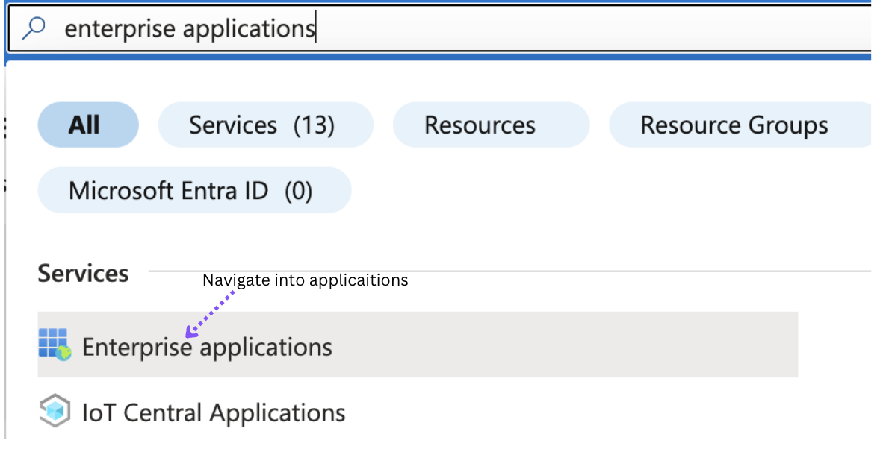
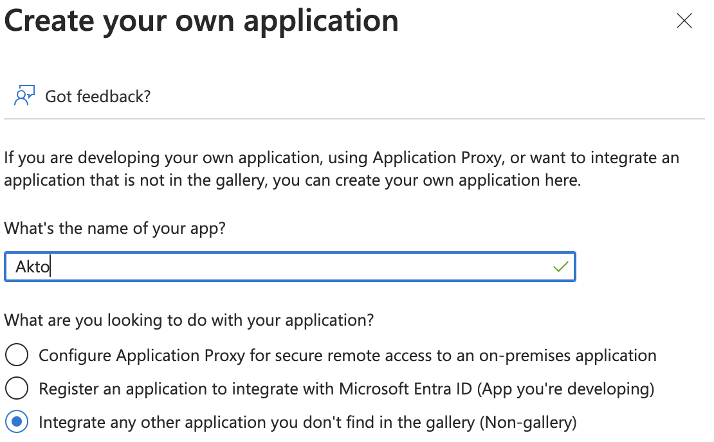
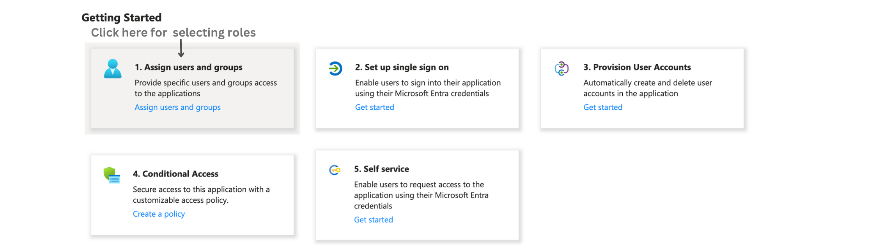
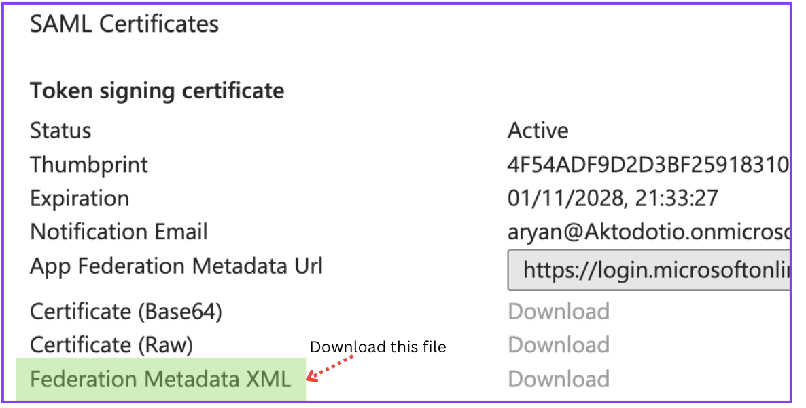
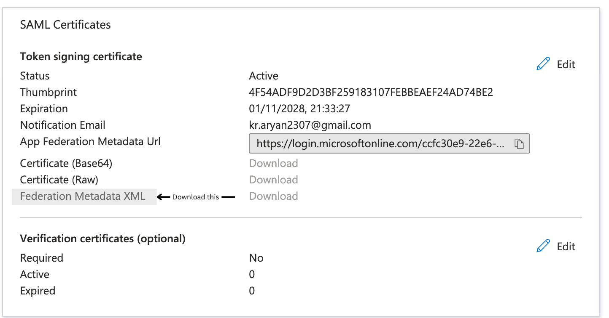
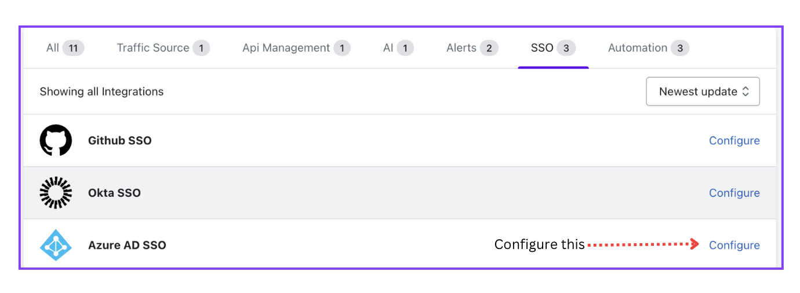
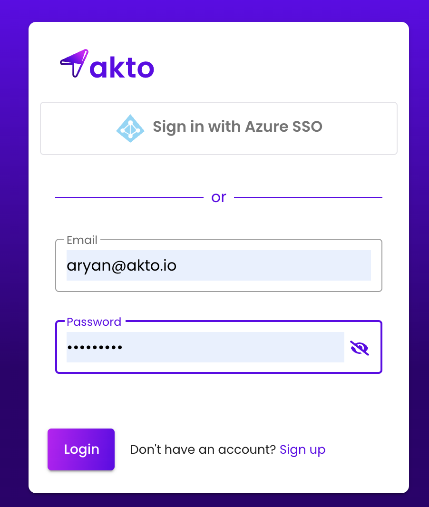

# Configure Azure AD SAML SSO

Follow these steps to configure SAML SSO using Azure Active Directory.

### 1. Create new application.
Step 1:  
Navigate to `Enterprise applications`.

Step 2:  
Add a new application

Step 3: 
1. Click on the `+ New application` button.

<figure>

</figure> 
 

2. After clicking on `+Create your own Application` write `Akto` as the name of your app.
Choose the `Integrate any other application you don't find in the gallery (Non-gallery)` option and then click on `Create`.
m

<figure>

</figure> 
 

### 2. Assign users and groups

To enable users to access Akto using Azure Active Directory Single Sign-On (SSO), the following prerequisites must be met:

1. **Assigned to the Application:**
   Users must be assigned to the 'Akto' application within the Azure Active Directory.

2. **User Profile Attributes:**
   Users should have the following attributes defined on their profile:
   - First Name
   - Last Name
   - User Principal Name
   - Email

<figure>

</figure> 
 

### 3. Set up SAML settings

In the Azure Active Directory admin center, select the 'Akto' Enterprise application. Set up single sign on for the 'Akto' application, selecting `SAML` as the sign-on method. Use the following SAML settings.
Here `{ hostname }` is the value of your domain hostname where you are hosting the Akto application.

**NOTE:**
  `Sign on URL` must be in `https:` format and not `http` for configuring SAML.

1. Under `Set up single sign on`, click on `SAML`.
2. **Basic SAML Configuration**

    | Setting     | Value        |
    | -------- | ----------------  |
    | Identifier (Entity ID)     | { hostname } |
    | Reply URL (Assertion Consumer Service URL)    | { hostname }/signup-azure-saml    |
    | Sign on URL    | { hostname }/signup-azure-request       |

<figure>

</figure> 
 

### 4. Import Azure Federation Metadata into Akto Dashboard
1. On the same page you configured SAML settings in the Azure Active Directory admin center, download the `Federation Metadata XML` file (listed under the SAML Signing Certificate).

 
<figure>

</figure> 
 

2. Navigating in Akto dashboard. 
    **Settings => Integrations => Azure SSO SAML**
    
3. Click on `Configure`, and then upload the metadata xml file.
    <figure>

</figure> 
     

4. `Logout` to test the configuration by clicking "Sign in with Azure SSO".

<figure>

</figure> 
     