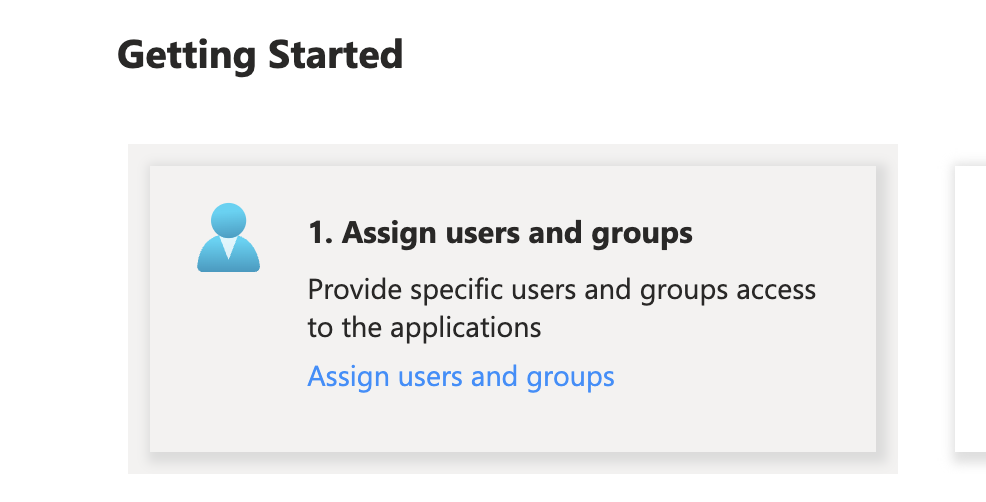
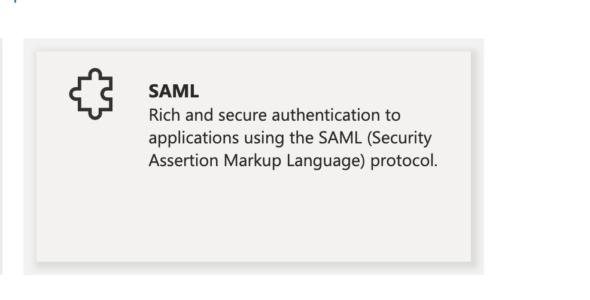
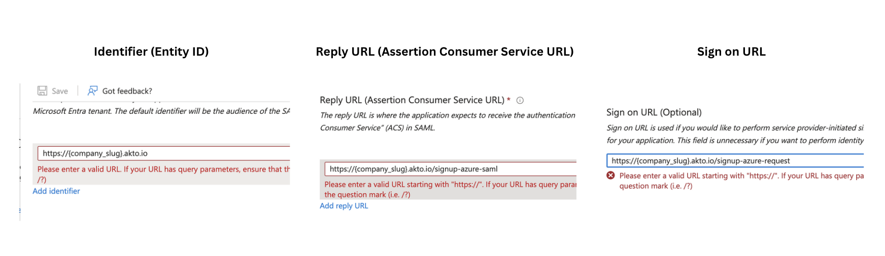

# Azure AD SAML

If you have Azure AD configured, you can enable SSO on Akto. and you should be an Admin on Akto dashboard.

1. [Ensure that all pre-requisites are met](azureAd-saml.md#pre-requisites)
2. [Create new Oauth application](azureAd-saml.md#create-new-application)
3. [Assign users and groups to your Oauth application](azureAd-saml.md#assign-users-and-groups)
4. [Set up SAML settings for Oauth application](azureAd-saml.md#set-up-saml-settings)
5. [Test your integration](azureAd-saml.md#import-azure-federation-metadata-into-akto-dashboard)

Follow these steps to configure SAML SSO using Azure Active Directory.

## Pre-requisites

To enable users to access Akto using Azure Active Directory Single Sign-On (SSO), the following prerequisites must be met:

1. One of the following roles on Azure AD: **Global Administrator, Privileged Role Administrator, Cloud Application Administrator, or Application Administrator**.
2. You should have **ADMIN** role in Akto dashboard.
3. **Assigned to the Application:** Users must be assigned to the 'Akto' application within the Azure AD.
4. **User Profile Attributes:** Users should have the following attributes defined on their profile on Azure AD:
   * First Name
   * Last Name
   * User Principal Name
   * Email

## Create new application.

1. Navigate to `Enterprise applications`.

<div align="center">

<figure><figcaption></figcaption></figure>

</div>

\


2. Click on the `+ New application` button.

<div align="center">

<figure><figcaption></figcaption></figure>

</div>

\
3\. Click on \`+Create your own Application\`.

<div align="center">

<figure><figcaption></figcaption></figure>

</div>

\
4\. Mention \`Akto\` as the name of your app.

<div align="center">

<figure><figcaption></figcaption></figure>

</div>

\
5\. Choose the \`Integrate any other application you don't find in the gallery (Non-gallery)\` option and then click on \`Create\`.

## Assign users and groups

<div align="center">

<figure><figcaption></figcaption></figure>

</div>

\


## Set up SAML settings

In the Azure Active Directory admin center, select the 'Akto' Enterprise application. Set up single sign on for the 'Akto' application, selecting `SAML` as the sign-on method. Use the following SAML settings. Here `{ hostname }` is the value of your domain hostname where you are hosting the Akto application.

**NOTE:** `Sign on URL` must be in `https:` format and not `http` for configuring SAML.

1. Under `Set up single sign on`, click on `SAML`.

<div align="center">

<figure><figcaption></figcaption></figure>

</div>

\
2\. \*\*Basic SAML Configuration\*\*

```
| Setting     | Value        |
| -------- | ----------------  |
| Identifier (Entity ID)     | { hostname } |
| Reply URL (Assertion Consumer Service URL)    | { hostname }/signup-azure-saml    |
| Sign on URL    | { hostname }/signup-azure-request       |
```

<div align="center">

<figure><figcaption></figcaption></figure>

</div>

\


## Import Azure Federation Metadata into Akto Dashboard

1. On the same page you configured SAML settings in the Azure Active Directory admin center, download the `Federation Metadata XML` file (listed under the SAML Signing Certificate).

\


<div align="center">

<figure><figcaption></figcaption></figure>

</div>

\


2. Navigating in Akto dashboard.\
   **Settings => Integrations => Azure SSO SAML**
3.  Click on `Configure`, and then upload the metadata xml file.

    <div align="center">

    <figure><figcaption></figcaption></figure>

    </div>

    \

4. `Logout` to test the configuration by clicking "Sign in with Azure SSO".

## Get Support for your Akto setup

There are multiple ways to request support from Akto. We are 24X7 available on the following:

1. In-app `intercom` support. Message us with your query on intercom in Akto dashboard and someone will reply.
2. Join our [discord channel](https://www.akto.io/community) for community support.
3. Contact `help@akto.io` for email support.
4. Contact us [here](https://www.akto.io/contact-us).
