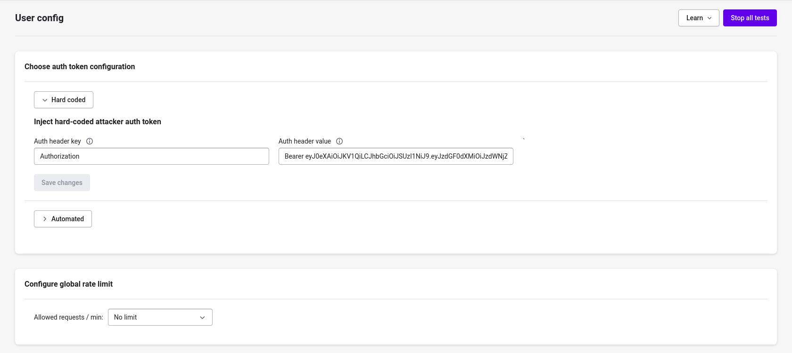

# Auth

Auth section is used for specifying that the endpoint selected for running the test should be authenticated. Auth header is stripped off and a sample request is made. If the request gives status 2xx, then we skip running the test on that particular endpoint.

**How Header Is Selected By Yaml Execution Engine -**

Key Defined in User Config Section is picked as authentication header.

<figure><figcaption></figcaption></figure>
