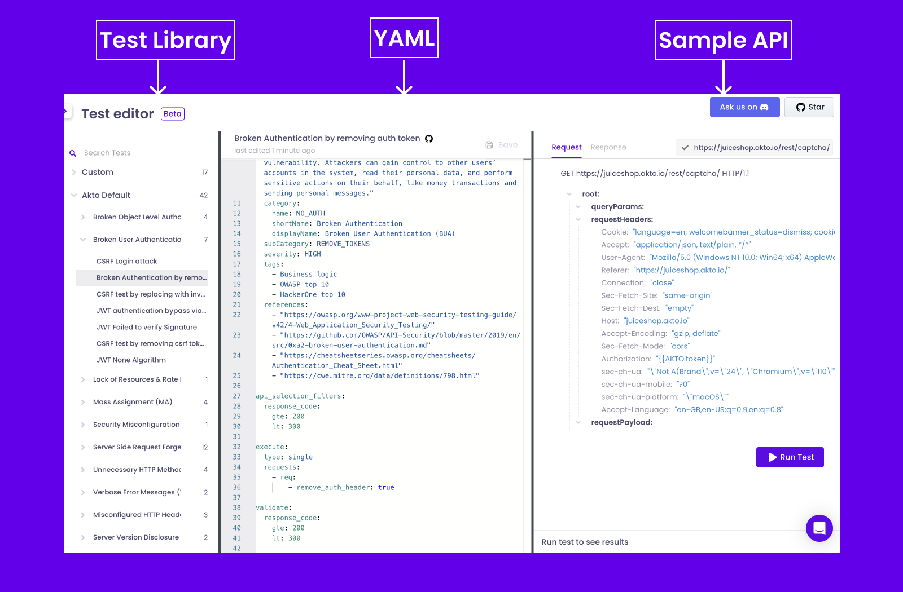

# Overview

Akto Test Editor is the test playground for security teams and developers to write their custom tests to find vulnerabilities in APIs.

Test Editor consists of three blocks:

1. `Test Library` consisting of 100+ built-in tests
2. `YAML` test editor
3. `Sample API` req and res to test

<figure><figcaption></figcaption></figure>
