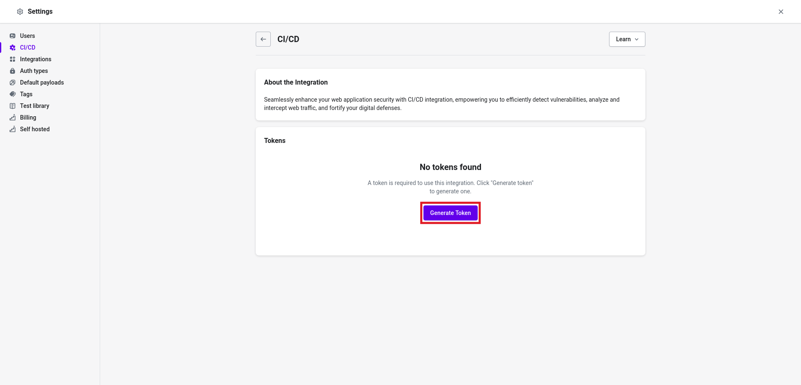
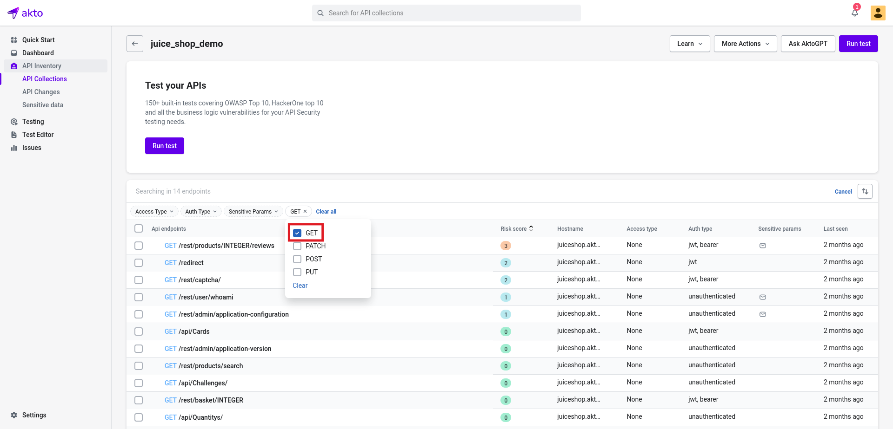
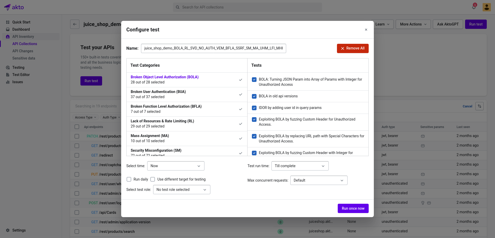

# Run tests in CICD

## Introduction

You can trigger Akto's API Security tests in your CI/CD pipelines too. Generate your **Akto token** and send API requests to Akto dashboard to start running tests. 

### Generate Akto token


* Go to `My account > Settings > Integrations`
* Select `CI/CD Integeration` under `Automation category`



* Click on `Generate token` button to generate a fresh token or copy an existing token.

### Add trigger in your CI/CD tool

* Open the API collection where you want to run the tests.

* By default, the API collection view shows all APIs. You can filter the APIs on which you want to run the tests. For example, to run tests only on `GET` endpoints, we can add a filter to show only `GET` endpoints.


* Click on the `Run test` button on the top right.
* Select the tests you want to run as part of CI/CD pipeline. Please keep `Select time = Now` and `Run daily` should be unchecked. Feel free to edit the `Name`, `Test run time` and `Max concurrent requests`.


* Click on `Run once now` (if the button name says anything else, read the previous point 🙄)
* Observe the `Test ID` on the testing page for the test you just created.


* Prepare the following curl command by replacing `akto-dashboard-url`, `akto-api-key` and `akto-test-id`
  ```
  curl "https://<akto-dashboard-url>/api/startTest" \
              -H \'X-API-KEY: <akto-api-key>\' \
              -H \'content-type: application/json\' \
              -d \'{"testingRunHexId": <akto-test-id>, "startTimestamp" : 0,"metadata": {"platform": "Github Actions"}}\' \
              --compressed
  ```
* Add a post deployment hook in your CI/CD tool. Add the above curl command as part of post deployment. For example, Jenkins post deployment hook should look like - 


* You can also use our plugin for github actions directly too:
    ```
      - name: Run CI/CD tests
        uses: oren-akto/akto-github-action@v1.0.0
        with:
          AKTO_DASHBOARD_URL: ${{vars.AKTO_DASHBOARD_URL}}
          AKTO_API_KEY: ${{vars.AKTO_API_KEY}}
          AKTO_TEST_ID: ${{vars.AKTO_TEST_ID}}
          START_TIME_DELAY: 180 # Delay in seconds after which testing run is started, optional, default is 0 
    ```

* If you have hosted Akto in your VPC, please ensure the CI/CD machine can reach Akto's dashboard. You might have to change Security rules on Akto-Load-Balancer accordingly.
* If you want this to become better, please create a GitHub issue [here](https://github.com/akto-api-security/akto/issues). Or even better, contribute! We are open source! 


