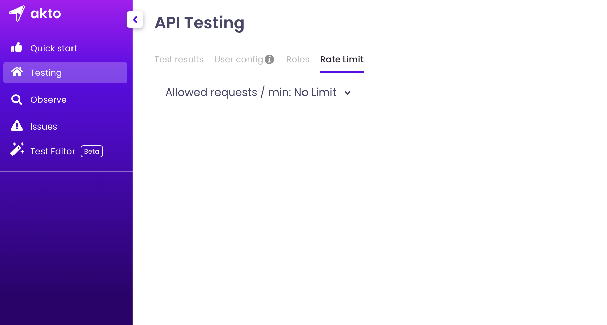
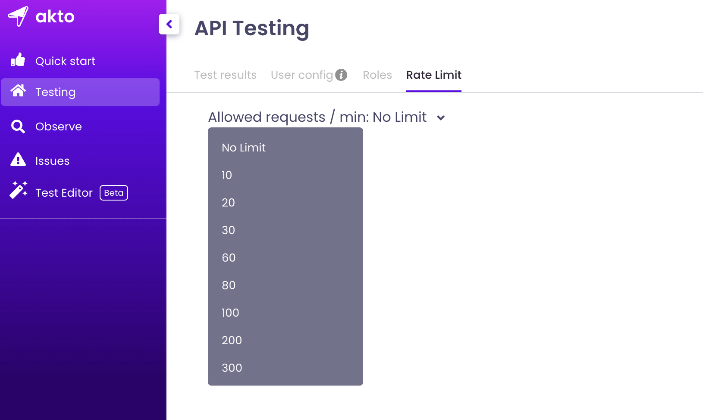

# Create user config

## Introduction

Running specialized tests like **Broken Object Level Authorization**, **Broken User Authentication** etc, require an additional attacker authorization token. Hence before triggering Akto tests on your apis, you may need to specify an authorization token which can be treated as attacker token during test run. Attacker Token can be specified manually, as well as in automated manner. We provide multiple ways to automate Attacker token generation.

## Method 1: Adding Token Manually

* Go to Testing Section.
* Click on User Config Tab
* Add your Auth Token in section 1 - **"Inject hard-coded attacker auth token"**. Enter the below 2 values -
  * Auth Header Key - Enter name of header which contains your auth token.
  * Auth Header Value - Enter value corresponding to the header name you mentioned in Auth Header Key.

## Method 2: Automating Attacker Token Generation

```
Documentation coming soon....
```

## Adding rate limit

* You can add a rate limit for testing your APIs using akto. E.g. Specifying a rate limit of 200 requests per min would mean that akto will only hit up to 200 api requests per minute during testing.

* To setup rate limit click on Testing > Rate limit.

<figure><figcaption></figcaption></figure>

* Then click on the dropdown menu and just select your proffered rate limit.

<figure><figcaption></figcaption></figure>